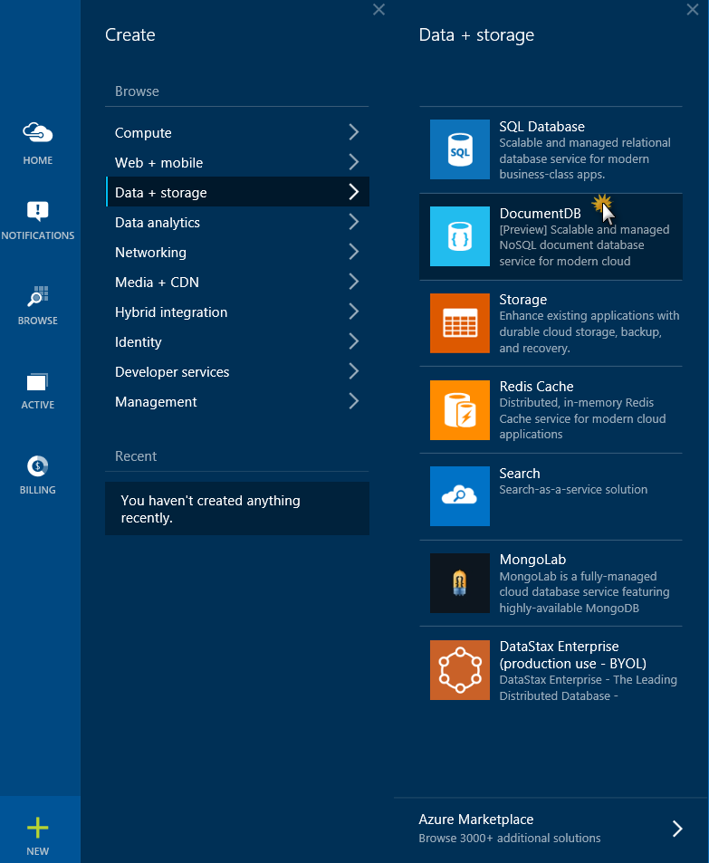
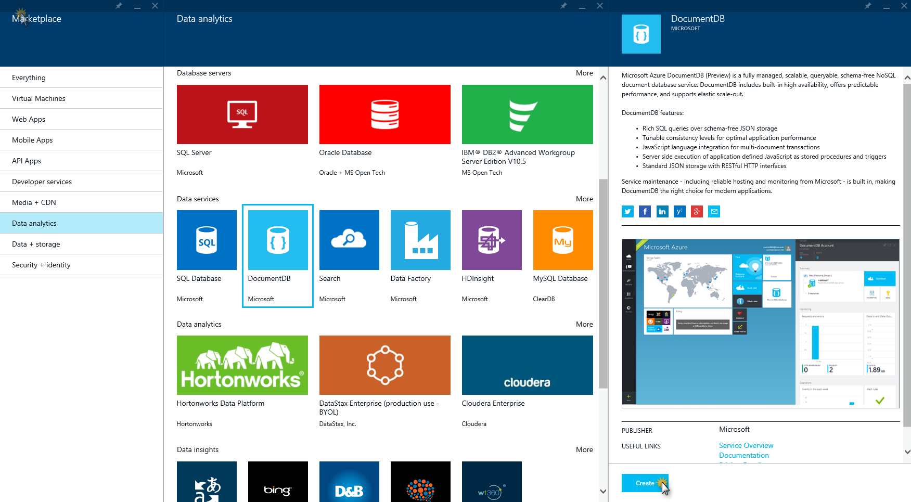
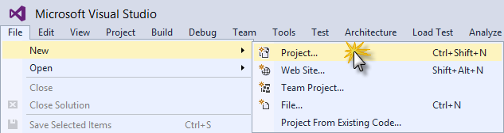

Building a web application with ASP.NET MVC using DocumentDB
=======================================================================================

**Azure DocumentDB** is a fully-managed, highly-scalable, NoSQL document database service provided by Azure. Its many benefits include rich query over a schema-free JSON data model, transactional execution of JavaScript logic, and scalable storage and throughput. You can find out more about DocumentDB online in the [Microsoft Azure subsite for DocumentDB](http://azure.microsoft.com/en-us/services/documentdb/).

In this lab, you will learn how to build a todo list web application using Azure DocumentDB. The task items will be stored as JSON documents in Azure DocumentDB. The web application is a C# MVC application, in which you will wire the basic CRUD operations to methods that use DocumentDB and then publish as an Azure website.

This lab includes instructions for the following tasks:

* [Creating a DocumentDB database account](#creating-a-documentdb-database-account)
* [Creating a new ASP.NET MVC application](#creating-a-new-aspnet-mvc-app)
* [Adding DocumentDB to your project](#adding-documentdb-to-your-project)
* [Setting up the ASP.NET MVC application](#setting-up-the-aspnet-mvc-app)
* [Wiring up DocumentDB](#wiring-up-documentdb)
* [Running the application locally](#running-the-application-locally)
* [Deploying the application to Azure Websites](#deploying-the-app-to-azure)
* [Appendix - Cleanup](#cleanup)

<a name="creating-a-documentdb-database-account"></a>
## Creating a DocumentDB database account

To use Microsoft Azure DocumentDB, you must create a DocumentDB account.  This task describes how to create a DocumentDB account in the Azure preview management portal.

1. Sign in to the [preview management portal](https://portal.azure.com/).

1. Click **NEW** and select **Data + storage**, then  **DocumentDB** in order to create a new DocumentDB account.  

    

    _Creating a DocumentDB account_

	> **Note:** Alternatively, from the Startboard, you can browse the Azure Marketplace, select the “Data analytics” category, choose **DocumentDB** and then click **Create**.

	> 

	> _Creating a DocumentDB Account from the Azure Marketplace_

	This will open the **New DocumentDB (Preview)** blade.

1. In the **New DocumentDB (Preview)** blade, enter a name to identify the DocumentDB account in the **Id** box (e.g.: _your-documentdb_) and specify the geographic location where your DocumentDB account will be hosted (e.g.: _West US_). You can update other configuration options based on the information below. Then click **Create**.

	

	_Configuring the DocumentDB account_

	> **Note:** In the **New DocumentDB (Preview)** blade you can find the following options to be configured for a new DocumentDB account configuration:

	> - **Id**: Name that identifies the DocumentDB account. This value becomes the host name within the URI. The Id can contain only lowercase letters, numbers, and the '-' character, and must be between 3 and 50 characters long. Note that documents.azure.com is appended to the endpoint name you choose to craft your DocumentDB account endpoint.

	> - **Pricing Tier**: Standard. This lens is locked because the DocumentDB preview supports a single standard pricing tier. For more information, see [DocumentDB pricing](http://go.microsoft.com/fwlink/p/?LinkID=402317&clcid=0x409).

	> - **Optional configuration**: This lens is used to specify the initial capacity allocated to your DocumentDB account. DocumentDB leverages capacity units to allow you to scale your DocumentDB account, where each capacity unit includes reserved database storage and throughput. By default, 1 capacity unit is provisioned. You can adjust the number of capacity units available to your DocumentDB account at any time via the [preview management portal](https://portal.azure.com/). For details about DocumentDB account capacity and throughput, please see the [Manage DocumentDB capacity and performance](http://azure.microsoft.com/en-us/documentation/articles/documentdb-manage) article.

	> - **Resource group**: The resource group for your DocumentDB account.  By default, a new Resource group will be created. You may, however, choose to add your DocumentDB account to an existing resource group. For more information, see [Using resource groups to manage your Azure resources](http://azure.microsoft.com/en-us/documentation/articles/azure-preview-portal-using-resource-groups/).

	> - **Subscription**: The Azure subscription that you want to use for the DocumentDB account. If your account has only one subscription, it will be selected automatically.

	> - **Location**: The geographic location where your DocumentDB account will be hosted.

	The DocumentDB account will be created. As this can take some time, you will proceed with the creation of the project and come back to retrieve some necessary information later, once the account creation has completed. Leave the browser open. You can monitor the creation progress on the **Notifications** Hub from time to time, if you wish to.

	

	_Checking the creation status in the Notification Hub_


In the next section you will be guided step by step to create a new ASP.NET MVC application from the ground up.

<a name="creating-a-new-aspnet-mvc-app"></a>
## Creating a new ASP.NET MVC application

In this task you will create a new ASP.NET MVC project and configure a Microsoft Azure Website where it will be deployed.

1. Open Visual Studio and from the **File** menu, hover over the **New** option and click **Project**.

    

    _Creating a New Project_

	> **Note:** You can open the end solution from [end/Todo](end/Todo) and configure it according to the instructions in [Setting up the end solution](end).

1. In the **New Project** dialog box, select **ASP.NET Web Application** under the **Visual C# | Web** tab. Make sure **.NET Framework 4.5** is selected.
Name the project _Todo_, choose a **Location** and click **OK**.

	> **Note:** You may also want to uncheck the **Add Application Insights to Project** if you don't want the functionality for your application.

	

    _Creating a new ASP.NET Web Application project_

1. In the **New ASP.NET Project** dialog box, select **MVC**. Make sure that the **Host in the cloud** option is also selected, and change the Authentication method to **No Authentication**. Click **Ok**.

	

    _Creating a new project with the MVC template_

	> **Note 1:** Selecting the _Host in the cloud_ option will preprovision an Azure Website for you and make life a lot easier when the time comes to deploy the final working application. If you want to host this elsewhere or don't want to configure Azure upfront, then just clear Host in the Cloud.

	> **Note 2**: You might be prompted to sign in to Visual Studio with your Microsoft account. If so, enter your credentials and click Sign in.

  > **Note 3**: This hands on lab will work with either Visual Studio 2013 or Visual Studio 2015. If you are using Visual Studio 2015 and don't see the *Host in the Cloud* option, the most likely reason is that you need to install the [latest release of the Microsoft Azure SDK for Visual Studio 2015](http://go.microsoft.com/fwlink/?linkid=518003&clcid=0x409).

1. The **Configure Microsoft Azure Website** dialog box will appear, using an auto-generated site name. Select a region (e.g.: _West US_). Also take note of which account you are currently signed into in the dialog box. You want to make sure that this is the account your Azure subscription is attached to (usually a Microsoft account).

	This project does not require a database, as it will be using a new Azure DocumentDB account created later in the Azure Preview portal, so make sure **No database** is selected in the **Database server** field.

1. Click **OK**.

	

	_Configuring Microsoft Azure Website_

The project will be created, and the authentication options and Azure Website options will be automatically configured with the project. The ASP.NET application can be run locally, if desired.

Next you will add DocumentDB to this project and build the application.

<a name="adding-documentdb-to-your-project"></a>
##Adding DocumentDB to your project

In this task you will add the Azure DocumentDB SDK to the application.

The DocumentDB .NET SDK is packaged and distributed as a NuGet package. To get the NuGet package in Visual Studio, use the NuGet Package Manager in Visual Studio.

1. Right-click the **Todo** project in the Solution Explorer and then select **Manage NuGet Packages** to open the NuGet Package Manager dialog box.

	

	_Opening Manage NuGet Packages_

1. In the Search box, type **Azure DocumentDB**. From the results, select the **Microsoft Azure DocumentDB Client Libraries** package that has id **Microsoft.Azure.Documents.Client** and click **Install**.

	This will download and install the DocumentDB client package as well as all dependencies, like Newtonsoft.Json.

	> **Note:** While the service is still in preview, the NuGet package is marked as "Prerelease", so you need to enable the "Include Prerelease" option in order to be able to find the package.

	
	_Installing the Microsoft Azure DocumentDB Client Libraries_

	> **Note:** Alternatively, you can use the Package Command Console to install the package by typing the following:

	>  ```PowerShell
	>  Install-Package Microsoft.Azure.Documents.Client -Pre
	>  ```

1. You will be prompted to accept the license. Click **I Accept**.

	

	_Accepting the License for Microsoft.Azure.Documents.Client_

1. Once the package is installed, verify that two new references have been added to the **Todo** project:  _Microsoft.Azure.Documents.Client_ and _Newtonsoft.Json_. Your Visual Studio solution should resemble the following:

	

	_References added to the Solution_

<a name="setting-up-the-aspnet-mvc-app"></a>
##Setting up the ASP.NET MVC application

In this task you will set up the ASP.Net MVC application by adding a model, a controller and several views.

###Adding a model###

1. In **Solution Explorer**, right-click the **Models** folder of the **Todo** project and select **Add**. Then click **Class...**.

    

    _Adding a new model class_

1. In the **Add New Item** dialog box, set the name of the file as _Item.cs_ and click **Add**.  

	

1. Replace the content of the new **Item.cs** file with the following.

	```C#
	namespace Todo.Models
	{
		 using Newtonsoft.Json;

		 public class Item
		 {
			  [JsonProperty(PropertyName = "id")]
			  public string Id { get; set; }

			  [JsonProperty(PropertyName = "name")]
			  public string Name { get; set; }

			  [JsonProperty(PropertyName = "desc")]
			  public string Description { get; set; }

			  [JsonProperty(PropertyName = "isComplete")]
			  public bool Completed { get; set; }
		 }
	}
	```

	> **Note:** All data in DocumentDB is passed over the wire and stored as JSON. To control the way your objects are serialized/deserialized by JSON.NET you can use the JsonProperty attribute as demonstrated in the Item class we just created. This is optional. Moreover, you can use JsonConverter objects to completely control how serialization is handled.

###Adding a controller###

1. In **Solution Explorer**, right-click the **Controllers** folder of the **Todo** project, click **Add**, and then click **Controller...**.

	

	_Adding a Controller_

1. In the **Add Scaffold** dialog box, select **MVC 5 Controller - Empty** and then click **Add**.

	

	_Adding the Scaffold_

1. Name your new Controller, **ItemController** and click **Add**.

	

	_Naming the new Controller_

1. Once the file is created, in **Solution Explorer** your Visual Studio solution should resemble the following with the new **Item.cs** and **ItemController.cs** files just added.

	

	_Solution after adding the model and the controller_

###Adding views###
Now you will add several views to make it possible to list, edit, delete and view the details of the existing To Do items and create new ones.

####Adding an Item Index View####
1. In **Solution Explorer**, expand the **Views** folder. Right-click the empty **Item** folder, click **Add**, and then click **View...**.

	

	_Adding a new View_

1. In the **Add View** dialog box, complete the following options and then click **Add**.
	- In the **View name** box, type **Index**.
	- In the **Template** box, select **List**.
	- In the **Model class** box, select **Item (Todo.Models)**.
	- In the **Use a layout page** box, type **~/Views/Shared/_Layout.cshtml**.

	

	_Adding the Index View_

	Visual Studio will create a template view, named _Index.cshtml_. Once it is done, the cshtml file will open.

1. Close the _Index.cshtml_ file in Visual Studio; you will come back to it later.

####Adding a Create New Item View####
You will now create a new view for creating new Items, very much like you did in the previous section for the Index view.

1. In **Solution Explorer**, right-click the **Item** folder under the **Views** folder, click **Add**, and then click **View**.

1. In the **Add View** dialog box, complete the following options and then click **Add**.
	- In the **View name** box, type **Create**.
	- In the **Template** box, select **Create**.
	- In the **Model class** box, select **Item (Todo.Models)**.
	- In the **Use a layout page** box, type **~/Views/Shared/_Layout.cshtml**.

	

	_Adding the Create View_

####Adding a Delete Item View####
You will now create a new view for deleting Items.

1. In **Solution Explorer**, right-click the **Item** folder under the **Views** folder, click **Add**, and then click **View**.

1. In the **Add View** dialog box, complete the following options and then click **Add**.
	- In the **View name** box, type **Delete**.
	- In the **Template** box, select **Delete**.
	- In the **Model class** box, select **Item (Todo.Models)**.
	- In the **Use a layout page** box, type **~/Views/Shared/_Layout.cshtml**.

	

	_Adding the Delete View_

####Adding an Edit Item View####
Now, create a new view for editing existing Items.

1. In **Solution Explorer**, right-click the **Item** folder under the **Views** folder, click **Add**, and then click **View**.

1. In the **Add View** dialog box, complete the following options and then click **Add**.
	- In the **View name** box, type **Edit**.
	- In the **Template** box, select **Edit**.
	- In the **Model class** box, select **Item (Todo.Models)**.
	- Select **Create as a partial view**.

	

	_Adding the Edit View_

####Adding a Details View####
Now, create a new view for viewing details of the Items.

1. In **Solution Explorer**, right-click the **Item** folder under the **Views** folder, click **Add**, and then click **View**.

1. In the **Add View** dialog box, complete the following options and then click **Add**.
	- In the **View name** box, type **Details**.
	- In the **Template** box, select **Details**.
	- In the **Model class** box, select **Item (Todo.Models)**.
	- Select **Create as a partial view**.

	

	_Adding the Details View_

Once this is done, close all the cshtml documents in Visual Studio. You will return to these views later.

<a name="wiring-up-documentdb"></a>
##Wiring up DocumentDB

In this task you will add code in the **ItemController** class to handle the following functionality:

* [Listing incomplete Items](#listing-incomplete-items)
* [Adding Items](#adding-items)
* [Editing Items](#editing-items)
* [Deleting Items](#deleting-items)
* [Viewing Details of Items](#details-items)

<a name="listing-incomplete-items"></a>
####Adding code to list incomplete Items####
1. Open the **ItemController.cs** file and remove all the code within the class, but make sure to keep the class. You will rebuild it piece by piece using DocumentDB in this section.

	The file should look like this:

	

1. Add the following code snippet within the now empty **ItemController** class.

	```C#
	public ActionResult Index()
	{
		var items = DocumentDBRepository.GetIncompleteItems();
		return this.View(items);
	}
	```

	This code also uses a "pseudo repository" class called **DocumentDBRepository** that has yet to be created. This is a helper class that contains all the DocumentDB specific code. For the purposes of this walk-through, it is not going to be a full data access layer with dependency injection,  factories and repository patterns as it would probably be if you were building a real-world application. In this case, instead, a single class in which all the data access logic is centralized will keep things simple and allow the focus to be on the DocumentDB specific bits.

1. Right-click the **Todo** project and click **Add**. Then click **Class**.

	

	_Adding a new class_

1. Once the **Add New Item** dialog box opens, name the new class **DocumentDBRepository** and click **Add**.

	

	_Adding the DocumentDBRepository class_

1. Replace the content of the **DocumentDBRepository.cs** file just created with the following:

	```C#
	namespace Todo
	{
		 using System;
		 using System.Collections.Generic;
		 using System.Configuration;
		 using System.Linq;
		 using Microsoft.Azure.Documents;
		 using Microsoft.Azure.Documents.Client;
		 using Microsoft.Azure.Documents.Linq;
		 using Models;

		 public static class DocumentDBRepository
		 {
			  private static string databaseId;
			  private static string collectionId;
			  private static Database database;
			  private static DocumentCollection collection;
			  private static DocumentClient client;

			  private static string DatabaseId
			  {
					get
					{
						 if (string.IsNullOrEmpty(databaseId))
						 {
							  databaseId = ConfigurationManager.AppSettings["database"];
						 }

						 return databaseId;
					}
			  }

			  private static string CollectionId
			  {
					get
					{
						 if (string.IsNullOrEmpty(collectionId))
						 {
							  collectionId = ConfigurationManager.AppSettings["collection"];
						 }

						 return collectionId;
					}
			  }

			  private static Database Database
			  {
					get
					{
						 if (database == null)
						 {
							  database = ReadOrCreateDatabase();
						 }

						 return database;
					}
			  }

			  private static DocumentCollection Collection
			  {
					get
					{
						 if (collection == null)
						 {
							  collection = ReadOrCreateCollection(Database.SelfLink);
						 }

						 return collection;
					}
			  }

			  private static DocumentClient Client
			  {
					get
					{
						 if (client == null)
						 {
							  string endpoint = ConfigurationManager.AppSettings["endpoint"];
							  string authKey = ConfigurationManager.AppSettings["authKey"];
							  Uri endpointUri = new Uri(endpoint);
							  client = new DocumentClient(endpointUri, authKey);
						 }

						 return client;
					}
			  }
		 }
	}
	```

	The references to the _ReadOrCreateDatabase_ and _ReadOrCreateCollection_ methods will still remain unresolved, as these methods will be added in the next step. These two method calls are used for reading or creating DocumentDB databases and document collections.

1. Add the following code to the **DocumentDBRepository** class:

	```C#
	private static DocumentCollection ReadOrCreateCollection(string databaseLink)
	{
		 var col = Client.CreateDocumentCollectionQuery(databaseLink)
								 .Where(c => c.Id == CollectionId)
								 .AsEnumerable()
								 .FirstOrDefault();

		 if (col == null)
		 {
			  col = Client.CreateDocumentCollectionAsync(databaseLink, new DocumentCollection { Id = CollectionId }).Result;
		 }

		 return col;
	}

	private static Database ReadOrCreateDatabase()
	{
		 var db = Client.CreateDatabaseQuery()
							  .Where(d => d.Id == DatabaseId)
							  .AsEnumerable()
							  .FirstOrDefault();

		 if (db == null)
		 {
			  db = Client.CreateDatabaseAsync(new Database { Id = DatabaseId }).Result;
		 }

		 return db;
	}
	```

	This code takes care of setting up the database, a DocumentCollection, and creating code to connect to DocumentDB through the DocumentClient.

	Now you will update the configuration to set the endpoint and authorization key values, retrieving them from the DocumentDB account that you set to create in the first task of this lab.

1. Open the **Web.config** file in the root of your project (not the Web.config file in the Views directory) and find the **appSettings** section. Update it to contain the last 4 keys in the snippet below.

	```XML
	<appSettings>
		<add key="webpages:Version" value="3.0.0.0"/>
		<add key="webpages:Enabled" value="false"/>
		<add key="ClientValidationEnabled" value="true"/>
		<add key="UnobtrusiveJavaScriptEnabled" value="true"/>
		<add key="endpoint" value="URI" />
		<add key="authKey" value="PRIMARY KEY" />
		<add key="database" value="ToDoList" />
		<add key="collection" value="Items" />
	</appSettings>
	```


1. Switch to the browser instance in which you have the Azure Preview Portal open. Verify that the DocumentDB account has been created by looking for a **Created DocumentDB** notification in the **Notifications** Hub. If there is one, click it. If not, wait until the account finishes creating and the notification appears.

	

	_Creation succeeded in Notification Hub_

1. Click on your new **DocumentDB** account under the resource group.

	> **Note:** The default consistency of the DocumentDB account will be set to Session. You can adjust the default consistency setting via the [preview management portal](https://portal.azure.com/#gallery/Microsoft.DocumentDB).

	

	_The new DocumentDB account has been created_

	> **Note:** You can also access your existing DocumentDB accounts from the **Browse** blade.

	> 

	> _Accessing the DocumentDB accounts from the Browse blade_

	> 

	> _Accessing the DocumentDB account just created_

1. Now, click the **KEYS** button to open the **Keys** blade. Copy the endpoint **URI** and paste the value in the **Web.config** file open in Visual Studio, in place of the **URI** placeholder.

	

	_Retrieving the keys of the DocumentDB account just created_

1. Switch back to the browser in which the **Keys** blade is open and copy the **PRIMARY KEY** value. Switch to Visual Studio and paste it in the **Web.config** file, replacing the **PRIMARY KEY** placeholder.

	Now that the code for handling the database is ready, let's add some code to do the work for the views.

	The first thing you want to be able to do with a todo list application is to display the incomplete items. You will add a method to do that next.

1. Copy and paste the following code anywhere within the **DocumentDBRepository** class.

	```C#
	public static List<Item> GetIncompleteItems()
	{
		 return Client.CreateDocumentQuery<Item>(Collection.DocumentsLink)
					.Where(d => !d.Completed)
					.AsEnumerable()
					.ToList<Item>();
	}
	```

	At this point your solution should build without any errors.

	If you run the application now, you will be taken to the **HomeController** and the **Index** view of that controller. This is the default behavior for the MVC template project. You will alter this behavior by changing the routing to open the **Index** view of the **ItemController** instead, so that the Incomplete Items are listed.

1. Open the **RouteConfig.cs** file under **App_Start** and locate the line starting with **defaults:**. Update it to resemble the one below:

	<!-- mark:8 -->
	```C#
	public static void RegisterRoutes(RouteCollection routes)
	{
		routes.IgnoreRoute("{resource}.axd/{*pathInfo}");

		routes.MapRoute(
			 name: "Default",
			 url: "{controller}/{action}/{id}",
			 defaults: new { controller = "Item", action = "Index", id = UrlParameter.Optional }
		);
	}
	```

	This tells ASP.NET MVC that if you have not specified a value in the URL to control the routing behavior, it should use **Item** as the controller instead of using **Home** and use **Index** as the view. Now if you run the application, it will call your **ItemController** and return the results of the **GetIncompleteItems** method to the **Item Index** view.

1. Press **F5** to build and debug the application.

	The page that opens should look like this:

	

	_To Do application running locally_

1. Stop debugging.

<a name="adding-items"></a>
####Adding Items####
Now that you have a view to list items you will add the functionality of adding items into the database, so that you have something more than an empty grid to look at.

You already have a **Create** view in the application and a button in the **Index** view that takes the user to the **Create** view. You will now add some code to the controller and repository to persist the record in DocumentDB.

1. Open the **ItemController.cs** file and add the following code snippet, which is how ASP.NET MVC knows what to do for the **Create** action. In this case, it will just render the associated Create.cshtml view created earlier.

	```C#
	public ActionResult Create()
	{
		return this.View();
	}
	```

1. Still in **ItemController.cs**, add the following block of code that tells ASP.NET MVC what to do with a POST form for this controller.

	```C#
	[HttpPost]
	[ValidateAntiForgeryToken]
	public async Task<ActionResult> Create([Bind(Include =  "Id,Name,Description,Completed")] Item item)  
	{
		 if (ModelState.IsValid)  
		 {  
			  await DocumentDBRepository.CreateItemAsync(item);
			  return this.RedirectToAction("Index");  
		 }

		 return this.View(item);
	}
	```

	>**Security Note:** The ValidateAntiForgeryToken attribute is used here to help protect this application against cross-site request forgery attacks. There is more to it than just adding this attribute; your views need to work with this anti-forgery token as well. For more on the subject and examples of how to implement this correctly, please see [Preventing Cross-Site Request Forgery](http://www.asp.net/web-api/overview/security/preventing-cross-site-request-forgery-(csrf)-attacks).

	>**Security Note:** We also use the Bind attribute on the method parameter to help protect against over-posting attacks. For more details please see [Basic CRUD Operations in ASP.NET MVC](http://www.asp.net/mvc/overview/getting-started/getting-started-with-ef-using-mvc/implementing-basic-crud-functionality-with-the-entity-framework-in-asp-net-mvc-application#overpost).

	Now that the **Create** method is in place, the **ItemController** will pass the **Item** object from the form to the **CreateDocument** method. You just need to add the **CreateItemAsync** method.

1. Open the **DocumentDBRepository** class and add the following method:

	```C#
	public static async Task<Document> CreateItemAsync(Item item)
	{
		 return await Client.CreateDocumentAsync(Collection.SelfLink, item);
	}
	```

	This method simply takes an object passed to it and persists it in DocumentDB.

With these steps, you have added all the code required to add new Items to the database.

 >You may have noticed some methods or classes are not yet recognized. This will be fixed in the next section.

<a name="editing-items"></a>
####Editing items####
Now you will add the ability to edit Items in the database and to mark them as complete. The **Edit** view already exists in the project, so you just need to add some code to the **ItemController** and to the **DocumentDBRepository** class again.

1. Open **ItemController.cs** and add the following code:

	```C#
	[HttpPost]
	[ValidateAntiForgeryToken]
	public async Task<ActionResult> Edit([Bind(Include = "Id,Name,Description,Completed")] Item item)
	{
		 if (ModelState.IsValid)
		 {
			  await DocumentDBRepository.UpdateItemAsync(item);
			  return this.RedirectToAction("Index");
		 }

		 return this.View(item);
	}

	public ActionResult Edit(string id)
	{
		 if (id == null)
		 {
			  return new HttpStatusCodeResult(HttpStatusCode.BadRequest);
		 }

		 Item item = (Item)DocumentDBRepository.GetItem(id);
		 if (item == null)
		 {
			  return this.HttpNotFound();
		 }

		 return this.View(item);
	}
	```

	The first Edit method handles the Http GET that happens when the user clicks on the Edit link from the Index view. This method fetches a Document from DocumentDB and passes it to the Edit view. The Edit view will then do an Http POST to the IndexController.

	The second Edit method added handles passing the updated object to DocumentDB to be persisted in the database.

1. Add the following using directives to the **ItemController.cs** file.

	```C#
	using Todo.Models;
	using System.Threading.Tasks;
	using System.Net;
	```

1. Add the following methods to the **DocumentDBRepository** class:

	```C#
	public static Item GetItem(string id)
	{
		return Client.CreateDocumentQuery<Item>(Collection.DocumentsLink)
						.Where(d => d.Id == id)
						.AsEnumerable()
						.FirstOrDefault();
	}

	public static Document GetDocument(string id)
	{
		return Client.CreateDocumentQuery(Collection.DocumentsLink)
					  .Where(d => d.Id == id)
					  .AsEnumerable()
					  .FirstOrDefault();
	}

	public static async Task<Document> UpdateItemAsync(Item item)
	{
		Document doc = GetDocument(item.Id);
		return await Client.ReplaceDocumentAsync(doc.SelfLink, item);
	}
	```
	The first of these methods fetches an Item from _DocumentDB_ which is passed back to the **ItemController** and then on to the Edit view.

	The second method retrieves a Document in DocumentDB based on the id. This method is used by the third one (UpdateItemAsync) to replace the Document in DocumentDB with the version of the Document passed in from the **ItemController**.

1. Add the following using directive to the **DocumentDBRepository.cs** file. After this addition, all references should be resolved.

	```C#
	using System.Threading.Tasks;
	```

	With these additions, the Edit functionality should be working. Now you will add support for deleting items.

<a name="deleting-items"></a>
####Deleting items####
The code changes that allow the deletion of Items are similar to those made to allow the edition of items. As before, the **Delete** view already exists in the project, so you just need to add some code to the **ItemController** and the **DocumentDBRepository** class again.

1. Open **ItemController.cs** and add the following code:

	```C#
	public ActionResult Delete(string id)
	{
		 if (id == null)
		 {
			  return new HttpStatusCodeResult(HttpStatusCode.BadRequest);
		 }

		 Item item = (Item)DocumentDBRepository.GetItem(id);
		 if (item == null)
		 {
			  return this.HttpNotFound();
		 }

		 return this.View(item);
	}

	[HttpPost, ActionName("Delete")]
	//// To protect against Cross-Site Request Forgery, validate that the anti-forgery token was received and is valid
	//// for more details on preventing see http://go.microsoft.com/fwlink/?LinkID=517254
	[ValidateAntiForgeryToken]
	//// To protect from overposting attacks, please enable the specific properties you want to bind to, for
	//// more details see http://go.microsoft.com/fwlink/?LinkId=317598.
	public async Task<ActionResult> DeleteConfirmed([Bind(Include = "Id")] string id)
	{
		 await DocumentDBRepository.DeleteItemAsync(id);
		 return this.RedirectToAction("Index");
	}
	```

1. Add the following methods to the **DocumentDBRepository** class:

	```C#
	public static async Task DeleteItemAsync(string id)
	{
		Document doc = GetDocument(id);
		await Client.DeleteDocumentAsync(doc.SelfLink);
	}
	```

<a name="details-items"></a>
####Viewing details of items####
The code changes that allow viewing details of Items are even fewer than those made to allow the edition or deletion of items. The **Details** view was already added to the project, and the necessary code in the **DocumentDBRepository** class to get a document already exists, so you only need to add some code to the **ItemController**.

1. Open **ItemController.cs** and add the following code:

	```C#
  public ActionResult Details(string id)
  {
		var item = DocumentDBRepository.GetItem(id);
		return this.View(item);
  }
	```

You have finished adding all the necessary code for the application to work. In the next section you will test the application locally.

<a name="running-the-application-locally"></a>
##Running the application locally

In this task you will verify that the application you built in the previous task is working as expected.

1. Press **F5** to build and run the solution.

	The application will be launched in a browser.

	

	_Application running locally_

1. Click the **Create new** link and add values to the Name and Description fields. Leave the Completed check box unselected; otherwise, the new Item will be added in a completed state and will not appear on the initial list.

	

	_Testing - Creating an item_

1. Click **Create**. You are redirected back to the **Index** view and your Item appears in the list.

	

	_Testing - the Index view after creating an item_

	Feel free to add a few more Items to your todo list.

1. Click **Edit** next to an Item on the list. You are taken to the Edit view where you can update any property of your object, including the **Completed** flag. Update any field and click **Save**.

	> **Note:** (Warning) If you mark the **Completed** flag and click **Save**, the Item will no longer appear in the list of incomplete tasks. Please do not do this just yet.

	

	_Testing - Editing an item_

1. Back in the Index view, click **Details**. You will be taken to the Details view where all fields for the item are visible.

	

	_Testing - Viewing details for an item_

1. Click **Back to List** and once in the Index view, click **Delete**. The app will navigate to the **Delete** view where you can confirm the deletion.

	

	_Testing - Deleting an item_

1. Click **Delete**. You will be taken to the Index view, where you will see that the item no longer exists.

	You can verify that completed items are not displayed in the **Index** view by creating a new item and editing it to check the **Completed** checkbox. Once you click **Save** and are redirected to the Index view, the item should no longer appear.

1. Go back to Visual Studio and press **Shift+F5** to stop debugging.

<a name="deploying-the-app-to-azure"></a>
## Deploying the application to Azure Web Apps

The following steps will show you how to deploy the application to Azure as an Azure Web App. In the earlier steps, you connected your new project with an Azure Web App, so it's ready to be published.

1. In **Visual Studio**, right-click the **Todo** project and select **Publish**.

	

	_Publishing the application_

	The **Publish Web** dialog box will appear with each setting already configured according to your credentials. In fact, the website has already been created in Azure for you at the Destination URL shown.

	>**Note:** If you opened the end solution provided instead of following the lab instructions, you might have to enter additional information.

1. Click **Publish**.

	

	_Publish Web Dialog box_

	Once Visual Studio publishes the web application, it will launch a browser with the web application running. You can use it to perform the same operations you tried while running it locally.

	

	_Application running in IE from Azure_

<!--
1. Click on the **Next** button to go to the **Settings** page. You may be prompted to authenticate; make sure you authenticate using your Azure subscription account (typically a Microsoft account) and not the organizational account you created earlier.

    

    _Publish Web dialog - Connection tab_
-->

<a name="cleanup"></a>
##Appendix - Cleanup

In this task you will learn how to delete the resources created created in the previous sections. These are:

* a website
* a DocumentDB account

To delete the website follow these steps:

1. In your browser, go to [the preview management portal](https://portal.azure.com/), and sign in with your Azure credentials.

2. Click **BROWSE** in the Navigation hub on the left and then **Web Apps**.

	

	_Browsing websites_

	A blade displaying all websites will be displayed.

1. Select your website and click **DELETE** in the details blade.

	

	_Clicking Delete to delete website_

4. In the **Delete Confirmation** dialog, click **Yes**.

	The website will be deleted. You will see a notification in the **Notifications** hub.

To delete the DocumentDB account proceed in a similar way:

1. Click **BROWSE** in the Navigation hub on the left and then **DocumentDB accounts**.

1. Click your documentDB account and in the details blade that opens, click **Delete**.

	

	_Accessing the DocumentDB account just created_

1. In the confirmation blade that appears, type your documentDB account name and click **Delete**. The account will be deleted.

	

	_Confirming deletion of DocumentDB account_

##Summary

By completing this lab you have learned how to create an ASP.Net MVC application that uses Azure DocumentDB to store data as JSON objects. You have implemented all basic CRUD operations, tested the application locally, and published it to Azure Websites.
