*This tutorial will help you build a
[node.js](http://nodejs.org/) powered real-time chatroom web app fully
deployed in the cloud. You are expected to know HTML5 and JavaScript. 
You will learn how to setup
[node.js](http://nodejs.org/) on your Windows machine, how to develop a
web frontend with [express](http://expressjs.com/), how to deploy a node
express apps to [Azure](http://azure.microsoft.com/en-us/), how to use
[socketio](http://socket.io/) to add a real-time layer and how to deploy
it all together.*

*Level: Beginner to Intermediate.*

Part 1 - Introduction to Node.js
================================

Welcome to Part 1 of Node.js Tutorial Series: A chatroom for all! In
this part, I will explain what [node.js](http://nodejs.org) is, why you
should pay attention to node.js and how to setup your machine.

What is node.js? Why node.js?
-----------------------------

[Node.js](http://nodejs.org) is a runtime environment and library for
running JavaScript applications outside the browser. Node.js is mostly
used to run real-time server applications and shines through its
performance using non-blocking I/O and asynchronous events. A complete
web ecosystem has been built around node.js with several web app
frameworks and protocol implementations available for usage. It’s
definitely one of the easiest and fastest way to develop real-time
applications on the web today.

Why use node.js? One word answer: JavaScript. JavaScript is an extremely
popular language and is credited with being one of the driving forces
that turned the web into the dynamic wonderland that it is today. What
you can do in a browser nowadays, rivals all others!

JavaScript arose on the frontend but - thanks to the V8 JavaScript
engine and the work of Ryan Dahl - you can now run networked JavaScript
applications outside of the browser precisely to build web apps. Node.js
lets you unify the programming language used by your app - no longer do
you need a different language for your backend, you can use JavaScript
throughout. If your background is in building and design websites and
web app frontends in HTML, CSS and JavaScript, you don’t need to pick up
another language to develop complex data-driven back-ends for your apps.

Node.js plays a critical role in the advancement of WebSockets as a
method for real-time communication between the front and back ends. The
use of WebSockets and the libraries building on that protocol such as
Socket.IO have really pushed what is expected of web applications and
lets us developers explore new ways to create the web.

Setting up node.js on Windows 8
-------------------------------

To get started, you will need a reasonably up to date machine, I will be
showing you how to install Node.js on Windows 8.1.

Firstly, you will need to download and install the node.js runtime. You
can download the current version 0.10.30 (as of this writing) here:
[http://nodejs.org/download/](http://nodejs.org/download/). Choosing the
Windows Installer is one of the easiest ways to get started.

Alternatively, if you’re a fan of [Chocolatey](http://chocolatey.org/),
the package manager for Windows, you can install node by running:

`choco install nodejs.install`

You should double check that the node executable has been added to your
PATH system environment variable. [Watch this
video](https://www.youtube.com/watch?v=W9pg2FHeoq8), if you want to see
how to change your environment variables on Windows 8 and Windows 8.1.
You will want to make sure the following folder has been added to the
PATH variable:

`C:\Program Files (x86)\nodejs\`

If you go to your Command Prompt and type in node –h, you should see the
help documentation for the node executable displayed.

Along with Node.js, [NPM](https://www.npmjs.org/), the system used to
manage node packages, should be installed and available on the Command
Prompt as well. Simply type in npm –h, you should see the help
documentation for NPM displayed.

If you encounter an error similar to this one:

`Error: ENOENT, stat 'C:\Users\someuser\AppData\Roaming\npm'`

The resolution is to create a folder at the path specified above, as
shown in this
[StackOverflow](http://stackoverflow.com/questions/25093276/nodejs-windows-error-enoent-stat-c-users-rt-appdata-roaming-npm)
question. This is only an issue in the latest node.js installer and
should be resolved by next release. You can create the folder like so:

`mkdir -r C:\Users\someuser\AppData\Roaming\npm`

Why use Visual Studio 2013? Node Tools for Visual Studio!
---------------------------------------------------------

With Node.js installed, it’s time to select a development tool. Of
course, you are free to use any editing tool you want but why use a
glorified notepad when you can experience the full power of
enterprise-grade integrated development environments like [Visual
Studio](http://www.visualstudio.com/). **You get it for free to boot!**

Now what’s cool about Node Tools for Visual Studio is that is adds
Node.js support for editing, Intellisense, performance profiling, npm,
TypeScript, Debugging locally and remotely (including on
Windows/MacOS/Linux), as well Azure Web Sites and Cloud Service.

Throughout these tutorials, I will be using Visual Studio 2013 to
develop, debug and deploy the chat engine, you are welcome to use any
development tool you wish. If you want to use Visual Studio, You can
download any of the following editions of Visual Studio and then install
the free [Node Tools for Visual
Studio](http://nodejstools.codeplex.com/releases/view/119433).

-   **[THIS ONE IS FREE]** Visual Studio 2013 Express for Web (requires
    Update 2). [Download
    here](http://www.microsoft.com/en-ca/download/details.aspx?id=40747).

-   Visual Studio 2013 Pro or higher (requires Update 2)

-   Visual Studio 2012 Pro or higher (requires Update 4)

Don’t forget to install the free [Node Tools for Visual
Studio](http://nodejstools.codeplex.com/releases/view/119433).

Starting a new node.js project in Visual Studio
-----------------------------------------------

*Note: Screenshots show Visual Studio 2013 Ultimate.*

Starting a new node.js project is fairly straight forward.

1.  You want to boot Visual Studio and go to the File > New > Project
    menu item.

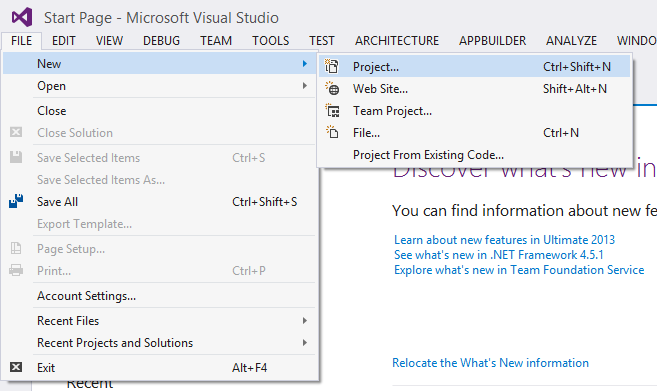

2.  You will want to go to Installed > Templates > JavaScript menu
    item on the left and select Blank Node.js Web Application on the
    right. Choose a location and name for your project and press OK.


3.  You will be presented with the following screen, feel free to
    explore Visual Studio at this point. You will want to open the
    generated server.js file in the Solution Explorer (on the right
    typically but may be located elsewhere on your screen.)

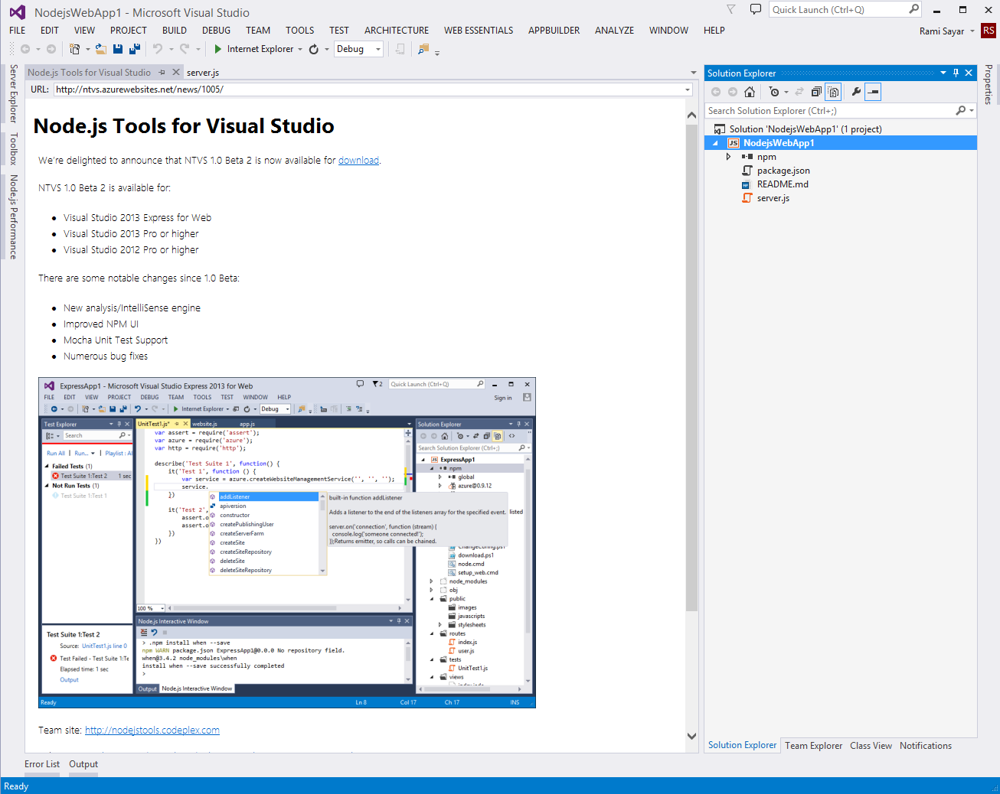

4.  You can now debug your node web application in your preferred
    browser.

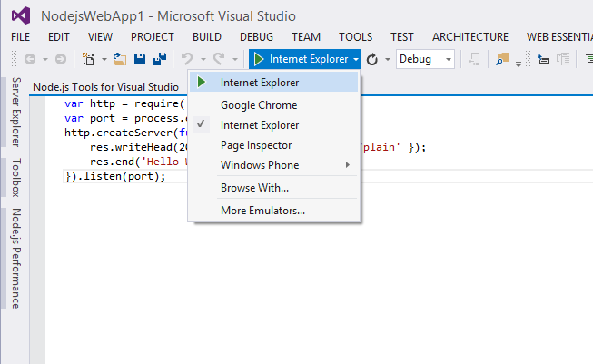

Hello World in Node.js
----------------------

As is typical in other languages, the generated code example shows you
how to output “Hello World” in the browser. Let me explain how the
generated code in server.js works line by line. **Note: As stated in
this tutorial series description, I am assuming you have a knowledge of
JavaScript, HTML5 and how HTTP/the Internet work.*

**Line 1**

```node
var http = require('http');
```

Node.js has a simple module and dependencies loading system. You simply
call the function “require” with the path of the file or directory
containing the module you would like to load at which point a variable
is returned containing all the exported functions of that module.

**Line 2**

```node
var port = process.env.port || 1337;
```

On this line, we want to determine on which port the HTTP server serving
the HTML should run. If a port number is specified in the environment
variables, we will use that one or we will simply use 1337.

**Line 3**

```node
http.createServer(function (req, res) {
```

We want to create a server to handle HTTP requests. We will also pass
the createServer function a function callback containing two parameters
to a handle each individual request and return a response. Take a look
at Michael Vollmer’s
[article](http://recurial.com/programming/understanding-callback-functions-in-javascript/)
if you’ve never encountered callback functions in JavaScript. The
request received is passed in the req parameter and the response is
expected to written to the res parameter.

**Line 4**

```node
res.writeHead(200, { 'Content-Type': 'text/plain' });
```

Any HTTP response requires a status-line and headers, to learn more
about HTTP headers and how they work check out this
[article](http://code.tutsplus.com/tutorials/http-headers-for-dummies--net-8039).
In this case, we want to return 200 OK as the status response and to
specify the content-type as plain text. We specify this by calling the
writeHead function on the response object.

**Line 5**

```node
res.end('Hello World\n');
```

Once we are done writing the response we want to call the end function.
We can also pass the final content through the end function, in this
case we want to send the string “Hello World” in plain text.

**Line 6**

```node
}).listen(port);
```

We close off the callback and call the function listen at the port we
defined earlier, this will start the server and start accepting requests
sent to the defined port.

To see the result, you can start debugging by pressing on the button
shown in the previous screenshot. You can see “Hello World” in the
browser.

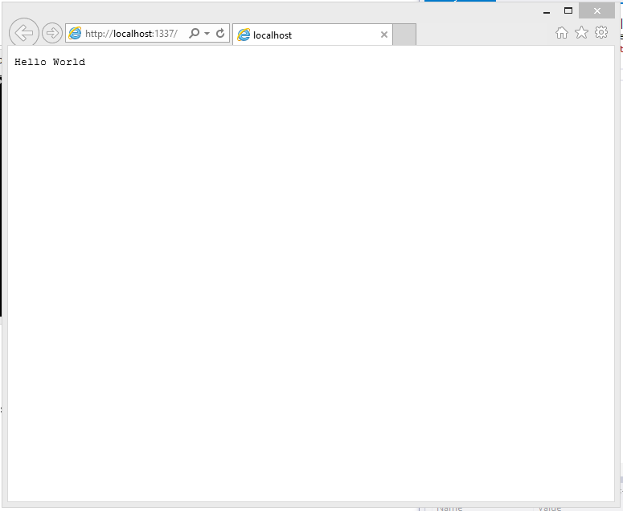

Voila! You have now successfully run a node.js app on Windows 8.1 using
Visual Studio 2013.

Part 2 – Welcome to Express with Node.js and Azure
==================================================

What is Express?
----------------

Express is a minimal, open source and flexible node.js web app framework
designed to make developing websites, web apps and APIs much easier.

Why use Express?
----------------

Express helps you respond to requests with route support so that you may
write responses to specific URLs. Express allows you to support multiple
templating engines to simplify generating HTML.

You will want to make sure node.js is properly installed and ready, take
a look at [Part 1 – Introduction to
node.js](http://blogs.msdn.com/b/cdndevs/archive/2014/09/04/node-js-tutorial-series-a-chatroom-for-all-part-1-introduction-to-node.aspx).

Let’s Get Started
-----------------

Starting a new node.js project is fairly straight forward.

1.  You want to boot Visual Studio and go to the File > New > Project
    menu item.


2.  You will want to go to Installed > Templates > JavaScript menu
    item on the left and select Basic Windows Azure Express Application
    on the right. Choose a location and name for your project and press
    OK.

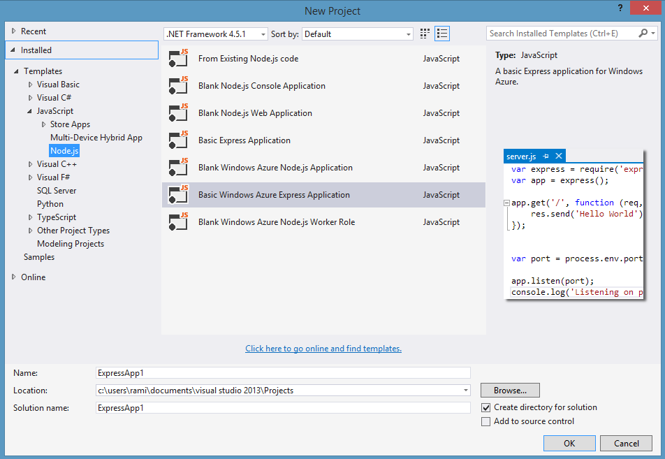

3.  A popup will appear notifying you that dependencies defined in
    package.json need to be installed using NPM the package manager.
    Take a look at an explanation of NPM
    [here](http://dailyjs.com/2012/05/03/windows-and-node-1/).


4.  A project will be generated that includes a file called app.js. We
    will start there.

Explanation of app.js
---------------------


**Lines 6 through 10**

Lines 6 through 10 load various modules including express, http and
path. What’s interesting is that we also load a module called routes
(which will be explained later) and a module in the routes folder called
user.

**Line 12**

On this line, we called the function express() which will create our app
this app will be used when we decide to create a HTTP Server and it will
be the object containing all the properties of our web application as
well as the mapping between the URL received in a request and the
function handling its response.

**Line 15 through 17**

On these lines, we set various configuration parameters such as what
port the server will run on (line 15) and in which directory the
template html files will be found (line 16). On line 17, we specify the
templating engine that we want to use, in this case
[Jade](http://jade-lang.com/). Jade is a popular templating engine that
makes writing HTML extremely easy and without the extraneous syntax
requirements of angle brackets (<>). You can change the templating
engine to simply return HTML as is and not do anything further by
replacing Line 17 with the following code:

`app.set('view engine', 'html');`

**Line 18 through 23**

On these lines, we set various configuration parameters. You can find
the meaning of each individual parameter by taking a look at the [API
documentation](http://expressjs.com/4x/api.html#express). The
explanation of these configuration parameters is not required for this
tutorial.

**Line 24 and 25**

These lines are interesting as it is where we specify middleware to
handle [Stylus](http://learnboost.github.io/stylus/) CSS sheets and
HTML. Middleware is a layer that is automatically inserted into the
function calls between receiving the request and returning a response.
In this case, we are asking express to run the stylus middleware and the
static middleware for all requests in which the URL specific a path
inside the public folder of our project. We use to this server CSS and
JavaScript verbatim and not execute a request function for that URL.

**Line 27 through 30**

In these lines, we are specifying to express to handle errors if the
environment is set as development and not production. You don’t have to
worry about these lines.

**Line 32, 33**

In these lines, we are finally mapping a URL path in a HTTP request to a
specific function to handling the response. We will get back to this
shortly.

**Line 35 through 38**

In these lines, we create a HTTP server and specify the port, along with
a callback on success to say the server has been started.

Routing
-------

Routing and how to properly do routes is a controversial topic and there
is no correct answer. There are plenty of modules implementing routing
for Express and node.js, each with a different flavor and structure. We
will stick to the routing engine packaged with Express. In app.js, we
already specified the routing engine and we import the route modules
from the route directory. We added the routes in line 32-33. In other
words, we mapped the URL in the browser to the function on the server
that will respond to that request. Those functions that will handle the
requests are in the routes directory. Let’s take a look at index.js.

```node
exports.index = function(req, res){
  res.render('index', { title: 'Express' });
};
```

It’s just three lines but those three lines do a ton of work. Line 1
adds a function called index to the exports variable. The exports
variable is created by Node.js every time a module is loaded to allow
you to pass functions and variables to other modules, in this case, the
app.js module.

The function index takes two parameters, req and res. If you recall from
[Part
1](http://blogs.msdn.com/b/cdndevs/archive/2014/09/04/node-js-tutorial-series-a-chatroom-for-all-part-1-introduction-to-node.aspx),
the req parameter held the request received and the res parameter holds
a variable to which you write your response. In this case, we are
executing the render function in the response variable which takes two
parameters. The first is the parameter that specifies the view to use
(the view is a file in the views directory) and the extension of the
file is not required so index will make to index.jade. The second
parameter is an object containing data that can be inserted into the
jade template.

The Index Template
------------------

The index.jade template is a whole different language that will not be
explained in this tutorial. A knowledge of HTML is required for this
entire tutorial series and in this case you will notice that the jade
templating language maps almost always directly to HTML.

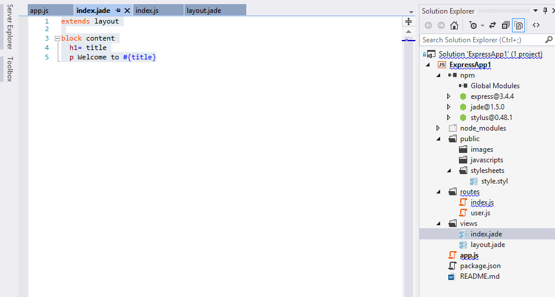

With the exception of the “block” and “extends” keywords, the other
keywords are signify exactly the same thing as in HTML. This template
will be converted by jade middleware we loaded into the following HTML.

```html
<!DOCTYPE html>
<html>
<head>
    <title>Express</title>
    <link rel="stylesheet" href="/stylesheets/style.css">
</head>
<body>
    <h1>Express</h1>
    <p>Welcome to Express</p>
</body>
</html>
```

You will notice that the H1 tag that was generated contains the value of
title that we passed previously in the render function. You will also
notice it was inserted into the p tag directly in line with the text.
You will also undoubtedly notice that the entire HTML generated includes
things not mapped in Jade. That is where the “extends” keyword comes in.
In this case, we chose to extend the layout.jade file.


You’ll notice that the “block content” reappears in both files, this is
used by jade to specify that this block of HTML goes here (in the
layout.jade file) and this is what it looks like (in the index.jade
file).

In the layout.jade file, you will notice a link to a style.css file
which seemingly does not exist in our initial project. This file is
generated from the style.styl code using the Stylus middleware as we set
it up in app.js

There you have it! How we go from app.js to a route defining the
response and to finally the view declaring what that response looks
like. If you choose to run the web app locally by clicking on the debug
button (you can choose a different browser by clicking the dropdown
button on the right).


When pressed, this will start a node.js server and open Internet
Explorer to the root URL.


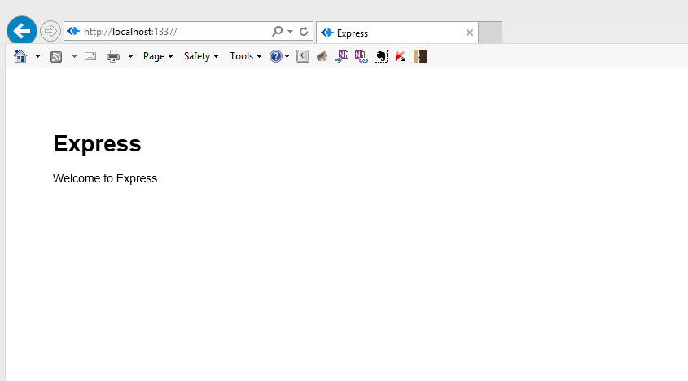

Publishing to Azure (for those using Visual Studio)
---------------------------------------------------

Now that we’ve got an express-based node.js app working, let’s deploy it
to the cloud in a few clicks. You can deploy to any cloud that supports
node.js among them [Nodejitsu](https://www.nodejitsu.com/),
[Heroku](https://www.heroku.com/), [Engine
Yard](https://www.engineyard.com/). I will be using Microsoft Azure as I
can run a node.js website on there for free.

You can sign up for a free trial of Microsoft Azure
[here](http://azure.microsoft.com/en-us/pricing/free-trial/). You will
get $220 to spend on all Azure services. For the service we are using,
[Azure Websites](http://azure.microsoft.com/en-us/services/websites/),
you can actually run 10 websites without spending a dime.

1.  Once you’ve got your Azure account setup, we will go back to the IDE
    and right click on the express project and select the Publish item
    from the menu.

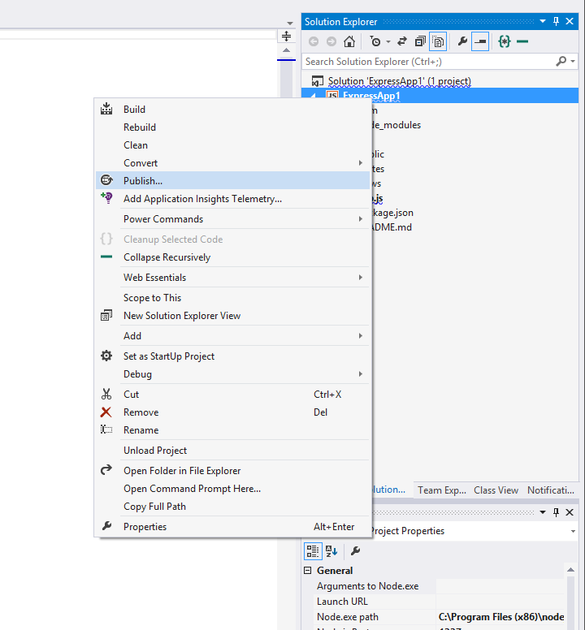

2.  The Publish menu item will open a wizard with a few options, you
    will want to select the target Microsoft Azure Websites.

3.  You will be asked to sign in at this step, please use the same
    Microsoft Account here as you did on the Azure sign up.

4.  You will want to press New to create a new Azure website or if you
    already have one created, you can simply select it from the
    dropdown.

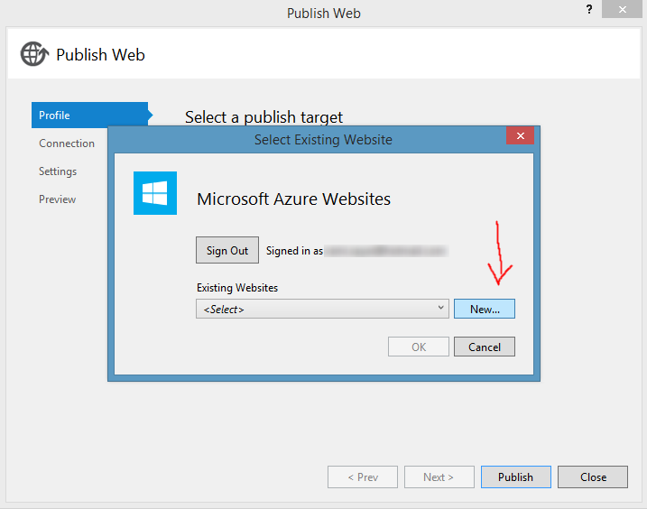

5.  You will want to fill up the fields in the wizard (just like below),
    make sure to choose a unique site name and press Create.

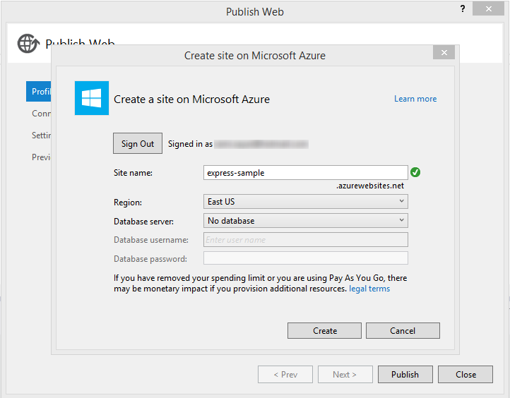

6.  You will be faced with a pre-filled wizard with a **Publish** bottom
    at the button, press Publish


**YOU ARE DONE! YOU ARE NOW PUBLISHED TO THE AZURE CLOUD!**

Take a tour of the Azure Websites in the [Azure
portal](http://manage.windowsazure.com). You can watch a [video
here](http://channel9.msdn.com/Series/Windows-Azure-Web-Sites-Deep-Dive/01).

*Note: if you encounter errors publishing, be sure to place your project
closer to the root of the drive to avoid temporary copying errors.*

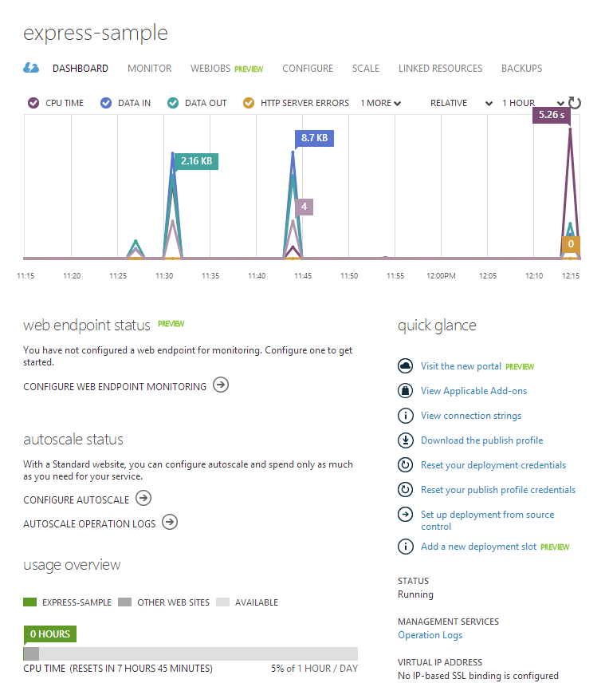

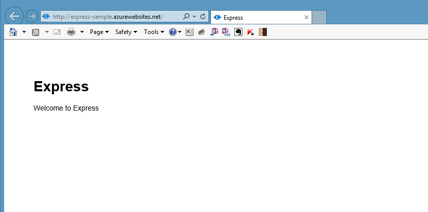


Part 3 – Building a Chatroom Backend with Node.js, Socket.IO and Mongo
======================================================================

What are WebSockets? What is Socket.IO?
---------------------------------------

[WebSocket](http://en.wikipedia.org/wiki/WebSocket) is a protocol
designed to allow web applications to create a full-duplex channel over
TCP (i.e. to have bi-directional communication) between the web browser
and a web server. It is fully compatible with HTTP and uses TCP port
number 80. WebSockets allowed web applications to become real-time and
support advanced interactions between the client and the server. It is
supposed by several browsers including Internet Explorer, Google Chrome,
Firefox, Safari and Opera.

[Socket.IO](http://socket.io/) is a simple JavaScript library and
node.js module that allows you to create real-time bidirectional
event-based communication apps simply and quickly. It simplifies the
process of using WebSockets significantly. We will be using Socket.IO
v1.0 to make our chatroom app.

Adding Socket.IO to Package.json
--------------------------------

Package.json is a file that holds various metadata relevant to the
project including its dependencies. NPM can use this file to download
modules required by the project. Take a look at this [interactive
explanation](http://browsenpm.org/package.json) of package.json and what
it can contain.

Let’s add Socket.IO to the project as a dependency, now there’s two ways
to do that.

1.  If you have been following the tutorial series and have your project
    in Visual Studio all setup, all you have to do is right-click on the
    npm part of the project and select “Install New npm Packages…”

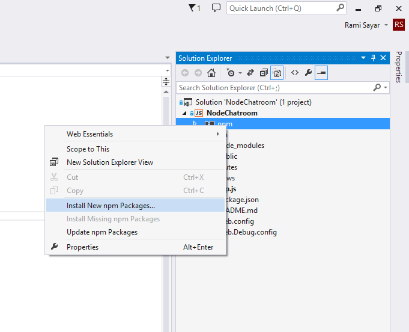

Once the window has opened, you will want to search for “socket.io”,
select the top result and make sure the “Add to package.json” checkbox
is checked. Next press the “Install Package” button. This will install
socket.io into your project and add it to the package.json file.

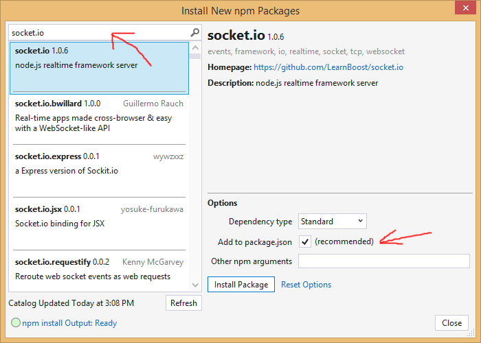

**package.json**

```json
{
	"name": "NodeChatroom",
	"version": "0.0.0",
	"description": "NodeChatroom",
	"main": "app.js",
	"author": {
		"name": "Rami Sayar",
		"email": ""
},
	"dependencies": {
		"express": "3.4.4",
		"jade": "*",
		"socket.io": "^1.0.6",
		"stylus": "*"
	}
}
```

2.  If you’re on OS X or Linux, you can achieve the same action as the
    above by running the following command in the root of your project
    folder.

`npm install --save socket.io`

Adding Socket.IO to app.js
--------------------------

The next step is to add socket.io to app.js. You can easily achieve this
by replacing the following code.

```node
http.createServer(app).listen(app.get('port'), function(){
	console.log('Express server listening on port ' + app.get('port'));
});
```

To be replaced with:

```node
var serve = http.createServer(app);
var io = require('socket.io')(serve);
serve.listen(app.get('port'), function () {
	console.log('Express server listening on port ' + app.get('port'));
});
```

This will capture the HTTP server in a variable called serve and pass
that server so that the socket.io module can attach to it. The last code
block takes the serve variable and executes the listen function which
starts the HTTP server.

Logging a User Joining and Leaving
----------------------------------

Ideally, we want to log a user joining the chatroom. The following code
easily helps us accomplish that by hooking a callback function to be
executed on every single “connection” event via WebSocket to our HTTP
server. In the callback function, we call console.log to log that a user
connected. We can add this code after we call serve.listen (or before,
it doesn’t matter).

```js
io.on('connection', function (socket) {
	console.log('a user connected');
});
```

To do the same for when a user leaves, we have to hook up to the
“disconnect” event for each socket, we do that by adding the following
code inside after the console log of the previous code block.

```js
socket.on('disconnect', function () {
	console.log('user disconnected');
});
```

Finally, the code will look like this:

```js
io.on('connection', function (socket) {
	console.log('a user connected');
	socket.on('disconnect', function () {
		console.log('user disconnected');
	});
});
```

Broadcasting a Message Received on the Chat Channel
---------------------------------------------------

Socket.IO gives us a function called emit that we can use to send an
event. What we want to do is any message received on the “chat” channel
and broadcast it to all the other connections on this socket.

To do this, we want to listen to the “chat” channel and call emit with
the broadcast flag in the callback for the “connection” event.

```js
socket.on('chat', function (msg) {
    socket.broadcast.emit(msg);
});
```

Finally, the code will look like this:

```js
io.on('connection', function (socket) {
    console.log('a user connected');
    socket.on('disconnect', function () {
        console.log('user disconnected');
    });
    socket.on('chat', function (msg) {
        socket.broadcast.emit(msg);
    });
});
```

Saving Messages to a NoSQL Database
-----------------------------------

The chatroom should save chat messages to a simple datastore. Normally,
there are two ways to save to a database in Node; you can use a
database-specific driver or you can use an ORM. In this tutorial, I will
show you how to save the messages to MongoDB. Of course, you can use any
other database you like, including SQL databases like PostgreSQL or
MySQL.

You should make sure you have a MongoDB to connect too. You can use a
third-party service to host your MongoDB such as MongoHQ or MongoLab.
Take a look at this
[tutorial](http://azure.microsoft.com/en-us/documentation/articles/store-mongolab-web-sites-nodejs-store-data-mongodb/)
to see how you can [create a MongoDB using the MongoLab Add-On in
Azure](http://azure.microsoft.com/en-us/documentation/articles/store-mongolab-web-sites-nodejs-store-data-mongodb/).
(You can stop reading when you get to the section “Create the App”, just
make sure to save the MONGOLAB_URI somewhere you can access easily
later.)

Once you have created a MongoDB and you have the MONGOLAB_URI for the
database – Under Connection info that you have copied to your clipboard
– you will want to ensure that URI is available to the application. It
is not best practice to add sensitive information such as this URI into
your code or into a configuration file in your source code management
tool. You can add the value to the Connection Strings list in the
Configuration menu of your Azure Web application (such as in the
tutorial you used). On your local machine, you can add it to the
environment variables with the name “CUSTOMCONNSTR_MONGOLAB_URI” and
value of the URI.

The next step is to add support for mongodb to our project. You can do
that by adding the following line to the dependencies object in
package.json. Make sure to save your changes to the file.

`"mongodb": "^1.4.10",`

Right-click on the npm part of the project in the Solution Explorer to
reveal the right-click context menu. Select “Install missing packages”
from the content menu to install the mongodb package so that it can be
used as a module.


We want to import that module to be able to use the mongodb client
object in app.js. You can add the following lines of code after the
first require(‘’) function calls, such as on line 11.

```node
var mongo = require('mongodb').MongoClient;
```

We want to connect to the database using the URI we have in the
CUSTOMCONNSTR_MONGOLAB_URI environment variable and once connected, we
want to insert the chat message received in the socket connection.

```node
mongo.connect(process.env.CUSTOMCONNSTR_MONGOLAB_URI, function (err, db) {
	var collection = db.collection('chat messages');
	collection.insert({ content: msg }, function (err, o) {
		if (err) { console.warn(err.message); }
		else { console.log("chat message inserted into db: " + msg); }
	});
});
```

AS you can see in the above code, we use the process.env object to get
the environment variable value. We go into a collection in the database
and we call the insert function with the content in an object.

Every message is now being saved into our MongoHQ database.

Emitting the Last 10 Messages Received
--------------------------------------

Off course, we don’t want our users to feel lost once joining the
chatroom, so we should make sure to send the last 10 messages received
to the server so at the very least we can give them some context. To do
that, we need to connect mongo. In this case, I am refraining from
wrapping all of the socket code with one connection to the database so
that I can still have the server working even if it loses the database
connection.

I will also want to sort and limit my query to the last 10 messages, I
will use the Mongo-generated _id as it contains a timestamp (although
in more scalable situations, you will want to create a dedicated
timestamp in the chat message) and I will call the limit function to
limit the results to only 10 messages.

I will stream the results from Mongo so that I can emit them as soon as
possible to the chatroom as they arrive.

```node
mongo.connect(process.env.CUSTOMCONNSTR_MONGOLAB_URI, function (err, db) {
	var collection = db.collection('chat messages')
	var stream = collection.find().sort({ _id : -1 }).limit(10).stream();
	stream.on('data', function (chat) { socket.emit('chat messages', chat.content); });
});
```

The above code does the job as explained in the previous paragraphs.

Deploying to Azure
------------------

You can redeploy to Azure by following the past tutorials (such as [part 2](http://blogs.msdn.com/b/cdndevs/archive/2014/09/11/a-chatroom-for-all-part-2-welcome-to-express-with-node-js-and-azure.aspx)).

Full Source Code of app.js
--------------------------

```node
/**
 * Module dependencies.
 */

var express = require('express');
var routes = require('./routes');
var user = require('./routes/user');
var http = require('http');
var path = require('path');

var mongo = require('mongodb').MongoClient;

var app = express();

// all environments
app.set('port', process.env.PORT || 3000);
app.set('views', path.join(__dirname, 'views'));
app.set('view engine', 'jade');
app.use(express.favicon());
app.use(express.logger('dev'));
app.use(express.json());
app.use(express.urlencoded());
app.use(express.methodOverride());
app.use(app.router);
app.use(require('stylus').middleware(path.join(__dirname, 'public')));
app.use(express.static(path.join(__dirname, 'public')));

// development only
if ('development' == app.get('env')) {
  app.use(express.errorHandler());
}

app.get('/', routes.index);
app.get('/users', user.list);

var serve = http.createServer(app);
var io = require('socket.io')(serve);

serve.listen(app.get('port'), function () {
    console.log('Express server listening on port ' + app.get('port'));
});

io.on('connection', function (socket) {
    console.log('a user connected');

    mongo.connect(process.env.CUSTOMCONNSTR_MONGOLAB_URI, function (err, db) {
        var collection = db.collection('chat messages')
        var stream = collection.find().sort({ _id : -1 }).limit(10).stream();
        stream.on('data', function (chat) { socket.emit('chat messages', chat); });
    });

    socket.on('disconnect', function () {
        console.log('user disconnected');
    });

    socket.on('chat', function (msg) {
        mongo.connect(process.env.CUSTOMCONNSTR_MONGOLAB_URI, function (err, db) {
            var collection = db.collection('chat messages');
            collection.insert({ content: msg }, function (err, o) {
                if (err) { console.warn(err.message); }
                else { console.log("chat message inserted into db: " + msg); }
            });
        });

        socket.broadcast.emit(msg);
    });
});
```

Part 4 – Building a Chatroom UI with Bootstrap
==============================================

What is Bootstrap?
------------------

[Bootstrap](http://getbootstrap.com) is a wildly popular HTML and CSS
framework for building websites and web applications. It is the number 1
project on GitHub. Bootstrap supports response web design allowing the
layout of your page to adapt to the device (desktop, tablet, mobile).

Adding Bootstrap to Our Project
-------------------------------

To add Bootstrap to our project, we have to first download the minified
CSS and JS files for Bootstrap. You can do that at this
[link](https://github.com/twbs/bootstrap/releases/download/v3.2.0/bootstrap-3.2.0-dist.zip).
After you have downloaded Bootstrap, unzip the zip file and copy over
the folders “css”, “js”, and “fonts” to the “public” folder in your
project.

You will notice a few inconsistencies with the existing folder. What we
will do is unify the stylesheets and JavaScript folders. I prefer the
Bootstrap nomenclature of “css” for “stylesheets” and “js” for
“javascripts” as that is shared with other libraries out there. Copy the
files in “stylesheets” into “css” and delete the “javascripts” folder as
it should be empty. Next go to layout.jade and change the following
line:

```jade
link(rel='stylesheet' href='/stylesheets/style.css')
```

to:

```jade
link(rel='stylesheet' href='/css/style.css')
```

Next, we want to add the Bootstrap CSS file links to the header and the
appropriate meta tags for HTML5 apps in the layout.jade file. You can do
that by adding the following lines right before the line containing the
style.css link.

```jade
meta(charset="utf-8")
meta(http-equiv="X-UA-Compatible" content="IE=edge")
link(rel='stylesheet' href='/css/bootstrap.min.css')
link(rel='stylesheet' href='/css/bootstrap-theme.min.css')
```

Next we want to make sure to add the JavaScript file that Bootstrap
needs for its components and plugins. Add the following line to the end
of layout.jade

```jade
script(type='text/javascript' src='/js/bootstrap.min.js')
```

Completed layout.jade
---------------------

```jade
doctype html
html
  head
    title= title
    meta(charset="utf-8")
    meta(http-equiv="X-UA-Compatible" content="IE=edge")
    link(rel='stylesheet' href='/css/bootstrap.min.css')
    link(rel='stylesheet' href='/css/bootstrap-theme.min.css')
    link(rel='stylesheet' href='/css/style.css')
 
  body
    block content
 
    script(type='text/javascript' src='/js/bootstrap.min.js')
```

Creating the Chat UI Layout
---------------------------

It is time to develop the chat user interface layout but it may be wise
to read about Bootstrap and take a look at this [long
tutorial](http://www.tutorialrepublic.com/twitter-bootstrap-tutorial/bootstrap-introduction.php).
All chat engines have an area for the recently received messages and an
area for a user to write and send the message. Historically, the layout
was to have the editing area attached to the bottom and the messages at
the top.

It is not easy to fix elements on an HTML page to the bottom of the
viewport without a bit of work. I will be following this
[sample](http://getbootstrap.com/2.3.2/examples/sticky-footer.html) to
fix a footer to the bottom. We will want to modify the index.jade file
now, and first I will remove all the lines of code under the content
block.

First, we want to add the area of the page that will contain messages
received. Let’s start by adding a div with the class wrap. In Jade, all
you need to write is wrap to generate a <div class=”wrap”></div>. By
using the indentation, we can signal to the jade templating engine that
more indented elements will go within the less indented elements. Take a
look at this [Jade tutorial](http://jade-lang.com/tutorial/) if you
missed it in the other tutorials. Next we want to add another div with
the class container-fluid to add a fluid width to the page. Inside, I
will create an h1 element that says “Welcome to the Node Chatroom” and a
div with an id messages and a final div with the class push that we will
use to push down the message editing area of the chatroom to the bottom
of the viewport.

```jade
.wrap
  .container-fluid
      h1 Welcome to the Node Chatroom
      #messages
 
      .push
```

Next we are going to develop the message editing area. We want to
capture the textbox and send button within a div called footer and a div
called container-fluid. The footer div will have the same indentation as
the wrap div.

Next I will use the Bootstrap grid system (read about
[here](http://getbootstrap.com/css/#grid)) to split the message editing
area into two. One of the columns will take the majority of the space
and will contain the textbox for writing the message, the second column
will contain a block-level button for sending the message. Note how Jade
lets us specify the attributes of an element using the paragraph
notation. The code will look like this:

```jade
.footer
  .container-fluid
    .row
      .col-xs-8.col-sm-9
        input(type="text" id="message-box" class="form-control input-lg" placeholder="Write a message here..." rows="3")
      .col-xs-4.col-sm-3
        button#send-message-btn.btn.btn-primary.btn-lg.btn-block Send Message
```

Completed index.jade
--------------------

```jade
extends layout
 
block content
  .wrap
    .container-fluid
        h1 Welcome to the Node Chatroom
        #messages
 
        .push
  .footer
    .container-fluid
      .row
        .col-xs-8.col-sm-9
          input(type="text" id="message-box" class="form-control input-lg" placeholder="Write a message here..." rows="3")
        .col-xs-4.col-sm-3
          button#send-message-btn.btn.btn-primary.btn-lg.btn-block Send Message
```

Adding CSS to Force Message Editing Area to Bottom of Viewport
--------------------------------------------------------------

We want to force the message editing area to the bottom of the viewport,
we will want to add a few custom CSS in the public/css/style.styl page.
This file uses the [Stylus](http://learnboost.github.io/stylus/) CSS
preprocessor but you can also paste verbatim CSS that will be recopied
into the generated CSS file.

First, we will want to ensure the whole page takes up 100% of the
height.

```stylus
html, body
  height: 100%
```

Second, we want to ensure the wrap area takes up the maximum height it
can but leaves a 60px margin at the bottom for our footer and message
editing area.

```stylus
.wrap 
  min-height: 100%
  height: auto !important
  height: 100%
  margin: 0 auto -60px
```

Thirdly, we want to ensure that this space for the editing area is
respected and to assign it to the footer.

```stylus
.push, .footer 
  height: 60px
```

Finally, for stylistic reasons, let’s a subtle background color to the
footer.

```stylus
.footer
  background-color: #f5f5f5
```

Completed Style.styl File
-------------------------

```stylus
html, body
  height: 100%
 
.wrap 
  min-height: 100%
  height: auto !important
  height: 100%
  margin: 0 auto -60px
 
.push, .footer 
  height: 60px
 
.footer
  background-color: #f5f5f5
```


Part 5 – Connecting the Chatroom with WebSockets
================================================

Adding jQuery, SocketIO and index.js
------------------------------------

The first thing we want to do before we start writing our frontend
JavaScript code is to ensure the files and dependencies we need are
going to be delivered by the node server. Let’s add jQuery and socket.io
first to the layout.jade file which is extended by all the other jade
files in our project.

What I want to do is replace the single link to bootstrap.min.js with a
link to all the other files we need.

```jade
script(type='text/javascript' src='http://ajax.aspnetcdn.com/ajax/jQuery/jquery-2.1.1.min.js')
script(type='text/javascript' src='/js/bootstrap.min.js')
script(type='text/javascript' src='/socket.io/socket.io.js')
```

Note, the first line link to jQuery hosted on the [Microsoft Ajax
Content Delivery Network](http://www.asp.net/ajax/cdn). This CDN hosts
popular third party JavaScript libraries such as jQuery and enables you
to easily add them to your Web applications. You can significantly
improve the performance of your Ajax applications by using a CDN. The
contents of the CDN are cached on servers located around the world. The
CDN supports SSL (HTTPS) in case you need to serve a web page using the
Secure Sockets Layer.

Now I will add one more line at the end to create a new block.

```jade
block body_end
```

I am doing this so that any Jade file that extends layout.jade can also
add script tags right before the end of the body tag.

Now we want to use that new block to add a link to our index.js file
which we will create in the public/js folder, make sure to create the
file.

```jade
block body_end
  script(type='text/javascript' src='/js/index.js')
```

Make sure that the block starts with zero indentation to follow Jade
coding conventions. If you run the node server and navigate to the main
page in your browser, you will notice in your F12 tools that the files
are being served correctly.

Quick Changes to app.js
-----------------------

Now there’s a few things I want to change in app.js. First, I want to
reverse the sorting direction so that the oldest messages are sent first
and second, I want to emit the previously received chat messages on the
same channel as I plan on receiving the new messages. The changes will
go to line 49 and 50 in app.js. This is the result:

```js
var stream = collection.find().sort().limit(10).stream();
stream.on('data', function (chat) { socket.emit('chat', chat.content); });
```

Don’t forget to set the CUSTOMCONNSTR_MONGOLAB_URI environment
variable before rerunning the app.js file as otherwise the node backend
will crash when it can’t connect to your MongoDB.

Powering Up the Send Button
---------------------------

It is time to power up that send button to send messages in the message
box using WebSockets to the backend server on the chat channel.

```js
var socket = io();
$('#send-message-btn').click(function () {
    var msg = $('#message-box').val();
    socket.emit('chat', msg);
    $('#messages').append($('<p>').text(msg));
    $('#message-box').val('');
    return false;
});
socket.on('chat', function (msg) {
    $('#messages').append($('<p>').text(msg));
});
```

**Line 1**

We want to create a socket and we can do that by calling the io()
function which is in the socket.io-client.js file.

**Line 2**

Followed by that, we want to execute a function on the click of the send
message button using the jQuery’s $ function and the click event
handler.

**Line 3**

We will get the string value in the message box using jQuery’s $
function.

**Line 4**

This is where the interesting thing happens, we use the emit function on
the socket variable we created in line 1 to send a message on the ‘chat’
channel containing the message box’s value.

**Line 5-7**

At this point, we will append the message in the message box to the
#messages div so that the user can see the message was sent. We will
assign the value of the message box to an empty string to clear it up.

**Line 9-10**

Now we want to make sure to append the message received on the chat
channel from other users to the #messages div. The node backend will
not resend the message that the client wrote back to itself but that’s
alright because we added the message right away in the click function
handler.

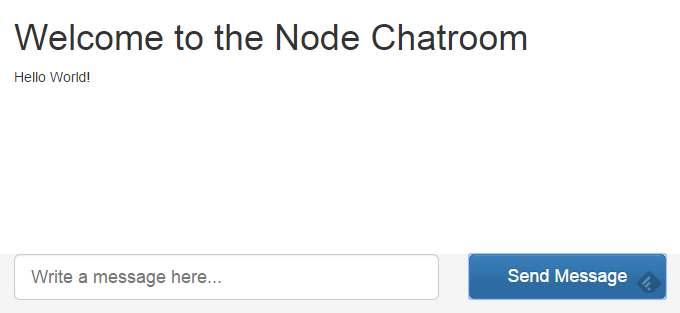

Part 6 – The Finale and Debugging Remote Node Apps!
===================================================

Deploying to Azure!
-------------------

Now that we’ve got our anonymous chatroom node.js app working, let’s
deploy it to the cloud in a few clicks. You can deploy to any cloud that
supports node.js. I will be using Microsoft Azure as I can run a node.js
website on there for free.

You can sign up for a free trial of Microsoft
Azure [here](http://azure.microsoft.com/en-us/pricing/free-trial/). You
will get $220 to spend on all Azure services. For the service we are
using, [Azure
Websites](http://azure.microsoft.com/en-us/services/websites/), you can
actually run 10 websites without spending a dime.

1.  Once you’ve got your Azure account setup, we will go back to the IDE
    and right click on the project and select the Publish item from the
    menu.

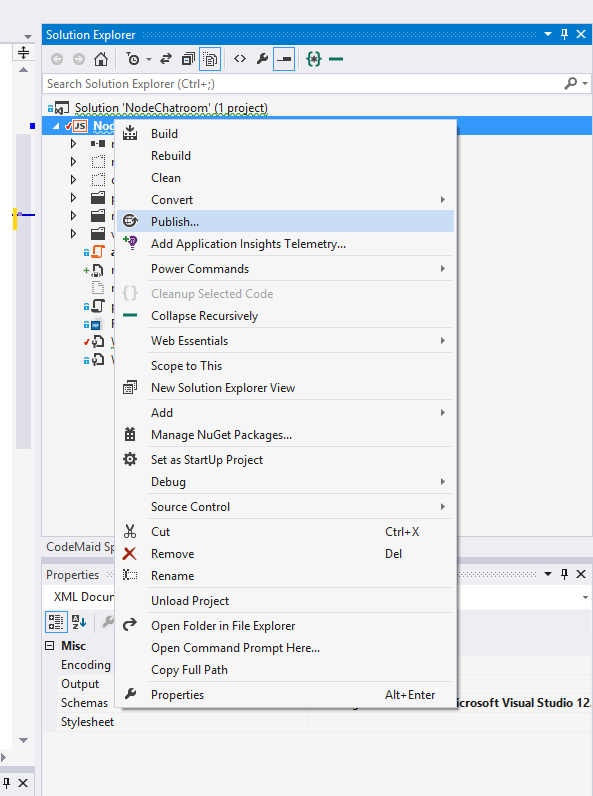

2.  The Publish menu item will open a wizard with a few options, you
    will want to select the target Microsoft Azure Websites.

3.  You will be asked to sign in at this step, please use the same
    Microsoft Account here as you did on the Azure sign up.

4.  You will want to press New to create a new Azure website or if you
    already have one created, you can simply select it from the
    dropdown.


5.  You will want to fill up the fields in the wizard (just like below),
    make sure to choose a unique site name and press Create.

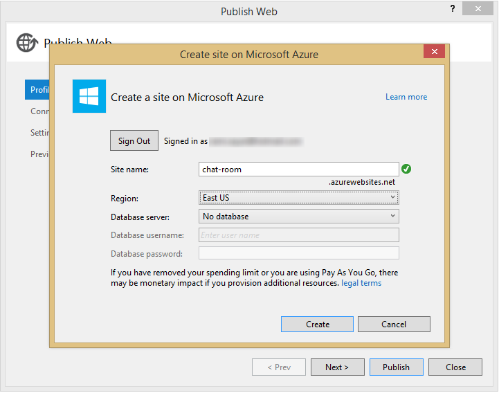

6.  You will be faced with a pre-filled wizard with a **Publish** bottom
    at the button, press Publish


**WE HAVE DEPLOYED TO THE CLOUD BUT THE WORK IS NOT OVER YET!**

### Enabling WebSockets in Azure Websites

There is a few things you need to do to ensure that WebSockets is
enabled in your Website. If you want more detailed steps or FAQ, be sure
to [visit this
page](http://azure.microsoft.com/en-us/documentation/articles/web-sites-nodejs-chat-app-socketio/).

First, you will need to enable WebSockets from the azure command-line or
the Configuration tab, like so:

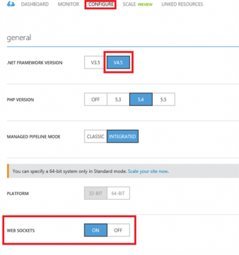

Second, you will want to modify your web.config file and the following
line to the system.webServer XML element.

`<webSocket enabled="false" />`


It may seem counterintuitive, but this disables the IIS WebSockets
module, which includes its own implementation of WebSockets and
conflicts with Node.js specific WebSockets modules such as Socket.IO.

Debugging Remote Node Apps
--------------------------

Node Tools for Visual Studio comes with several advanced debugging
features such as conditional breakpoints, “hit count” breakpoints,
tracepoints and remote debugging support for Windows, Linux and MacOSX.
Read more
[here](http://nodejstools.codeplex.com/wikipage?title=AdvancedDebugging).

### Connecting to Remote Node Instances

NTVS has special support for remote debugging of code running on Azure
Web Sites. Unlike simple remote debugging, the target machine is not
directly accessible over TCP, but NTVS comes with a WebSocket proxy for
the debugging protocol that exposes the debugger protocol via HTTP. When
you create a new Windows Azure project, the proxy is fully configured
for you in Web.Debug.config, and will be enabled on the web site if you
publish your project in the "Debug" configuration by following the next
couple of steps.

1.  Right click on the project and select the Publish item from the
    menu.

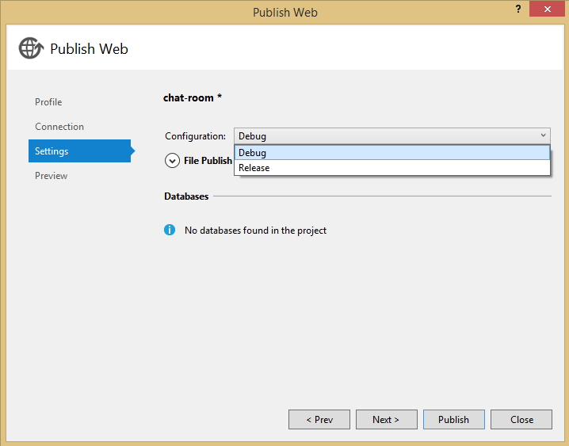

2.  Select the Settings tab on the left and be sure to choose the
    “Debug” configuration from the dropdown.


3.  Press Publish.

Once your project is properly deployed and web sockets are enabled, you
can attach to the web site from Server Explorer. If you do not have the
Server Explorer window open, you can open it via View → Server Explorer.
Then, locate your web site under Windows Azure → Web Sites, and
right-click on it. If it is running, and your project has been deployed
to it using the Debug configuration, you should see the "Attach Debugger
(Node.js)" command in the context menu.


### Reading Logs and Streaming Logs

If you want to stream the latest logs, it’s quite easy! All you have to
do is right click on your website in the Server Explorer and press View
Stream Logs


Conclusion
----------

Voila! There you have it! You now have an anonymous real-time chatroom
in the cloud! Throughout this series, we learned how to setup node,
develop a web frontend with express, deploy our app to the cloud, how to
use socket.io to add a real-time layer and how to deploy it all
together!

![](data:image/png;base64,iVBORw0KGgoAAAANSUhEUgAAARsAAACZCAYAAAAfIp5GAAAACXBIWXMAAA69AAAOwgHvXPWUAACV40lEQVR4nOy9CXxU13k3/EhC2zBakAYhxCKJxQIM2MGAnbhxTOPUdpy0feM6cZs2TZe8ddO3Teu06dc2bZp+6fc2m5t0Sfy2zb40jl+nWeotwQE7dWzAYFaDENpACC0joZFGI42EpO/8n3OfO+eeuXcWIbDT+O8f1sydO3fucs7/PPuz6OZbNs0lhy9RNDFAS2mKsmEutJIKEj1Z97MRm66hquJh931tRRkVldby63BVCY1PR2hxcTTte5FQiX5R3uBu279/Dx+vaPQ8zVSu4G04No7ZMRzi1/GhCbpYvIQ/G75U4Dlm9dyo+7qwuIJmp8c8n48UVHreh0r1cRLJi1SzaI5fm9+RY+CvQD7HNvl9/G6mfeRzc3/zN/z2wfmY+8u5N1WU8/0R4D7hvpwbLfOc++pVzVRas4iub2gmmujlbdHqIookl7n7REv7KTIyk3qvPqfeCWq/MM3vs40HPBf+3kyEIkVRqqpbTtRQzsfA8+2OVbrPfuO2bbS5qtzz/aOtx2goWUNLG2toY8ttdBPtpQN9xbTn6PnU+anz7eo4Tf2JAqqPLOftp9vbaXQi4R4H90meH1BZHqKusQnPfRbYY8B8drh/+Bz3uLIqxNveva6CEj199IW2XmovqHG/A+x8zetoLqHvbUfrGc9x8Vxes6FKf9beSXWRFTSTHOK5ESq+yNsT00t4W3fXRQrXlvPYBn721uuptrqMCuvX0eCp4/x6ITE0MukeE/dfxoeJaMKfM+IxvR3nffi8vteLQDQYLOXqAuLGzhO1VWpbzHMAXOj4uTbPBctr/OUfcbbbKKLzNGgfc+w8D8TYgPq8dIpmnZtbGFpGs4l+/uteTKLLHaD4DRwPGDmvB3pRRQHVRSepqOAiX8fQGAbVMA3Opp/LoPG6tAx7F1By0rxpQ579C8omaLysnKZHhmikrMTal/h3zL+lvM+09Zn87jClY9j388Ec9uk39hg0zn3Emj+16n7hSmfH9OST+1JLber/69WE7UrtrHaJUhcTgdx/zzKQ0IOpIHHe+d0Sd6HCa95laJz/hmoXq+c8ya8LqMc5uwtURZoQui7E1T1N0mL1KY6JSROvb6Bw4wrP+Xf3xWnXVrWt71k6QMW8De+PxyYoeqiLlm6roT9823vpU1/7Mg1ET1BnrIbazumxgecBFOJ+qWcn70ficZpW7733WeAdA3Lf9XcL1PlO0KhDXCC0Mz3t+ltq3E3PDhnfIWqsGqXPPd/tM27UuSUH3PN877138YT+4V4Qkp4Len4N8d81Let426/9xr36bOJdTL7958/Qh7/zFd729l/fTi3O/bkcgGjMv2riEU126ZdlTTwuIoUgnwaeqyBEIcex+KxzL/R3R+KXmOgXBf2YTTTZEEQy2QAGB/sB5gmDaGzw6iqSDukHW1tRkLafiVJfckgh02eCkUk1uyYTWffL5ffy3W8hgQE7NJa6Dj1xptP2E5IJWrUyAaSDsSCyid+oEImWz0lJtSPJOepR/6qNfZaMvUQXKzbxaz3gU899R/00SzbAb7QsogNVN9MXv9+qP1QTIqGkZLk+3GP7Pst7IZ1csag4TLfddAO/7oteoNFYgiUbSCZff2qYLhaF6dJsPO17kNyCnrVsx7FBqP1nWz2fy7zqHppWr8/wM/zKFz5Ja9Y2szYw2P1N2ne8LfUFtRi3KiXgNcWH1X3YkfZ7oeIDvttzgiKZtPdqjGCuhhJ62cMcFqKGICGEw9eI/0E1GhrqVKvcpay/Z0s1mfaxpSPzNX4TmElGXZERJ4p/YZ9jijplT4BshLPQE79yaopGM+yfdFbObMfLdb/LAe6LlvA0zAUBv41roVLvvWOigZoETnIkyWwQgsFzZ8mmtiTjYqUXl+Xu+5XqHDBx5tTqiefbVV1D4QqvZNNYnxoV48OdinCa+TVIB+QTbwnT44cOKdJaToMXRmmqOJ7TM7CB+1Id1r8F0R9kAjUTWFK4lP/+3BtvoZtvu50693yZPvpvX1Wq3930tl/+AJ1s3U0f/uhX0o4pKlQmXJqO0/4Xf6zEAk3+0yUhKp5KSaGlZQU0ODmnJKFL/Nxi0zF1btOK9IjOnut0jwPSfqOSbIRQ1pTVUMdkShLOh2igQqUkGy94PipijxTq9wNK1wB4HlNKgABwviNllJJsWNz1UZtMFQmwVSY/wpFBnWnAQXcHTKIJ3FfEeQx+Q8CQyZSLhLNQGC3RpBdEFLmulvZ+C048FcXqvnilljVz6n6RJh/8Fkiz1pJsWDxWhBF1iEZsaRFDojQJX8aAtp3pQW0+dxCRvcKZko2JkbJid6GJd5+nVTUxlm7wexs31Lj7vTR1DW0aPs1/QTQgH1KKDTDYOartNBOFVF0W0lJpjlgWqWGCEYCw1MwgmBpAOGNl1bR9wxpqPXGIHvrBIzR85CRf+0lFcvg3m+gPPngOGIwZz8I6bxkbSUftG4TqdS79GCDEoWSYakv1szCJJldA+qHqAFKCKuVIONHZlB21UN02uX6TaACZM0w2YrMRCIGwUbd22EMqJgGZRGNKPAI/u48Agw+DkE+suDB1HCVWQ3fHXxM82JUaFfUcw0syAxFFn8452Kv6QmI+K2a2fRZawoGUOmRtw/2pLZjw3BeQhCZ+bbSFqsoGYkdljRCMPyWuUVhIB89nIJp67jJOINXguQN49hhDdaXl6nyGPIRjgw3E05AcotQ0MsxE86PZZmrqPu/ZT9QrEA2gJZtm6puBRNHiGmz1CSipZKKM7QWwt2UDiAZEJX9BWGQcrmJyhCb7TrO6AwKyF1q9YKY7OWC0frlgSza5wFf6cUiGCcaw1whmfdQoAHO8ckr9fuloSo2aUIKQEIPpORJiiVtkBHFZ9ufB5UMqudp9TKkGRKPtNoY3xFlJzdVVX0jwQ7xSRLNQatTVQCbCFclKP2evF4MJBwPKvN+OOiXPYpztIp2e7/ECZHg04RBYqqSdmWQZrW1qpCr13djABd/zwfFgSI2qOX5ADZuu6mYmHUwUfAYPlWnHESRjX6KPPa0YYcntdM+uFfTQo9+irkSCxzCI5003X0fHR7QA/8wT3wm8F+VqKpieK5FwbBUKRANihMersX596iA+nhoBbDtXC1A34bWb7cuNYHIiI0Oace15inQ04WhEQw7xxFLPXwQKSDaVSqJ21aiSaQiwMYdY1Gqi/vJA9PE8ASASeY/XEzywpjzkZEo2fpKPH0A0tnHYtNfYhCOAijCQ9ejpyNdICASpT6aom+03rzQZDeHROmqUScom+YA440PTrmvaA6hRkG4QcuBMJFOdXdybWsFlhZdwBjxDeCSgLFXVNfP3oP+zG7Whkgc4vE3wJM32nXFdt67nq1Stkqd6aRY2g75TastW3i5EA9I5MPg8nRvcor6zznWXQ6V6yDmPwTGtAoFoNldfYrc4ANXKRHHpNBUWe62EIB24t6sr9TgUogFAiLtuvJmuW7eRGtbWUW/7AB2K11BR37P8+Z79p73qkHO8Kw2Mqdtuei2rTybRCJG01B+i1r5tad/LSeoRw7BBOuZnplrNgoLSVPj5O+qztg0We71RtljoZ5Mx1SiThGRF89h5DMkG2yCy48Yvmb7oGeBQpSrChSzhgGhsNcqUbOS1qFDyt6NgztewnA0iiVwugsjDj1iultTjJ/nJPbNtNqKmAq4ahddDXenGectojNiQgeh5jp/R+4bVNmdxqG1isoKhcXF0lMrW1fEAH9qXWhVr6YwiigZ34IN8ZtU2ju1Y8jpqVN+Ht0lLPs6CU347tWzfRruKUnaSM21tPMgxwEumtY1nvOck7eshdtPDJmPCjDdaWR+hG9cuprLmW6mxVo+kZSu0qxlEAmIEBruHOb6nd2YZveeu36aSI3+gPk+5mt973730mQe/4SGcZDxYfcyE9atWsnS2LDTHc+TQsRQxVK9YSeuXl1PT8rARXxM8rmyiAeHDEC/SYybUCumLdAOJhkkmpVKZ9htblRK4ZKONYU7MRK1XffIzEJt//Ww1YZ8LR5CZKEwiYgFCNGDF2QTsAT5ub2fAy1+ZSPIXkg1FJyk+D/UYzOsfa3F5eFnVKSXVmI+71olD6o5ryWYpzGTquicaqlka8aiqIBNFEhwsZ7icTbI30bTmGh707m85g1//HWYz2kDUsWaeiSkiWsWr5OK4M/nVfhjwItIn/uvHTEpQBzAZuho3K/0FEyJMLdXDTEY68E8TzaaS0/TdU/9FB09W87gSFUoAVShJK2llKOW5gUMkEmp21CF13Gu3UYMirpn662lbeJilFQGI5sCe5/k6ARAwvdBLPY/W0JE+b0wLzmvXzmvomz84kctTyohr1q6lbY1TDlHP0iErRksbYoOXWCbtvjO+nzHBKAmogzKrUq5HypRoDJUKz1GIRuw2LNkmvcdBEKRHsgFpCNEIbKKxt/sF87Hq5OOlMm09QjTaM3HR3ae3qI5W+l52amUVkjMNxJBsmHDyxNLC7PuYgP5ZSpmlk6D4jqD9rhT8bDb2Nn5WkaVpRMITCjBUJyhO7KlS72Vg7dzSwqSwuWoFe5Bk0JrRp5BoIkriwDSH7YbPo36D3k+tmGOHL9LS61tYtVrTTXQgMkmbMAEwUco04by+WUvJFyu2pF0njMXnzh2hieJraS50gdYrSaAgtJxdzgViS4hoe8YbbrsrTXJBUBwA1ehQepgMB87VhJvokWeP0q7rKt3788FHv+aJrBZAmltaeMINnBQX9nwgrudO0teP59eZLOaYpCCvnoClloDPQDAAnhckHMpg4/G4wEWVMg3GpKUdsdsEeeXSbDZB8DMU+33m5xZPIyIHEtCXIH3ToEIFEY0Ak+LoPAMI/cDGq6mFm/Ciksnfyw0ovFwEGYnluvGM4HJmgFAg1YhXyg7sU59Fnf2UlkM7d+6iP3zbbfTsU7spPqIHrqhL0VCZqzaNR9QEjV/U3qiubtoaXkInlaTTTFVUu26DksBOMensMQjqpeOn+HtD1Mvbuma1NAMpw0xngFRzYeiSngBqNWVJRalbVB6msvq3uMQCdzXbbdS/hBpzIDchG/wVaYZtL4p08PcLf/dvdO2WZrrht/6K94PtZywZUeSqfq7+GvZM7T+2x1o4gdMcekCx9IDJfMCxRROjfP0DhpMLzw32VBjeIdmYxG4CJLJmxN8uI5LkGofUM0lBvgiQbjLBJRsxBosaZQODkvORKOWKDDL4ynY/l7kJyQERcBTp5LS/25uMgDMHtk3CdH3nA44DyCOozy8FwsQrwRPFgz2HIE080/WcWlHK+UXRhlQelHm/mXyEhBybDYyRXzt4iGZBMoosBuJFTCBjilhiSkI4qvbp/rZeW/H82YDcOULfK7hIjU1L1OcXqQJqlZpT+C7FoWqt4okDMqKoXphmu2bVZDhF8abXKZVLr8gwEvfNHqBv9G3jiULlw9TocNDxkWra3ryGdm693nOtXY89zn/P4l/nPp5o5Te+3bPPTP3NLN3IKMO1QPLpHopzpO7BbzzK0b4IwuPAyNI5N0A1ktSMgBwwnUelJ3k+48sPIlXIeMfxME8zyzWkyaOsJvBzISEhnEy/76dOif3MJhp28MTTvY5p6Qp+yZhCGkJI5jZ5DfgRCqtNlG7XEZiE40c0notyAs74BixQIB+7sksu30BsqkRBr3M5BnClyAqqpkCkOe361tG6bAyGQZdSxltXwqGUCgVgQLX2jlIL6UHKapEinM64Ioiw0k2V2gRiWUPaeN/dlaB4xQTSihhis9N5NEWumjUW76ZaJXWAtE5MF7L+j+0Viox4NVYrNaSo49XNNHhqXK34bVSXrGGvE+JgAEzz1sOHWKrRdpibWXrZ8Jvv4+2rLh5TZDPCLvZbSBuAD6l9BCzlqPdNbz7Pru5CJRXhrwBEA3CAnZp/jbU9rucFfxG3NjttGIgv93lyTlIRexhha6p08s4EQQmYpi3GtsvgfXH1bpoeuS0nA7HnXCQ3ylK9TUOxaC24H91Kd0FSKpMNrN0DGdRKiaPxU4uCDMmyjd3h9rEMCNFIFHFgQJ8DuTibaObr+hZ1Ih8DsR8pmG5vfJ4vcSw40cDtbXjrBKJSQTrz2KvKGxSZ9PrGi4iEYxMOntVQaNL1VuxvS/Lggpo0pqSWF5SkKWPFVOfwWshH52spqYNSuTT7D7ey06Bp+Spq7xpiO0+7Ur+wfah+jg3LO+96I/2b2gb09nayexrxL31F61jdAaA6cabR0W/ye5BpX3Sa+mDAWR2hfs4p+qZ2tbcecjPdnzGuHXaf7j49gW7cvJ7VNGSTiwG6py+qJJuIOu8e5/5qKWQ0efkLIdS+piVR2li+hhqH+mjH+jr9Qc1id59QQSHt+O5+OvCG69MPYHCETSiauDXR5KJC2WkLOsamyfBMGVHlTqycaSROMxALzCxeMRrb8TaCINe4+8OWROPabCq0X0okGwns85NscgGv2j7SU06JmHkYiUUKyubqNm032eJy5HhCUgtBOLa3DmADekWKcLJJdBI1DIhEacY6IUBv/7HznBTYmKhRv3WRdiqpBKQAbFfk0WmEODQaxw6rSWl7MmXBgkQ01lytpB1NJvuPtTIRgXTg1YJqM77vgPs9RPOCP0A0gMTWCCCVwP6x8tqfU//Sr3NjaQ27tP0gHij3GtRxGuuvc48LKQZ3U0qvmHNHgGzuhx//PsftIPSjP5pbwN1j+9to+5oQveviYc/2qfveQSUPPqTftPfxnx1Pe/f5d8NMV3JtE9vObAgBgWjEFe5HOh6iMVIVIsZ72QZIMjUWDMkAB3zJxrxZdnqCTR5BpSbSTlj9VGNtccbAPjty2A9BQX0CTCgQjxlPkglMCnkYiG21y480zL9+MTxBRGTag/wknVyIyN7HlGxg0xrqChBhAyJg3Rgbib1xgv1AOljF4Y2CVDRe+GNaG1YLlSKatzQ304BaNOrUCoe5HV5WT2trqqh9WC808f4+Ojk3ywZkAOQBVQkkM+CcJ5elUASDAQvJB7VcALzHP3MlPX6miw4eP80TEwAx7T+tJ4iMtxeKl6hJ/qjnPgGwuYAEJJ5FgBSDZezVaqCLs4MsOSHTW1zlMBBT3yGuD0SjUSqrnKVJ9XpVpXa9JydTNX6+/u09NDI5TYMxb90fycWSEhM2FnGwYbqB0CUaH4BkftkQqtpm52i1ur9llE42gGSBiyvcD4EJmU7JiVyMw4BLNn6MLAjKh5LPgExEA0DXjGdIXxA1KuTUsTEhq6kEiAlsFQG/3+EMrlzTFebricoUCJirJ8o8Bl7z1PMhrqD3ucK8T0LCkvUdm67zDEMzoE/ypDgnypFsxIbjcW+qZwIDb114RhHBEiaXjTUxOldWzx+DaOQvCIc/V4RDS52iEupvxeAI0ZYlPDGEeGYUaWBM1FZ4J5zUOwLpACCMUSpxa+nEFTFhceP8MIyDimIajXt92nIv8T0a7VcSRwWNlofcNJ2I+u3+RITqQ6kIYqhRcPNDCoIniqWcqkauyQMM0HkOcJxTRLW9OMRlIaaTxTShzsOOXJ5wjPf4vaDxUqsI+2YQdB4amRAN/oJ41hcWUNJnP4kozpQFHpTxrUmmweP2BvA+UzIqkw1UGZNogiKHMyGTagVky5MSNcovVYENlDwJsqfqA2Z2cza4UkoeE1mkm8tVdzLlUdmf5apepQ1Yy/Vtk7BpIAYikqLgot9bLdEhewTmdV1opVnHbgKResfm17nEoo6sXnvPbYrO0iq17dyw3gekAykHWG0QD6ShE5J3pcamZGBpe4haZS+kcrJg+xFpsLvDvPbplB0ugwtajLzwHPV7guYSpL1JpwO/64uONmuD/u2kz0Ler6SJfitvE3Y0GVtQt76u3j/pY5/M+XQQf6aIu5NSdXJA0ifPVKjFQXsQgUvXjFNDr1NR0cp7koXEfG9meUt5iUKDT6E+yWIAsIEYSWLLltdy1TxBrtKKjWzG4kyQbO+MGd/Oqut3PNNAbHpdcpmk+RqIM9k65mvoDVK78g0QzJWU0iQ6g0hcqPeRCe97ALYaWTow7WGngc6fIhp/lNBqJhwBMrupppxOnpxwiQd/ARDOWSXtQMUCoK61O8QmhmSMgW1bajiMP1s4Qr4Q9/bVBl+H8fzwfjDmXSBO5biQevY/ksVOxKld8rAvZthRkGLJ192yiWsS2VKNpI4IFtkrm6hTJmFkUrEAW8UKSmews8XNKn36RJdkdH3b0ZqmCmXnRuVqs8nXQOz5ngM/28uo2AR8iCwfg3E+kk2mfZCXVhftpe6A73Jqgow1IR2RcPDeICOQy+SZAeoM69SDNzU0u8dZvb6Uzrb5Ce7k2GyqmGTOEUhFj4ONG8uVtKP3wWcgJWLiaqUTimygUqHoJnKvQHRSixfA6x3b17MxdSHxchDNTzLMEhNiILaxiOuNGBtAKnZgX7ZC6H7Sj19ZCjcdwtlmxtgEFc9yM4GNpL58SpDmMkkvN+jKJolRQzrxW3GDMsRtG45JOJdTQ4dJmYufp8g5Y+S0EItZAN1RYWEshBSDlII6pQYggdLEVHirIpyj/FpIByRj2m1ExWofJleawV+QDhONA2y/kSWd5+gFXiEvuCulma6CJNBXSlmPn3YEEQ2Q1Rt1OTAJxy+q2IRfaQkP2AuiB7xfUS5Ro8QbxSUWfOrrLgTsmjZ+A10mcib1zHaTA7ZEk0+cTrZ9zeJZNtF4pEYPycyk7DhquxkcNttXQGu3eVWnvhcPkA0QzJGTrXTdxhbXIwUJJt4/4bHbmERjfq+wXpGKEzRip83gWmYqa9T19FyRZNpX4Q+omc311ezF0ypUynDvB46z0dneudtlckWQu1zemyUmxBOVqUSEX8KbDWQ1i71GKtXlonpcjs3GnuQmcQQlbV6JFdjvmPa9N7O+06DIxG7Z4kdAHUZqwkalTuULVqGGq9hOA/JhOFKPKQG51wDJpquD1irCQdCgn70O1QRCTdXq5EbyPp9XMT/AU4as9MZSLcXCSCxdFjQylJhYCPiVnxDY9hvkjyCOAUmAI0qRa2C5JLi0hIlcKgBeqUp9gCmNBBGHEJIfkdnqkh9saScX2MRXZ5Xc4PiVeHCoOEfQYt0xDcWGrUYSM2cT2vuwJkPeDWBKMSAWkW5W1Zylkhr9HhCjsEk0sP0w2qqU5LOGTnR2emoZL161ns609tKSGa2Ub6gopL5XVamrDvFmCaRwmg3061qEbG/YTiQCMl8PlAm77ESmOji1RVH1u0TVTjpZgvwlG7/qfJlqG6ckp9xqEM83zsYe1LbqI2SRyR4kQXylhjF51IdksqlIQYZk0yvn1vvxuS8Zo7YN4oFxFu7MCLs1l2T0PgnRiI0G74Vw+DeX6c9FupH9BbD39FeE1fKTMjbDUMz2xQgK3/fQ9avg1V7J9iiuCFc657ixc0O+BdFfRQqTRamFxlaf7MhhwO0bJZ0KuRTPPIkmE+yCXCZcFSpLmoJpILbzrQD2Rqlj26t5NoihNB8DoxkLIfBTpYKSPE2Cs/f1iyKW15nqHtvnAIj9CpD74xdBjHCDSMiSZkyIN4q6eWCdnZ6ipkhYk8GYv9dmraUaSUCfabeBRCPkw7DIS47Nko+SbGaaq13JBvE1WFBGkJNUUUyLkXk95K2JnA0oCUrzK6L3U4+yGe3FRvzNQDzd5e0HJhsQDQgHHQuvBCCFBDkS7WLnQaRjSzfmRJL3fomY8w2GywSbaILc1pnicVxC8Tm2bMskPfldl63amfdH4JH4KnQdG/YglF/jSjEoHWFHj3KyooNri2eprLqMi2UtyxJbY5KODfFE+e0j5CSfQZJCJWIkeEadYDEhHJTS4BbAY/k5BBYiWfKnHTqK2Es2fpINsEiq64tkcyWQKagv5SrLnBMlkPoq9kSSOBt7+0Lr8H6Rw0GTHvCz2Yhq5WevMb1RNnnkqkrlDEzOWqOspWOf8QtThz2nY+wlWttUwrE6r1cLw9oGL9FASkEgnkQDiy3GhksupAmn3djuRzju6ca97V1Rh3fN8nK3fzaIxw6Ay4RX7TvzB3K6kDNWnvAu8UFSDUcQw1ZTpHRdxCpcDZiqlM721tuRE+VXexhw7TaIaKUG6qCX0vZJc307q/dCx1/k0spFEJSEadtmACEx0ztmu8Xl+35xN7nYd9JUTEeycUMOzOA986/zmXgQGxOTFF7TxK9BBgf6et2kSjftwIEZFSz7i0cKsG02ph3ITxpyryWyQg2M81yt7kqo/q8iM5C9vn5S3fc82oovqDcqG4IkHK06aSOTGWvjFswyMo9tkU3AOSCm6zvHCOLLScTMVGYiX5jHyhZkmIv9BrBVTb9KhlJlzpdgLNuNFEZHyU9v9yZNMpBqTMnGJhqBTk+o4s+PqH8gHFNtsklG4nCgSqGgFvKlpDATzgkN8GA8nk+x+8tBviki5nd+0gHJBhnxdaXRNI8U4NeQcBE34Zqcdr1RucJuqZoNQasP1791Gltl6qrAr524j6AizphMQjj5ur5h9M01vyaXaN4gb5QZYWwakMXobB4/WxuYbAPXz2YTCIdYECHc6hC6BPOxDQfBCdE96hnpPlBCCiACSDXIeEJRblTYswnHRqKnz5P3BLf2tc3NaS5wVwqieoqo73ROT1AI9priQuq6kGDpRtoAdWUqnxGAfJ65CVO6lC4VlOOxrmQnD0G+BHg5sG02Yq8x89cELNnMpz1oPkQjMH/YLAUK+NWysd3eZvkDP0hQn1kkKtebfrkpC37IpAbZBmR2gZN3oMw3RQHfR9Z7tvpBtU6ZA483qrRMx9uIyxs2HByi3FFdyL8MJYgDmd9jThKfpFtGkpNUd8P1TDogGSBa6v0++5AU4XCZic0bfKUb/o4iGykfimc9U6Fb+laEQzy4X5hdODc27mF1OMy9paQHFOrPoL8UFuXuoTna+ZrXub2scA/bLkxwbZri6lqaG0+6+VWosyMqqFQdxHmbGes24JZHGYpcKgxg3xtb9PH1BJ9WfzUBmt91VfTZ+ROtDWgj2iOlpRvbZqMrMSZSlfrYOKxOMl/pBshHwglSoyRVIZM3is8zhyhiIK8V3cF8V4FMXqFMBmCBDKag7wRFKNsGZDvOp7a0QN3rVLU6v75aIOOwet7h5c3pRG6qULDXKOlmQD2nxgSkjkrPOUKKGVhX5xqWUXZCpJbVzc1kQz4TYA+oSNi+7/nnKG5IOTqFIca/ccL5HhfZUpJMnaNCBRklsyHTZEM7XqgKVZWTLtlwD/BYgqqKiYl8+406vaIW1e0akOvXSiPn1RxfNEdlqxbRjWuvpY72Tmpanqq9gPusSy+UoaomhZwaPIh3gx0EDe2WLq2hNTUJd0GGAbyTvGERIAsYyAHse9Mdd7kN51Ab+uh+x645lko0ri2dpsaWGve4kArhhcY1SfEwCB4oRJYNyDxAGdZIqXdOBnmiACYb/PjcTEGgR8omFLO4c74SjqhTkoQpRDObyUBsVPjXk6A1bR82EPvYJK6kLp3JNuMn1dgw1Si/CoByHPu4Qb9nw7TZtFU16No1AQGPQjToQslqk/FXtuM5wRN1Z1mNK3mIOrQXBavUMZGBfa1DHALOcXLUKahC/L3OVGrB6matcoFw5JibHLKxJRxINUMRvYpLxYD5SNmZwOVZw/5FxDEp60Ll/Nto61JRqkstyH3ifUBSNOxO+DGn4iAkgFoqppPWOU+OFtJIUZmin4RbVMusiMDHdGyLUjcazzDsFPpCJUOU8xTzArQBPHsunLWlKlUFsbbM6FpKHO5QNdRFcXU9YcWgWOxzFTZ066fMBbNMfnALnrPdJHFJB/dVRNMeXtB7e3su5GMH9klOlF9ulG6z2qAzjplkej3xHn6wjaJXUncNIhRzu62j225tPwN1rvE12a7LvA/IH6pT9ybQiGpIMrp1x3Dqr8Pfpkorqs6mzbrZ3LXNffS4WlG5Zu+5U0wcb73lRnd/kVQqDFsNgEA9IRkBpJgg47JEEXOJU2fBy6cKQC6YmdHXKVX7BEubK7nesUgEIBppBAdi7mKJIfWdt25eQ9873uESDSamFFMQtSo2rGSbcsiKk0pamKXKaf3MTKLZvLmWS3n8cO9hN9MdJUPiQ+fdFjk2QDQN6+qpuzbBnSlQ0xm/DU/iuNN7fSipn2k8Nv/5YatRgJ90g9Y2TDYVsT6qcPYVsgiSZmzIheKzXFYYk2gydVQAuLxEootfR4z2IgK7IybIypZuroRBzpQ6MsXYZPs+JJlmJdpiUO65cIF1eFGpgqKT8yFOIV75K/fGlGrMgYoJA8AYjIEIO438BZZu2EyDp467+5uGXBDDPU4G98lIJW0s8C8SBCLB51BAsOJybeEmx4Z3qp2lnLOU7kIHIA2ZUcRmnaQXOhbOXlNUhHtcwmYFqBi6ap8urA6HSnQ44kgAN9Loym1EZ3a738XzkzM/qkgVOVyFIfiHe9MCU3EdVcXaiCrPCLd6xtpn5/W6wLrYIvkc1eIBwgG54d6hQ0Iufbvd4xqSmNhL9Rxc4VNt0B/o84YlyvZG+alRsH25apTJpCaEZIJIyOzZnU2y8evO4H7mtH/wlJlAUzTTWAkpJ0m+cTZy/DXW6n0lDL9AJnUmm9QinifYBf703jfxdkgIsFc84lSdEwNekE0ok8dB//60xztnwlSjeIVWq1NtQ6VSTqepRYn5Luk4qpS8xmCOKBKxc6Js0rlXvUcqAxmpDKZXCkR01okIfsuuZjpZVk8bJ5Uk85o70/YF4JE66Qi0pvru11poIYB7Wrk0xIRS5cSRmIuItD5CS170pTIre+KZQ9XaXpRgiW3PhR61+oe4NW2Ea/ducPfFdeD+z0yrg8V6XcLB94tKy92cxcd/dIR2rrdjzVMqnSzU0pEUi/RyZx+UAamrn6GImhQgd+5OSt6FpZlGWdrB/IrHsttrBFybeSb3Bkq+cTaZSMMkF3tbECEJbJIxq3ppktFE48bXsB3BkGisspUi1chD4uNH89Pf59t+N9uEFxe3fWwetBiQ6t90ySKP5+Vax5iKQbG3NZ6xp3g2exGxgXjCQ7wS1GdKNrDTFYb00ASxt6LMRDJF+OYKiF7cgJlGUP+aHW4NG5OEzJwpyYkCEGUMQpLKNbDPbNT1xF3VyXSB47s6AHCCpZo6pxA6X09kBd2wMcJVA089204LBfYUTsBomnKYyHPEBJuzpGy77xJ6SY1Po5qglloK1zZ7avoCUp+3SKlNyxRh0PK1tFqRy4CaNyVKepqJacLF86lS35f8I4x1sb/VGd0g8PtCNFBtko1VzrnNseSR6Bymii3+WfpMQHY+XA7gCGJrW5Bx2NM3inOjEj0u20qelEkgJvwkGlsKygZTkjED+jzV+cwWsO4k8BqIRVUYoPl5ooBcM6z94GfMlW22x4PdqcPDjgo14caqCEA4sGscmgquq5vr+Zn2KxAxr0GWFMCifJ0mlahDNJIbpfV6Z4Ay0a/gc3Xr0JB/sSwbJgkJkUjRLL/UhqB8KvFCkTPWkKOFMhfxpQsruYrNxjSW+uW5Dce71Ik3qYm+W7cAPqllHBiIwcsSaIixjXovZtFwKQger9nk6XG1rC/OLWPErGG2pwZSQave+ci/nxxms4PON0xpKvjd9uZ0tTQI85kDdoFzWyhhAzE3+DKqomMnNhI77yHGgV3tg5gHyscz5TYic1IVYGfRNpuArgpGy13QqGkgtlu5+GV8Z7PZyIqVa2yLH4IMxZVWsBfiLX59K6SXZvrnPYdoTcs636A3TEBc12iyOGOypU1y9nvTfuWnYiJdwXyO2tvnSDOOvcYUtyGt4GzN1ALUnUEpUCEdv7SDIOjawzqS2C+twQ+7lmsprDtURqsXl7HqWdqdvb5RPhCbDUrm6s6Xp917ivYtXR16skONAvw6SuIpn92wlsJOGpAQDQqPoZWuGI2xAEhr37GyajbJ6P5VKfd0Y2KJkj5WUZdjfBY1S+DaghzJn9UqS7uR38sFucyBs4MD7P6eUv/JGLKlmrSgPokgZkIxjL3uhRRZvSaMAwn8JBzZxyYh0/WtmXBZxna7dhsRFOX2iyDmuIs8VajLgV/CZCbVZqlS/u98/XV0XUMzT6TbCwppXYPWnyXiFn8RBBdaWc/3qRJBX873bTIMii5mt61jszHJNy00oMJKakEsjRM93OIkvMCGA1et2G6OnOzzlIjgc+c6w5popFyEKfnIdtkmpT4BFNBCDI2fVAPYBATjMUR+RCz/r+3Xudsf73xxQb2OfJwwuS12AQTO8Vwh6QSSkjj8ukju5aZ6F+lUTPc5Z2KnS9TYtISD3LCtsSlEJSvbaCy0ni4l2pSakZI+zPrcMDSvDacMv5C4+mmlp6keAAN+raNOFYOA1xmEpIhgMdXQuCEQQSoc8qlNn+u9TAyNU1xdk+lh9vOMsQ2SyF+NkuA+vy+KmgVpiFuPcm5N1PM5YBKNX1yOKdnYYDUKNYcTwVHDpmVeAtYuB/OVaMzXmcgG0aZrysLuRINbEhPppeOnPPshUhb2jO1OQ/ag88sq2ZR6RTzJHXMlm7Fpx1Cs1Sitsw9rVVVKTDjqK4gGq3e4bNhDNGYuk0QII1r4uR88zfE0zcWpwf6cEz2MzwHse8T5TFQqOynTrE8M3HjTa/nvvq5u1/YDHFATKTm7cKqU3MezL512pVLUvoG9BlLIYoOnoUqZko14o0Aq6HlOxzuoL1lOE0mlQZQuor7WSbdgV7WSnK6BkXVyhBqXlFJ3bIRVqGWhlNPGdd5wm1t9xzDn0JkTQXUmxA3vAb432cW2G7vOCwzKXR1RznFqvMxc1mw1xgE3ziaS7KOouojoTEpXtYlCkBZx7OxjRiD7EY3vSQa4vbnzIl6g17R0wnSNWK1u/hMmjGuz8QnquxKwVTNPtvasv4QD8dsMbgOpYI4j5kTiTCT+JJHMnTgzeaNMtzcg90e8USgKL2RvB/BBjWqh1DasmGuVVGZOckCIQVIRcI37FNFAtelsJFfFQRtYxH4QpXpSCzkBtsQE2CqmSD37jPdHfNTQywXsarC7jFSMUWmygO8xDJwAjKKLqcAzZsU4K5UTYFzuGIaqU8j3WAL1AJBWKaUkh7mEU3K1uIRfL3OEKfEO4y/mz1qn1S2A+TeXUM/U6bUG6X9zVTkdV5ILt9A19mW7W5/2SnXXlen+3OTY6Ia66ER0kDavbuDXXJyOLi9chBsNGF5naTzgGohht0lSxCUR10isiCOIMFxbjrPNfs8XakgyLhk5hmeJsckGKS2RlpFM3r5RA05UqR3Ulysu1zCMfzYBmf2odlTpiYkJxtKLTxwJwMQTQDbZztHjHVOSjX0vbG8UxPq5kDedwHR1m54oQFzbZokIYOCgJhCof8CvvPkOlzge7nyc7vzZ19A60upiyLhuJGCGHFUJJCY2HHZ1n/QuGmEjolgkJnwH93OhG9T5ATV0YVNZMokFspdJAG7v1u5hmkUdHyfYsHJqlokKxcCFSAQIbEMvcKz+Z2bCHCuzumYJnVXSC4LtTqgBY6pPrnF47Dy1K7I4pCS4HeFC6odmwcJRaqFGITOqTvc2aRuR9krpWLUmxw7ayxHO3UrN26xE6b6idWrbpcsuNaMbDWiFaWho2lPQjA3E0P2ESYUgQAqmcdhUl8SIbMK07UiZUfN4so8YnrOVAnWTMI0eRqxS+fc/u6zayZkq6gXtvxTGX6Ndi1/WtulWF1uFJCGKigBysYmHJ22nLnGZKWLYVp9kW1CcjS35gXQWW9cm9hkhHXP7m9xiWfibkkKEPMNWigFURA7SG9SpCRLjIYDnTSQiQBPMhBtTY94nE/i9u58+TE+vradPHFr4OkwIQKNyLWLIKg8CqV92ntXM6FAJ9STrqXcGTg3v74P48DRXXTzGz7YDUs3UXJqNDIXaZypXUuHG66hAqWbjVaPUpMZ6V4eOczFj36RRAEvxSLBV88j2UglghzkZL3LbTkKiiTp1o/G3jpQEE2qi/cda2Z6E5FIT3IGDclt8QZ5D6l7VGpKbC4dkzIUgY5yNqEiASSZBKpGQjJ/3Kh+XuFm/BqkKpt0mU7pCnU8A25VAWh4ToUF9CpIxjFWsu2vKzWcBfCNjB0fSPteq1XBO5QKCjNRBBnMzqM80MppSTdp3Soe5qZwN030tcI28mzd49nNtLIqLEMQHiI3Kj1TkewKxDSEAcuqWG+kLn/n3KyPVqIkyWpyyl8k9Xbnk9TTZp8mgIpZZfTuA7iHHztCp0Tk2Lhc7PcwwF7qx4lcQSz9l9ddQi5GVAeIxJSJNKqn0DrZPqm32Qt3lSDWww5heJ0g0dTTj9uPWth99HtvXEB3rjbNqeH21VqgRy0THhrMSDQJSZ7MQjQ2PgVhIIpONxdzP3uYn3WRyidvFsmxEnP7efDyHcOS9H2wbRS4Q6SNf6caELWHgeDesqeU4kO8NdXiC6MTzhEljkwyyms1aMPbx84XtoUsL6lOrLbJ8wz5eatOGg9fwTJEayAigk3wo22bCofIOIQlJmHE1AhDNyblZt7qfvb9JMH4kJFJiPiVE8sF0SYiWwmYDCUfdo8oxfXwhGs4nEsnCcTfDHgW7lAAk3vTmO2np49+n0eQlGi+opBollZwam9WT0ZB0cFyQDgCjr9hx/aQXHuOUbuuEzQaqVFf9OlqsnpEa0dR7po+6Tus0lVonGVSA10jgBGD4lhirIiu/KwiwQ/kV6WMVCo4bi3A4zsbj+nZgqkx2KoOfKzxom+nh8nODZ+yAKccRicbI/IbF3Y9UoEZ1WAbibOkKoubkaxST7wlJmRIFmt3/P2/c4aoTyHsS+Ek24va2P8+npm6aS9wngtgP+tktT9sOcjGNiS1CPqtSUo/YcMSjVlZVx3EvsF9IJreog9gmyYEwCi92vmOrVjaxmBJR3LDvQP3KVudlvjAzvrc1Veje4k5SJk9KaqDwxn4d1KcAG1Kvo1ZK9PGB1n4mcqz8o2pawuaD8hH9US0xFSvygQ0IEKIxYVZFsAG7CqKnTcI5HptAihkbq8fDwy4RwFM3OJqgGzavpEXFeM4pgoeEtXmdttnphVyf8+Wk+IikA8awj5MW1Mc/bJBHUM4U4Cfl2Mcxvz3vUgBOThSnLjglJmyiMeu1mER0pSqjCfzibd7ipB2IirFTTSjb03LCmYSSomDWa5H3+cJb33jabW0jqRxpEcRq9cEzFMGG3d2OAd5MWTABKadj0r9B3cH/2MeDm0ngyDC3aEUBKaiRF4vC9BheHzpPO05foGu36Otm6SbLtcIAzbFHTieG59R72GqSV8gw3B9VakTZJK1rKGaiYdvWqpVMChtLa3hCY9QjqG+QjrMEIVKN5FW9cQWkhxn64ktzNFNUwn2TTPsYyMcGJJzxaVB8r7vIj1k2Sh7nimjgrjZd3x5vlA+iiQFaWwwK0mMUAXg7WppopGwR9Z89QHPqmE3l11C7xyAQjPIM7a1FcrbrdV9WDWI/24yNIHUsE9Ia0xmJmEFAvgis+8Dl2m3yqe4n6XGmCoVJYZLLjvoGX3uECVOlEtUBA6uzLCWs5lK5b9SQbAC5F74GdCXKi2TDhmGUk0gG225so7EAgYiwvYBADjzX7p6nVKpju8ps6vX3J0K8HyTAreHsHsmnFTmthjt972F2nH99dOaKeqBgY0EBq7lQiMLUQ51KDcJkBRlguYyWTnvIGHlI67tjTDjsKFCSzVPDIbpmyUo1/js4IbVwkRofSmICrdqN8UQ9k0hiEMmli8f4tW2zETWK7TqiRlnzYnG8htUoQHtsF6n5VOfZBxUDuy7EWYXqC0EaSc2Zy5YWoSL62G0WrOB5JlKROjmAKd0E2Wz8Wu5mA4hmvm5vGwshDQm5mIWgBNJ0zYRZ40W+C1072ZGYt10iKBvaNRCrASF2Ab+CWbId8NsmgNQhRt7a4x2+aRYmQEI7KgupYMkWtTjmVqwJatgBJxz+Sru6YY8YGe2nyqpmbrBIjmpwfGRRyiNVikjrFEx7DbB+eTnHViE9FDYgWZQkzgaomEwtMKxK9R3yHMPPZoMxDlUHiwSimD1qlBPUh1rQ4o1CcGEYc47j37xhDvhuT3JQO4JC+hu5Fs/CPSotrlAXd5HtNKahWLu/vfAkYgLZ1KJMyFSmwvRq5QJJxJQOmAwrzmahiMUGJvZgHhPbz/0sYLduqf91I9it5Nom3geTFe8lU1cAssiXaMx9M/XrEuhnttxTTsKEaSS2JR3TniIqzu/t2sZ5X5Cs7GqAYoxfvekauufm9Q6pahVK7oMNkDU8JMiCX8go4UyAilBdqa8VVfQEIBoTHGdD4jnUxCERxCjlCduKBPWNKzUKRtJRJ0gQ0ZRisxFwbpQiINMb5TenYHwOVxl2Np4jNdojpdSoSJYyqTrQDzazBloJCRhZ6U5AX64oN6jDJJohd3sGyWasqp4iGdx5JplgXxQqN29EJtuOX1BgWu0aC5yI6RjjPLDKTJiYT3cFvxITmSY4VqniqXS3qNSpgW1CwJPHUY9ETYoYAXuSB2XD9MBcybKmNkxisbcJUqQzTGt8PE2IBP499bd+5w38HisuR9jiO86zQz0bW630uw8AJD7YTZKTVz6kwQQk5WXL19EovFJxrd5AooF0E3GytBFng4l7UKkjYhC/TUlrkGhc7N9DZ9Rlj1N6B05Tskn7fSNdwVSjBKZx2C5Aj3gakWwkGRJFvARsm4MLXC3qsBGB3CL+YTt5wwzqA8wx6W7NFjcAuNZxte+MsQ3Iakiu8Ab5cS2bHFzfbj0bSDRGuoIf5hNnE9R3O0iNMokGMJMfIREt9Wk0bE8srOKQaiRSGJN13a3Xu6/lL0TgU0dSEz8XQjH3MaUav4LnJkw1yt4etO+aMv/eUCCcI/sP8mvxaNUhXzygep8A7nCp8GfasE7l0eUyHwTdT6g6kAqhrnBFvBlt2gXR2NjasoUi65ZRZc8hjh9qVNuWNhoEvV//gVQzTcW0dt1KOn6miwkM8S1ir8Hfikmnt7mThmCqUSLJi83GBJ4FEh39cqOk+uNmIje1AQBBceXF7mFqPzmUFp2/EBCbZpqB2E8NMonElWqSqRqj5nfyVaMySTZuUJ+PodivjYgJeSh+Rb2zwR14meeEC9vajsGLCvYmJLJ2tfVdM5AtqN4ujKdPGjEPOacq+MAtLpZD7pgt4fiqWBicVanBGVSDJkg98oN4pswseLMw+kIi072CBAK38OqQkimKoSLp/aBG9fWvSAssBdHocpz+xakARNuWOrZ+BHyCbNgTbM1vSBmgHJFaagYuMIGYiyhI0M74zgR2HMQSukgXpUtCazfqBFdEL8+36qGpsovNxo5f81C1TRhmnobAJBr7O0GEYxuPEceTmJ7zzfiWOjbyWsAGudJUMSc/1/dC2HDctIMcvVG2zUYITlbmTUYUrV/AnsCPcObj/hbgPFDCwBw8dr0fM7fMJBTbKGxvN2GnKEjAnZmGYBKOHaQHaQaARGPGGwF2y5eFRC4qJzKrOT8wVkgj4xF3OwgHeJYeT8WB8Zgd9dg+IGl4fjM+yZMevadGzmgpBh4oUbsg6cgTF+fJcN1ylpZQiEuCVv1i6LO5vlEuI1zlDcPTmeopp8CB1i6arzaVjaTc7goCmyg0sXi3SRUwSCaZ+vXYxCMBfoBWqYIvyyQcd5t6qEPlKUnILuYtRGP3+s4HklaQjzfKzIkS2CH8MrkykYc9CTkpkeqzNhMDyW1pWERr1jZzMh8CCFH82yQSP8jnEmeTSY2ytz92cIhVAbqdWPTeYdi1JdBP4Eew5rWahdFNiQaQeswvByCJiKEWxbTqSiY5XSGS1GoPFr9vfukFjiUKF82yERgSy923NXH8TfTMbnr4ZNSZhFqigDsdk/7suU5FdtNMPDduDvOx2g+OMrlJyVHbzGDaI9f6lJfwAwIo76nVav9AfJi4h19olVuFka9jqIu6lHrV0fo8B5AWRrQ9Ll/k4oxwyUaLZl6CEDKx1SmpRVNk1GCW7UIyNnFJRni2wD6P6qQGctSsiesYGCEp2ZHCbJMgs2xi/mqUJ3UhR2OrTTSYHGbEq8CcYLLSm58HhesHASRza0uY7/edThGu8JomlqQ+8K+P6mNa98juroB7FJQb5euZUoP04b3H3aZteD5IPVALtuuNMmvRAKbbX67LlmyEcFYbKtSVRiY1SvJ+BqJSaS4lEbgqVG/q3s4pdXI2CSlM30uJLBZVSNv5yjj+BhBDMard7TvepghnPQfT2VniAgksjKNXlJrUnhgbwCnZCunmqDF0EGw4O637RlVYagSKqEtHChR2I2dMcBJqHhCSMceambLgayCWQWerTSZpyGdmCDUYWPaRshGZVCsxENelF4v3QEpLRPgaUkZiTgj02d9tu/syI1MBLSES04ZhqhtCQNivRMkba2v8UxYg7bz7hlVpk9JWxezVRtQok4j9XN8wcM72GZnf6jk8dnyci0nBGwe35l23voElGhANd0dQv20+lyDC9NsueVIIs9e6tb6uKynVZFKj4jOFBPkdZUFHlNIi+8KIG++I0frT2gzL3kf1d3xYX1NlfTWrRbh/uJ+RkF5YzTgbEIwcD6SG4uiQdKaTxdQTLuPJjsheQJo3AnhmXOxcnVOT3araMewebT3muQ7pG7WWINkQ92GHVwxSjTZtJOh1t2yi9pf6KKkkN5pMsESXj2Rjji8Zb6ZHqjRbBLFfTQ1TbUoYKhATT7FemfTnKQlHjmUDF5qpvEQapOm9T6yHaacJal2SLy4nqA/fNVd4O7fHBghGVnNT4snUKwCRt5lsPwKQSx2lF8/yg+fedqeMnTAaQpfHKsVu/Rm1qC5b53HvLj53SveKsuJuALMMqAk3EdMp88n2GcWES69vUbN8ykPCVxsIOhxNltDguVSA28BUGXuj5KrtID5gcHCYgwFPt7dzfV6UzcRCsUjND8TZFE6OeUiOA+OM1+zOLirOODfWx3oVCW30blSLwfGYU/jMaYGMmC2RbKJOAiaC/eqo0t2ncU01LQqtp/5oqjUSSmn050g2ZZWzZl31jGoUB/UhDHtZSPfSEEIRW41JNGKrsSUfKYAlNYVF0sF+qABY4VN/BpJNUak3a9W00/imKyjC4VYV1f2Bqtjl1iCWAlhLM3mjnFBsW30SF7rE2ZgZ0WaLklxUJPM7pvtb+ju/pTndi4fJiVKc7L1R59inVsqZpTXsumUpRm3jYkZqfcEqiiDWISWhoEzlRGtbavVx8plMYBt0ZmzH6+tecy21XLuVqEdHvGqiuEgnmxqZcEwcccqFgkSlcBgwoAY+11hRfzHmpN93ndOd8YfTV77iYibYkk+s/ww980R6rWFJwwBGcHvVEByMeaNw+X6OpIdE4Df6PU3lpvgY3/zBCd9zOlO8WB/L7/PvvOh5K2N48IhNHF5bT3fHdzzv287lFkGM8IDJ0TJaGtS7yy9dQedMaJYWQsHfMaXHIXDPrKinycR7AJOgABBMQ7EmKz+iEQSxdya3N3+eXEaxig734kxDca7I3NyN3KJYmRDUp3vJVJwbtKETgUkuQYRj2ij8PDbi/ka+zs6bdtAd1XrQysovktGYmpzcbzs+pwgvxEbNzj4YWhejmD9diunvMXGQMwEm8R5rawkHOuOe2EQj+5rfu/vmrezuFRQqkmHppKubHncyvj0tddXBx5z0DBCiBHh24S/p0gcV5FPn4lV44PdsgnA1DOss2QRBSmgYHLDI9L8LRozkP1NSAfzKeZpRjg0zAy75mN811Sm4vu28KK5XQ15Jx4VPsJHthXLjSIAM4ly29rhZG9YZjB1EOIDdDyoIfuqQqXrB4Hu7khpAOqurvYONpQRFNCeOdXLeEEtVRdp7Ir2PZICKxCLvhXDl/SX/BF4X9kBHaLy4dtnAi+vga+l0OwsAtuEeMCvxY2w0U/qgReb8k2mr8qt4JYFTOSoDPrRq9gCLoFv2J0IeAzGiic1waVt1MgknqI6wbDePIwlk+JeYrnX1XyYW1NMw3N1SElR7o5yNTlDffoRg+9SyAbK537LFV8ynQ6Z8R77H9WAt+AXt+e0jRCPdBkBaW63SoaKOSBwKJjLO4dKklkBANDY52O8vJ7Vh2Yp1VLnvkO9nkHLWqGeN3CBAkidtV7ykBFYU68/Hnf7gudynV/HKgdlSWyoL8DaLaDjOBmoUiEbUIeQ9NbDBVwy/Fz1tcs3XgJ+kY6pbXJNDHRMEFgkosucXxMfbxc0oLu8M0cPShI0i5Ve2PKiRPi9BfZIThbqyfjBJRN7zOWdwd5tlKoKIZq/jEtUis7esw0LAz34DN2lR37OB3wFhLAaBtKzTiYhjCdeTIhXjxD5jXxtg3ge5rwt5Ta9i4QA1KkzeRd5d7B3JxnS2sDcKhAAPE+JmYKdJkJc8/AhF0g1mjVQhPyknqDBzyHDfmXYa872UARWSMd2zwqB25LBUpxvKUNwnCDlJNI5xmCUDKZilvgei4XKSS/1D1v0Ixj3nPLw4AhDNlcoZEvhN8urK7NUVQSCw0aAnd114kgZqy2g12uVaLWv8YBIvvG6vqlKvXJQPxdxMwInaKn4PmHPPjFlLc32nOlVmR5w9B5nVKYAzxK1tHnuNRTKmcZgjh+XbTmtYLhrd5R2wtoHYr6aGH0S8n6lcwdGdiOKEWxf1RRprw6wyhCpWUsPKUtq09bosR9N46P57deFp8lef/Ors5goYhDGRO+FRoqtTcsGE2SUSCPKwQXJpRk1l0g337M+CYJLxWqQyHNHGcbvg1NUAXPyJ5EW3qh4q+L2KFJA3tmT6opNzF8saRZy1eJaQiEg3ppQTpFqBSEBE5ud+eVN+RbKYaJw6Nrp1i3cltYP6JHbE7RuVhwqFQfzXf/9Z2hYepoa1dVS44edz+p6J2VPf5b/4rrzm8yiroQMjvZ7Yk7SguwyucLsZnLnf3peh5IKJmfqblfj8rGubynQdq7M0tM8UMQyJNptB/0qiKFxBW5UuxwtQ1Sg9vFdH17o1aX6KgfAJJJZCohGiAViq8XF7u8Wz3vxLv0c333Y7b+ztSVLnqb30oyc+y++D7DN+RLNx3Xr6hfs+7u5/5mQ7nXj6QTp5ps39XlXdcnrbL3+A1m1cy78FQGp4dveT1HriEMUvIPekizZu20a3tNzG+5nnhX0AXNyv/cb7+fVnP/ERttOgyFLTzl20QUklj33hU+55INr1d37vr/T5jvWwpIK/X/ny59n+gKamJfGjFJ1q9EgvII/e9gFqDmu3bXLZjfzXJKUgguIsYHjRJr2ub/n7G395P51Sv7ehpJs/x2tB4ruf4fgU7Hv7r/wq9b14gN+zi1tJC+/8y7+lb3/xi3TwuM7TKa6upa888ABfl1wj8Mz3v0mf+cajvufnB9hoPvS//5wu9gzSPz/4zzyhQMjv/8gHedsDn/p73k9sNlve/Wf8F9eA8+fzRsM2I5kSLXPf8cA33PePfvr9tP/Rp/g16vmg+PnNb7yNnvz6V3kbhwc0rqDr1m2kjke/SZWlc3QxUUi33PEL9Me/9Qfu9ckz3H/0sHteIKYPfuSv6c6bb+Hn+NLRI3T/hz9OrS/8yJVK7v/DP6Jbb36L7/Uf6d5HH/6z/4+9ebNlFbRhRZJWqhkVCY0y8Unx89pS9byckC70Xfr0x/7eHacY8+/7wB95pCDs86+ffdg9bxPvv//Xc45tAfyeNV7j3D/ywb92SfC9995Fd9x9v/u9vc/+p3ufzOP85Yf+wv192Wae//pVK+mTD3wp7Tw+8bl/oO7TT9NSJV1DlUIB9tvfei+95/4P8OfffehbPL/2P/O012bTPRSnm9VfPKBnd3+McztsaYUvzCIa8zU+u/YN9/Ex8EMAHsDPv+P7apDcywlfaOx1kyKRn3/H23ggyKR4dvcZnU8yoTsNRmpfS2/9xd9xj9V//oy+iDfvpI/+zXup/aS+OLmwr3zhk5wrtVURGW4wyMskm5vecjvdpr77wb/4K2dLqgXsjvppmgpvpYiSbOo2XOeRVPCvgb5LSfLWbzVhSjOl/fvc1whOmxw8xe5gk2gE/3nkkpq0X6YzSkrA/ah89N/oyJmT/FncKNOw8q7f5u2YwF98Tst03b/7+3ThhWddstm6spaP8cnP/iOTguBwr7f0aDYgofD96tgAyIavKVzG2/C8MFixygMggyN7vkx3ve+TeMfnf8wwaON8UcwdRLP7sf00tPsBJhXsH+++l4uYw9D9P9Q2XGP4qd3u/Wne9S5aqZ594cFDVFgMu9UUvfftb+NniPEAEgWg6r5wKlXBBUQj53rH3b/K33nika/y++2v/RneB/tP9j3A3/3I3/6N/p4zLvAZ7FRFRSU0PTJEF2LX0/X1WNya+HPbvAByBolgvIHUAPweJv/P3/NGd7+W7a/nc3/paCl9/tP/2z13pD90jeUXvNhUUc7PGvcBRCttYMz7ACDn6o67yfndI2mfQzXEcUyyfu1NP8PbQEASRbz82hvcY8i5A5cSnVQyHVYMNcwL///dc8i9l5Ode+kTX3+Gj3XbnTfS4DM6QnkRPFGnfvyf9GxtWJPNM99yq4DFY+nkAvgRkfn+W//+MX2MjVX0xc/soZZrt9G+h9o4y3WwQV8ETnzg3D5Wudov6FYykHoQ8HVTY427MuFYApDLDdvfTc8/4b9aZ6td/LWvfknXEXHY/82VavC8aw1LNYUb/oG3uYTh/IU0Y5IIb6OURGN/BvTNPEnDg43szpVEQ1vNmNj3TYeElCqiHoqs7CZMCeF7xzs8gVp+hZxMaWc+MFuYIG8nqSb5ZFHK4A3JoeX6bUqNul7ds72KNLhfAz+nYwZZACAcSGXAjz71P/kvPv8tEIuSXEA22Gd01Q73Mz9w+LwhJXzmm9+iHz/1NL++NO0dB5BoQGwf/vDv8n145onv0Ho1cSQBEsC2Z/jVoyzhgCi+98jDHulCxkdP92E6XLWcVqIcqZJS6yKrCIoCVIcNFKOtv7iBJyIW02ecMYnXn/jcN1gisCWWx599xpA0c5c4/YD7gGsJOhau/4lHHlDn9w3+3dS+GnJPcQ+EbN50m5bcdTCohlQT9J679koijwo5nKg4AODeyyLf3Nio+6WfT92DRQjggwHXRjyW0kkzubtNySYNTmYsjKwgtbPn+j2TpBP5HLFpXTOEkMbQyQYmpOgDUK1ePKVXy/HpZ1jVw+AAzAhkBAmGyftgtQ45kZb5bera/avX0YG+Yl6lIaGAQDrjza7aBAiZjBR9japn3uk5linVCE6/dJTqi26n8NJUIzYYSf1KTgTBJBkApTXF8ySRvJurLzmT5spgvKycE/NgtxAgfqeiVIe7476BNIDKcwfSvg9JDhILiAiAyoTr+tw7b+X3Ei3N33VUV7bfWMdhg/Q57zbTSybueRAhVG1M/r3P3uWSbj4qiuCGzbqPE5Ikr29oZqncLNwG1aGuZR3dvO5Ofl/8xBO8cCGm6AfP6uuFRGD/9vqaFXS5GCpZetnHEEA6gvQhAZ4gazwv8/7adZJNVHKL4kmXK3DvUX4UiaU0PcZN/jJ6owC/xlh2rI3b0DxA+jFd223D5zmgD4ajzU79VomhAdEgu5ZzeLhKO9FoeTlfNNQ7LstYqR8S9GGoZpB+qgzNxtNDnFWztTpjd6yHvU2VEylRVWI3oJfjt0E0kGzUreLPYSiG2mRLLDbRBOG7p/6LyWZA3R90JswHduGos07YwFgyVbhJBoKfZDNchJV3/pKNiVDpEposG6Pm8vG0z8w4GyYTlk52u9sQCyQ1iIWIJCfKzJPCX5FsBLgHrzXe49naRmIz/keIBpMFdgkMeKhHT+9+dN5SnqiK7Wd6OIt7sROfZiYB+80RQKQojPMfO+eZqdZwvqidSqnJdo/3fAEVCmQD+1QpjXlMINkAqQYBwQDiqQRvuetGeujBtpSh2ImqTyueJfDzLoUSqfpgUiMV+4SKU98RwLiL2qZioLrwo4d5lTCjCj9w36eYPAA2JL3YzxbuodLUCgB9FJLJaHKAVziQ1jpFJJBkTMlLijrDkyWGM9wIcWuDvAAx0uE4X/70ZyBUOURDbAiGfUbUI6hKfipSJjz9o0P0yA9L6IF3VFFH7zCrUdJi1va6uB0wrfcuyXDrEi3qYvL8yjvuzvr7Dz/4YbW6/zm/hgHPFp3zwVPf/qLnPQYiCFoT37hnO8RngQQdNtbfzO8PxfUElWv3K7MBvPZPP+2SjGmkR3GvpJGsCJsIfg/PUQyZmGggoH/84pdpycqlbLf50b6DbMMyjaa5oi96gdAp1nS3Y2y1VA+7XhcEwEJiB9l+abKUVdDaiovUFw9OBsbEfsExJEMtwRicj+QFiC1KjvU3H/kk25nygdhxKmpXU3FMOyrEHmYD9/S6Rq1m/d0//j6XpQDE1f1Lu7axgfhP/+ozbG/9q/f9Bh3sGKLK4WGvgdiGEI24sCWtwFWdmHi88TUmOeEHBTAY/XDvYZp1fkoaceEGiTETD5czkX1glt4UEoJE0k8pq76fGoW8Dcn4ku/BmwVpCSSGFWhVpXdgRI/spimQjuMGn3bc2UI6toolON83Rmfa2ujjj2lDGCJ/4fqejJ5yA9gQW+JX8vJppfv/lvP+BdT5Yde9TqgUGw0mzee/8hQtr7rAJQEw0Dz3KJZw7ykMx8B4T5vv/cwVX3/oEdf4+BHHfib5Vkgy7beqMcWd7G4AKhPCCQQgGpCJSSKiTokaBZUZyZ1QzTZt/aS+R4ZEJxADsV0HWDKr//KP/5wn3u+/+11M0lANYLzNRLwoH2ECasDOyOtYckDMVXQoSpFCRLFXujFeUuoW14QM6NlpbYoQuxfuW8Hi56nUIDrxjkHSwZjHGDS7c+QCkSYwJvCsIeFy+5fxDFnPAYA3CXj3W2+l5w89ya9hWPYDzh0LGDDYOeoU2Vrski/SUz7b+hF66AeP0D989F/YYIzv3PVWtXg79qFFsNeYiZcmRHpBlLBIN3bUMKQcJFWCdOA1AsByTWuuYUMZ0Jcs52plmDyiAz7/n0/S9w8fd9lYymviTESCwQNLTj7Kq5aItgBUJHImGC4Ik61odALak6tGsT457RV1/+lfvsD1RhDwN6skpro1Sr9sS9Lq9doOBK8UANLBMLfd2iwFGTYMAESzZ98AdUzOcG8juGox8VBQahZSipMFDTIBTUlOkFvIe8Na9323Wi2xvtgZuyDlziNPkaa5lygIf68kt+H2FwM/zweQEvBs1q864nptANhsetfrMAl53gJINNKeBhINlgOQDobxcx99Hx1TUs3NjvdJcKpgK+938v/+M9+De375Tn6mmMS8KMS8wXzaMJrZuIrzhtETqhQkHJDzktrawAldNjNMZpl2WfhgJBc1KjrbwCq+eKQgTZ9s3U0/T2+j1auaWXKfUWPuvl/ZxZ+/ufwAPVMzoRa3lM0QkvzJ5x7z/HbllJOwWGrMQSMdxgTOX/pY/WD3vqz3IRv6ehN8r2EkhkQIHO2xSgMbBmKTsJdx+dDUQJWAvuEjJ+nud76FPvrBT7Mk985f/XXXAM0GYjSqElUD8LPPmFna8rkZBWwG7J2IDrIeJxfylS/8E42SNhSZ+iuKCQkwwTDlETAFGwuvgmp1BdFAfAdERcKKgKLRgLlaMjk6+7h1XEiTl3wPD3JIPdzaikt8zlihYa/dUa/VKSEcSDPTjvtbVKoV9RUs3TRYEfuIqSmsX6cGw3Mc1AuikXwuDjbs1I3WULS60wlya1Z/QR6SLnagoEjdg8urCwD7ykLHuNoGSRjvxWbTYOS6wUYFeVnsMXqftzGZAH7FsLBtwxzu+05PFwXzmZqepHxhThzYJWgyNzUDlfogeRQ7nTLg5RyIwkpdSXVhHc0+aFQogMqFTjU4V8mEPzesS2ZgPJtGVh7fU1NOxUOiYmftgg0E0gL/rdB/K+0SnYqQtFFWAx4hIUacq7yeMJrGZYKQr3a6ODFkk97fzGQgBszkS/mLtAVIn7Cv7tyqWxS5QX2YpGJEnTVUJDsnSuwk2N51AYOg0/OjUnsVP9atDg2REavKxte+mZ57/r/SHra4V+2Lf+TZo/Se+ylFVOoBIVYGNwUMC/d1ZSx107mI9HklqdRscr1VQWBSQw3Y0kW0eCbCAWZl6+rounVv58/FhhMEqFFm3M3HHvo2tfzM/3KDDWEnmj35HFfFN7OkihzCaXbuGuwyzYrszjqf64GSXy6XQERrWwrIF8OX0msCmQZJxOEAiE2CN+rPP/sYx8TgnsN42pjUVwPCgaqFxQYG2899LeV9MqWaqNEtVMhYPFwApAppEJcLEPhnBvCZqoU9iTKBK/XFdIlMVN2bW16uFqZZXlCIq9wd5jF+sk/HRcFjdeBoPy2enHDPv7h6N22vWEzdU+n0zw4KNe4hBRc6bAMSWb799fz63IXga16+XKuv2zesUfvdQqvU+0uJNprq6eI5CGdKVfEwHeu9pFv6OoC6ht/DXEJhdjxr3B+oy5BcN23Vrmtb+sOxgyC5UFApd+7c5bSC8Skw5oDJBiqPRBC//o7f5YkDd9+sYRRmKcZRqzQBJbi3DiaJNG4THRtqE4xro3sf5wt44EN/Qp//9CX206NdBQDyQMyGoPXwIXrh+DEeKEdePOEO1D/4yw+zGiHBZhI8hWAo6K3Y/qEPfZZjCn7zfX/CqyJiHWANH5yd9lTdg0hnAvFFqAUzcOECRz5LbA/sCMllddw+yrTZ2EBgXm29btWC+6X172m2vWynC2yn2Y7sefUwhFwAEI6QjJRiyLQaSSOzIHBwlcJb776HjX7i8cNkfXTv0xm/awKTRSCT07RnwB6BBeWOP/oqS42/9gd/5Eoht/zc29kVjwLokFhguqyv+DLbX2CvgQph2nFM+xXuOcpojO9q9GyDdGEPfgTqyfUBsFmIeI9xtmnrV9mu8/EH/pb+5P6/cI8lRmQglyxyjK83XVNLbRcmeH6w+9tG7wSPbzYXqDEHIGgRv3duaEaRk5Ksu4o9ExYTHu6HxlpRm7TdcC6k5w6ubbPjYse1gVTwTIWATCJatdxrN0P8TyQUojkK0e/dd5frVIDd6tg7ttKeb2uD8rBTonRGSWfaVqPVZHjzggDjMKKSBRhbx88eYcJZ29Tomkz+2LkP8v4P/vR/ut9hslm+XXsOcJNAOlCpBv7DO8FAPOEqba+B+tE9pFdhFt/UxWGygDD+9YGPuRMHDxgBVr/47ne7xzl1vpRJgo22RtwBJtRz5xrZmIQSjPfc9yH6H7u2ujdM9Hjc/KN71WmriQFrPnRXhLH/5vv+jAc0mPrr396jCDAlJcA+tFvdLBHpJNQd57u/oEsNiARbz+/7kwd5lZbVN4hoYNN5XhENvGi/9q770mwXMPJ2opSCYwQWFzbIp9Mpg1l0qp32FsxxXILfiiLAxLGNdth24cRB9z2KaOMYkARvvTm1HwZPPmQD9QHPBpDzKZnsdiOT0ffooQe/yueMHpG4n+KJgsj85QdP0w8Vef7srdcTquT27T/I6QmYgHh2uJ/iQYHRGHFIiI5uXrWDukNl1Bgd5byrnkf/jc7EazySGmw1eG74Z4bhL+/e55LNa+/8BQ63x7nAVsML1p030sH9+vmYJIOFQSaXn/SEVR/jfHBQkwFUqcFTxznWRtSF2MAFevDj96lPH+TxB+B+hA59iF+vWjVGg09eosKX+viZ4RqkM4XbocLB0qpOKuyLur1eJZgSCy9sSniPmKeqcA3/xn/s0RL4omH9jZFRHG+aopQKt0DcUW+Pfj4b6zfSHjriXltyGs93itqOtLnPBMGNNjBf5RljQRFATTrdDrKL0f5jrUwyCN6V+yCGfNx73GvIxEw2x578GrunAcnAFnuM9jwtcyu966RKfDLm0Rfxav+LP2bpxAT6C40qUpAVcvz8Cfr8V2qoZuacExeiEYsP82eCi63P0ffUjQSrg2DEgCV/2eCshKRRJTb/n8kR9hogPB+WcpDdiGP+gNqEc+pTpGeD3fGOMQ4SxhNf/WPadeMOenb3MrqzpcbX8wR87ulTtP/wd6hjWKtyaDCP5NHkpDr/Uq2KcGkNqElGiQ0YibF+oRwmRcrYy1cXmqPfescbfX5F49ff+540IrK34fXd79EDQTKUgXzbcmAyfuLjn+fBLcCkAKmz50RJNuFKGAeXs9TxzHc+xeNF1GvcQ0iUGHy0pUVHTnefpxc+8jtU/xp1X5/aTQ+/eJoKQg3q+2P0s1Uz/Pnn/+73ac9T+tmvvOMMHVH382Rsgo35Aqjh71cEC5URkpyfLQeGYdyb1Uvr6Jq1a/kcg2JtcM/+4Z//le2BQUS/aMkWNZae49cgGSkUbgL2SSyob7jtLl4wUfz9up/poVW1RSzdYKJBWv+1++8PVOWwz+pVTfxaitghLg1OEdhMxM4JrWBJ4SWW4jctucS9o8aXrHV6SHnLquJcsJ+0QsJfGLIBkHjbOR2fNJrU0seSwqVcsN0GHA7v+d17Usd1SBB9tADxRu3fv4faTz7nmhPwHgIJDOAwdHvibIRkxAPVW1THhmM2EFOqQ9+MYvNDXWNO75tLTl2X1E1LxqwugOpzOxQ85VkJVg+gho2cS/B3n3lCZ2j/k+NWZLWtQqlvYwmaHU7Q7uef85TltAcPHrbo8TiOeMY8DebGpniStHd1c0nKvkQLlawvZaOwiYee/j/0sYfm+DduueP17nbox0sLtXcAkcnLTqnVtLmaV0ex0wh1QcdFagYICnpupnqxfhPBb5t49fy6JeYDSJUxa5s8P4Tg42FjcGMidKsdtzVOuS1k4UhA6knMkUhYVVL/4kqK+fpjT9BTDjmPThzjsIPvnZvgNIxUATCd5/anv/2r3K1R+ivJ9bW5mldwkJyMt1ziV3SZ1PQiYUhItInBJBo8v/jQhFN4v4QJzZTCNo3cxjYboFktxH1K8i9Wk409IKXFXBMIdkaEcCBsA3jzDbWp3yhvoCZ2MIzqf9UN7HBoLG92umCQ26QO2ehRg3dbGirZfgY1B0R1KZGgvtAipZoto/HIYu45hTLAI+f10QEt+Wnpz68+t7e0hn5dFqnx1CCWeJvux7W3Dc8U9stOZ35BMHENxBKopyODl1GDI9EApu3m1Ngsr3Z+NUYWOu1erO1MPPgt8/diKXsM68FTuZ2Dfc4YDGzfwXNWTIyBhEkSXhajdqVB/eovpMgGbu4/enCWuxkCpu0AtW/MdrcweJ51pBuQjBT5xmqJAcIZ4ejHtP/y4mGuJjh1IKEk0GltX4A0ucYx6cAjh/FTH2kgOAprq6do0mnREt68gc72jtL65cRSDV+/A5GMWCpSAxSN03pnlqkJc/6qlXGwbTiQDleua+LXcGJAYl7pSKxLN2xWC4U6f6ee0oaKQoqpuQDJHas9vKDx/mW0pJpYulmjVMUhLI5yKWqRxD7jcguG9PNvXV7MRAHwPa1q8NR57mBjeqoNcm1DqvgvS11WY0EmoepxGu9WmoCSjA73Duq6Umo8ZmoUmc89ZwNxbbn/h+jmYRyvsmrOG9QnKQh2MXJA1CjkhfQp9svVvXY5AKmVlhUEdkOQ1RDepSRe53ij5Hj4/mhSly4Ese3aeQ3ds0sbPdDwCyvNrr46V7r5u09/J03XTrmB+2nZaoTeH4BPl43CZrH3XcuXc0QxlSs5cWKURc5Dx36yijFBxB8wuJoDNNW1YAKixzQMqRK0GVl3G/Wc+TrbqQ7ENMkIMDkQ9IjJtENNJhAVQiUuFpfRDYqpPvKh/5fueftd9s9fNcCGs1IpvFDDpPIipFAxEsN+gxY7mLQoeVtc2kaFSvWsrIpQ+2Dw5KvlOXMpVZjfAaSbjvZO9U+/v+ueu5lk8A8S0ncPrXP37UnOucQnr/GXPPKo85r5UD8wlOU9MSaSSAmFmtDLZ9wdz/OtGyQub/OahgxaydqkziQaHWOTqsp3TK1QSaccZqYWpguFK3F8+5hQpbbULuI0C2BTyWl66Eybk+WrAalmb1d6PgxWYQBkA5XisehKFo8RZs8th0nr/uPWan7oZexjPV/YwZ+6UV2YJ4UUMICHEfYC9Lo+qqSande3EDzQ2BdEhL+F9TVqXJVTU/d5dhUXxlB9sVWR9RYW/WvPtfl7f64SECkNe57EciWHFUks0XFTMBLrbh/dHGtzrZHEDFWqvnSCJeMlLcQ2GwR0dqBWtLMPPEYz02GWEsU+M5OMUlQRjowXAPeFO1z2baNI4SkOKgRALpAsoUYJ6ZjkExSki/GIbl2oOY5ecWigJ5gv0UgpULs6X60jiJik48bZ5AKJrRGigXiZT6lG+c6E2HkWEJdzPLcjglKh+p94lA44wWVQg+rU8xGpBvE0fjV/kf7w2rpxzsyGKLssFOVUChBOUWQFk3WkVk9KADaanyTVSQC7Bga1kIoO9tKDCpKJmaQIr8ST3/sGh/Xfe1MNTZ45RS8Vp9JLEBi4ZGyPYqBNbCAe7OultRslM0od89brtZH5ZQLUqv6ojn1Zv7yc2tS4744t55gbkMSNm3URuPKul2hkZYN2MtTooL5kMrXCs5GY3d96AsrknKhFgmmC+hOSjqH/ygIF8o6P6GqPKFfSOtviyQVEO+oep1rDiPFXwOQYABANw6mlLQLDfAUHs6sJXoOAcY1DPtQSSDamKiUqFKzLbGAt1W62pVO5N8PChVQWTtFEyctX5tEPcv7TapDAxhLaog1BuOY/fOe7CGZdJFg+/AP/LF+s4nv6tIGYJo7zNgwYrFThquJUXWW1UsN4ejAg9+SVDnhtcC0xJydIe0jCbl9wACQDCS/efZroVDuFI3ogjq/aQNvVfkjOxX1CDtQ5eE+cyG6oYYjRcuOJWHJ4+chGgLouS5sr1d8L1DV2nDPhLzkeVNwLLokJGAnGmBsnpgsJ0UeQbAC3zMnYiKPUjKu5BHVqMq0VSoH6e0CRL/fi4h8idrFrycRA4pJSac+zHbAfn6n3nDMYWukanl1iMb9mSDTc+cAZ//NdsE01iqOHySvlsOPGdH2btWHESGw2NYdHaiCaYP1uaaGOqxGPTj4YzMOucrUBiQtGSty0puUhtt0gmvh9n/s2dT0X871WSCmunaLvEM0l4q4BTmnS6l7qOCKUOj3wQttPnNpkAlGn4rGER0OPmTBtVurQHtTInPyxIpoVtOfoedpRpSXDXeElujwqaUMnwjlhSA+r/dz6xUpdgDp1IDbsVq8zDZ0vJyDhIDr4YNEZWl1RTZdqUkGHIMTyocNUUVFIodrFFOud5NAAeJrY/tS6mVa1YPHRXi2kJ2DOcI8xmnPVqdHiBEtQgxSnza/ZwerR4YtJao/16TyswWoaq6pjRxYkFhCJJIHqGlCTHFsDEsF5EBNMibqPUSqr9JKLYNSxcbIpxNier4RTbtQetqEbDixyj1tcRl5vFMhFl4zwGoehQsFLAGjCWLhK91fD7pMLwMBD6jQam8o46G7PvgMUr28IlGgARJcWhOJsSBw/1+aEiqcs/SCemHr2/x3akZg5OQDGTDymJJGtK9jge/JMET2851le8Q9QA0eVhpTEom0cxEZiE2ZaghBStkjplwNYSKD+IwZlSU1qG2xPmGiY7BuQCV46QRdJkwAnChuACxjG7yXTE2oSTnNQJICcqkonHKC0ppJ+7o238OtnzzxOPZ31VNUc4mC8jX3aLd3aDI1ik46bUZLy2iajG8mWEk+TRxdriW08WCCgaomKJXYbM7wAWIi56Nay8UaNeCUb0zCsCUi/h6X8cgAXddCqfjWJJtN5AFh9xEWNxLsDk12epnQ2EHS2uLiKVxstUsfdQmBc8GtsOGuHzp8UwFYBIok7nU1h3DQ9TDCmY7B3xyoRoUnbb9yspR7rOFCzbHB8ibNAvlKkGoEkZCIEw00P8CmGhbYmAO4TFh5ZsGG3IacVkewTVuMFNbT7DduKX7VMkApUz6iTENpCxa5tDM+Cu4+MSJujBqVx9foSDsfkqDmOs+9RBAfPVNTa53LtNfIer1mq8euIaR9AbDUi6SwEXinqgwTyyWtAJCvu2tiywq069oaljfSloyddkdP3eEqtBBGDnOaU3owJiIl4dnQRjQ4OeHTin2TgHi1euVFJMAPUZeTmYLU8HltNW1u2sOcEAx3bgM1VLfx3h5IObakGKQkSMiDfi0ibdkymid5XFElDNUJKCHKcUE8IgMpXW/EcL06IPZsdHnEzubGywyMVj2giQE8zSS6RUpoSIQwyA0ziBsn0UGeqZk/vBLve2aMlLY4m9HYhDUg6vBgYMXN2yV/uCUda9SpX9zeRu38oDWZAHxDUMyqtLGgqmM8LKZ41yF6Hq9skzCaFhYJ9vC0Ni5yaI5fY/tK0JEq73vBL/Fn3dw9SuRpAyQzN4Lq7EhRbUaPUpx6lb65g8dTNf1nYU3/ZgPB/CWCESr0spFdoTBBE+lLVFs6InlXiP1ndVEVFwuTcMnHaJRp472DHgVTDfcJIqycIH8CYtWtHv1yAOxseqZHROUcFaaM+9bdRqXxIHt0zdoFjz17gEimXaO3yYjUGFrvfh2SzurmSDnRp282UmqSQfpcqCUNH8+rUBLxufUHnaol00tOZcN3aaA4gpV3GumbTorxh32kfmGUiGXAYCIsg6M4O4uPoZ0fVEdtNvkBdncHKEr72XJFmILaD+bg1r2VkysfOMl+bjFmh70oB57ZzSwvtJP2AYdikqtdxCYWPfedwTvYp7DN4roe9dDGlk3efW7h6s68UmF0wpeSIuRLD2Lu5cQWd8NkOScUsdSBE46Jc7y92kKERrQqYK+LLCUg065c3smqAXL7Y+WGqCi/njOw3rKuj+HEdDICgUNhj9rWf5/lytKKQ3hK9js7REZ39fWxaj6cYxscIDQ6G3Ho5UNHOwosVXey4xrWXi6OTSZOFTnyOeaosALhPsCnZDhtNIPEM0nVK4pnPPINkkzGC2IF4o5QcrMnGjEo0AakGFwpVwiQNjk0p9BJCLqSSD/FcDVsOHpJUzAdgtBQviS6WlDsQc1R8/uq3iL2aQNzHQUPbZ3LgkjHDHJgHu82+9gtuVUVECJORK4f3m9VfSDR8rzHvkANU3uD5ncbE5CvCaSAAgU7UDlJk5pya7os5aXjTZMrewoZiJeHqwD2v0ZVjbZyhhAXJLRuqJmsk5G1YB9sf6kCR41mCtKIX/wtcn0bfE8u2o7b5Sd5y/3KRroNKk9o5YybKjXa7YrsxbTi2N2qkrFa/Y72uNF2UgsTz46Mpl5jAtXc47zP1YrazkxcKC+HFQig6JhAwRL2604KSahDI9/RztgktO/472GcCoUgB+TkYE5IbhW2IkUGcDdQpvC449ogiIW3XYBXL9DIpCQcxOCAaVqOwzSEaHY2sUxlO5kn0VxIYY6gaMDutpJXhIapQJIAyDy9dTJ0zwEmHSuqYSZRQrbpHiIsRuw1KTQCQZCrL9XirDKUiiAG2ryg1fBBhcdNhWlOh5xPsMPjGIUgo87wGLpzlI+GgtKckWfrNpUx1f2DsnqDZtLgagZ2y4MbZ4ELDPl+AgVhIxPbBy2uwX/FU3PX05EMC2bxDmWD+Rq6/KYQpGeLwGqGb46qaGO1cr0VXEA16P/23Jo48AUklmtDki8E/HvOmKpAi7A6nAwIaliHQj3PLHM+J2GLo4vO8r9hr8J2y+pu4rhCOx+qW2gehB68k3H2bjm7+l0eeRgAJSzYgHMCzqivpAxN0+FItVcYSdCJUTlIXQHf6uMQ2FFTSQ4Er03yBuymNGRCJjJy6urC65/CIUsFlqZWcB+izPRPR5AI7ziabUX8RjF4watnJl1ChZgw3jK5yliIcOUEuoegwZ66TXiQhW8fMNwVCkO03hdRY/UNCnFIZJd6BJ8lwDa1bX6cu+iidV2T+j1/JXBr0pw06S1vHcbhSjQ8gyUAFgsv7qFNyWBIzuaSmwqrCTgpXKMkG67WSiETqgcu7sDRKryya0UDWN+q9IIp68/rVXC0vxm12GtgIK+ESlaVjXD0AWeMIi+iv0vVjxP3N6S6xHmes99DZc9NuuQmgIAF7zzSrYQdax2igttg9vhuJW1aRVv7i5VA52RtlVPk11SlbjRIsQmCRGVMj0O4zFH7S7Cc9kINwNQy6CwFJEkPW7tbwjKtGoaYuDMNoyfJChhT8nzawNOiUw2DX6oVejxFYwN4oRTaouLcSJSJGDrixM5BaxE5zkXQ+1OyktxzCULKBpLR6phIILwfYCxVJ5dEh3qamR6t6sKsMOXNf1xNOXRdsMGhYiAZ+cH+fIq02JcXOMonwiR7u+GlL+aEG5OYtZe9TRTjE6QeYqyA96Wsl54akUW/NmasPO5LYJhqOs0GzKVR0g0EqKIFKEEQm+ZKMn/SSDDB0LQREBJWmdbgxiHAtQ4lHJ5IVRAN869AJOnyuMPBYP23QNXOJCccvE3t05TauSzzrRLmiJgsyvgHdBiWq1KrVnOUtkExvji6mXg4E3L6hxs0efyXF2ACczR3RZLDeqSeMyc4etMgq6rrQyqRz/YpZetIx9YF4YtNO3E34A+r/f6vDOZRkjbmG7Ou03znT5c6lFSsbOOgvUjTLSaqJ6dN04EgbNdZ20eh0DV0TcSr0Ka2ktKae+p9JkY10JDFtrVdKEEDipbi/056bEwzLv13qFM/CxoSbJGakzL/CkibnC1wsHjSkGQi2qLGyGoluTiYtDMPkdFX44fMjSop7ZcR4vBIAMR+AmmObzGGbQUSwDHPYaLDt5KFDrrqFGJrNVenuUSYnMQ6Xk1skCsd4pcTYCMzKfydap9z+55vXV3ORMAAVETDxMLlRUFzKs6KHWG31x6jptVXUocaWXzMZEFfbf73kCR5FeVvE97CRSEmVCEFBkXREHteq1xw86QTvnY96LTJSgRC4UiQjTSAD42yM3ldwJI0UVGQOIfxJUItyAYhmx/b11KTEXzeblnQrWLQckfYtMA77lZH4aQYGfFAKgd2KF5Nic9UKGvQYkb2IOzVszJIUAnaV9x1fqFO/4oDt5uBw1F3RE2qhrsTMQglQJzHozN7DdKqzitvUkOMRj/VOUYx63AJ0bKu0jFWa4NJ/s7S325mXwx4P8dXOMVwyfTFNdUqLIlZSXOWY9oJxIqZdFJuzUqdeOUFVC4Vri2e1NONAek73q4G/2pHmUCDrVXih7TN6HEg4vAAZ3HBlN+ENbF/VwzpgT0ksjc44hKRjZniL2qpr6aYIR0pgYo1+pXoCoZ4kkhfVKnyRy00smhqkjtHzgfvDq/Tk3KwuIVrgtWNwQF+ymAknn6qXVyqUJF8McW0qrUKZuVFSs0fKbgiPsM2GjVrqmc8O69VLjGBi/f7vIN1Ur1ipS3JaYMJBeQNawTYbtOJ9FV5o6USPjf+/vWuLjSu963/bGV/G40s8tnfi+J77ZbMhiZNtt3TbalERUAlBVXhBRYgHBA+88AISL8BL3xDiARBCKrxAS6VCK6DqhW1paXfTDZu9JJts1h7HiePYnvFlxtfZGfP9/t/5n/Odb84Zz4wvM6n2J+16LmdOZs75zu/8/ne7yA99aQAQhfhs8PcXf/0v6DPjc/Slv/pr3evGccKDiMSkMolGZxhXntd02JB54gC8m3bJgD/hTh+zp4Hv55whAdUNJawHcKAFXfqM16SfjVf1HfFnELOyyfj9NEI4zzrRSDh9vGed2heVtO3zjxKFskHi1ed6uuihOgwYxfsRwsE5NkZCX3Lkou99RPb+czJJv7XzFs06/XTRiziZTbo+GUCUjgDzwwWVZm5/hNogzN3gM+ekX7dkEPNs4X2fEF0fAGnGO/CDWwOVDSY3ZnIbTDJQNtvv3zn8L1nHwMKRRDtAlI1Mh3A7/zttQS+dOU696naP+VDoNodtLhkOZFE1dhW4CT3W+SM8qyglUNiI9NnIRrZhvTS2qhSSnm3CdAwDUDVTimgaR73ua0sd59X/f3gYX3FXYEYTkr3ChqwdBi6eHKV2h2hQnS2qBqQzOHaako4iSb2HthKzSrFoX8zNlR5fvROTTJfXLMuuh0JPYphkPA6mzsLeH6F8mGH2IO44Yg6Tf1bJJQgwBzETCk2smlqCK1ORvHddLXoz9F0v+IWXXqBv/+h2Tb+DJI7ZAOmI6SO+GoH4YlAV/ekXPDUp/ho2odQxlypvqQjXkaifTYVdaxx0rk05KGqeJbVOUoD1LBMPK5uWBvbXXIi0FL3/7tQU30XRVuJWtoderMF3DAMWBxLoypnqeJC4fFQfN6ga0zkcFNJGAaX0rgHQ/wahcSm8tHNtZB8oVxjoP86mFv6desux+VmA5JkddH8ls25S/pocUnTrKlXp+ayAf6CRxDdsOYbvbkzSw6kVDkfiArk09yN6mNmiiVO1V3cwn/7kl16gL/3zf9TsO7hgUydYbbj+Guc5nMPaT1O8rRmFCoJdvlBvkNYQyC0xw9eIyNRrXhbWcWIgypnKmPaBwk50oUSzt8NILQi6ho5cGowTqf/qob5iv4ADHVcmFIjG9MkAUDRTimXGxrrp5ttptzZq+JS+i3/uaif9648OPwx79eJpunHxFPs8MAUR7QrogMo3yoEuvBWzaNb11yBzdaLrtG80rNsTyPDDSGc+gSTz2c5hPQKn/hqdm0BjKsyUJ5S7OJFblL5Ahe2lc8FBAhf79CSm166zys81b/oabOEaQQdG5AKlVrb3VWSEdWRgmuY5R6jirP9Uh7KAg7sU6/HKEiyAhBZjjbxgWNnQcS7EBPQUzMM9ECbRRCM3aeneC+oEvbH7Bw8QsSa9KvGd7qW2OQLFzcxDgBopmvumSzjw6SRbetwxstI4y07mA0x/TT0mk0o6iGni4bH0sKm37ytAvxr0PEZLC26wvq7I8s59JhwQAOaTr60sH6g1I0TjTsSExOrLPKb1rkjRLOtnDXxHzmdZ8g73jfneQ04NgDaNL7eNUO9owbfwuRjzxgR9kJw+8PErMJdOnzhB124M88WIyYdAbPEFNvNqDZ5xjahRi1Ytps+GyYE8kuC53dlkUcc9wB3ZokwpbhNqTFIAQEpSgBk4iqSOIIW8qOCebNDE07mHplYCjp62+M0xXUGu545Xa9bjs8ijw6qfWU1x4q6pwlrzadpswr7DO/LtB6D+8B3cHsTLraM0HP2QujvXaTuSdQusZF5ULQGGvrq97J7gUnay9Nfp7iyuqhUU5hroYWyZxiJtNI0LivQFAXWDOd+/+xufV2Tzd/v6GwT4LWjGNOEMU8zeu6NeTNB6boL60epDPX7923cP5N+uBCBCatM9gQG7j42oFZBH41k97RLkBPUT5EBGeJuWwwmcSahOYaZRICV/0gnPi7qJh3wO7+9mYkmaxpUzPW5rDRlCh/HF8NFPUXV+RHymUSl83S94SY9XMcREiktPmg/cT8u1UWQ4iLkH8bEIrTQpGy5TeRe8gwITzbg6ne8t8x3lZrYQ+p3kdZw8XTHrx1osrQ4+UXu2x3Uan7O2ubN9mhXOn37xY/TnX/7xvvwGfC/krNw40c6jTUxke2+r+0qCiQaP5zebud9sPUBMKDRW28ltc52U2V1OapkYG7O+zwoZiXMYbSjYCAtQP9Llb79GBx0k4GAVhcPjf3b041ONDfR+wX8THI9pBSTml/h5ADdT3yEyEAv2Nd/bykWbcmPF9luF6q4/ydUCWgYHqD39IeW2HrktXobO36Aj6Xu0oNgAtVoHbdUURaO4HWELufOTao2Xf+4Yd39D5345AbuRX1hrjHNt43R3p0DDbVaCn5L3J3q63ExiKBzMQro2fnvPyi7SHadXLl90zSW0IJ1Ja1kD0wmKJrs4p+u08rfZZ7O1WXuyQa+U1NaoerTqTlQAZHY5AJKAc1hybUxVIw5k/MXxHaXiBuiAmFCCek63ECVjPw4iGuCm1d60VFifK6gX9ezvbPHsgYohDn6Z+y2je+2iT5ARp1gcsLB082xQyYuOYDKcDohGovx8OnWfWx3WAlA1P9/eSutL2tcC5k853c5sdeM2dVaP8/nmwDlYADKJ59V7/Sv+RQ2igQl1c+6020jry79/nb6yMMQXE3w77NwUue80k8Kxg+MN86LQ4wMOOZxANLPGHCqYSyAYiOEZ0iSD53OFm5RY/qxHNE/nuBvczAxs9fCRv4cBHHchFbPKm3uoJE67JCJOXRybxfWkbx8SqTJrosTUMpP6niUIuQATmMO9ownlu83+jHXTdDLnn/UZ9zg7wx0k00/BLGPPdeLZ2eomhgsYjlcArULN60GbRt26udW6l69l+pjQ2nR9ZZH3j1nulUSj5TvhWmtqKq+WktuC0mauaF6UPOdh5SuHPwsJJwbmE+qXooMJGs5pO/lC7Ci9lV1i2UnO+BlEBPBD4avpw0nMZ1kNUXtr4L5tosGFbnbsE99Ne88YfUGRxJ2u5533+mktPcWmlsZxCsLRzB0ufcBfG6JqiF7R2555h5buERMgBO/rdVB5fuJ8Qj8wTCOOZCiMOs+ZgBXxctjbaRmKHjYgkc+f0SQC5YN2oS7hGGUKQUSjFVR9h0RF0YjKBtze1ui7a6kXM0RuPrffF2UTNFkSIeoms5WFWvexHqWAUh/SRGGJv8t4s/pO6nXTn4mwdmF1jaZJX8fryWUfEeazGZIhuXarmd2AHB7t13XnJrh/ZQgejodcm/wu5FXsWOmOfLXw2+AkoAcNOdcenLlTDuH85osfo+zYHJtEqOb+xjuTlFJfb0F9x1xrlBItG5RRhGRXedtwFYUCmmjd6ThN59P3FamMKVIhJxzuKR3dp3iMJihH27FL3HQL5AOAgEBQAAaqgmhALFrVeBAzCrk0ueVXFNFcZF9NCoomMaFIdH/8RNUCYXh7hhh8Nc+R13tYfCyIHoFsUKmtUwY0kEsjDbfYxJKEPyKfokGvG3Eac1U+1Xc7Vihr+GHI4BPxy8TQRW8xzz2zbIexSTBCVjbh9C9qxWwSjevfUaThnzPqfR/5K+Qn1+rHP3men28/2mQzCmgYVReJkdTHHQeVWcvTFyqwXmCiYdwMRdK+tqA2QDimkjIangcTDqbyzZX/PfYNMoRdAKJ5OKWnCZ6/eJaJ4hyIQhEKDwnLaN8KHF3yWYS67ezhMCCpTzfRGmMiwQDVCaPfiKgdmFnAROItV+XgdRASCOqJutuIemG1lPHIBWpGHoNk5rvSNK5+BxzEiVG9/UKhtmSDsS290VUmETEZ0WA70et37MJ0KnA/3k4mmjPXfoXo3VtMJkI0+DxmSU06Ph2Qk61ouGIc5RDRVsrPPzn4H1glWM04LIP1JuQA8EXvPBcCMGH6bmyiAfi5jnT7lE3QtkIsGOHbT7NFr4soePxolkmAJ2mmplzVZSqbTOqhuuGlOUO6EgcxTLQuJQTwPftCQnEyWEDaoLp5NkFEI6Nd4DC+eLK3JtXH2+8miU4mil4XNWJDpCrC5LBXSwHmGbKJW6ZX2Ln3Z//+hhtdGB7r1gmBiqhg3kiW8euKgoZ6tIkkikbMLVE9J9WmGFqi37+v1NJ5uh5Xf7e/SIlGrXagaGLKSl3s7uELEfuHs3jm+x1VHqn9A5PBxioTABRLQ/QCJaLaXwMflAuYTuoiuje7Si998td0L2KlVODHYseyY4IVDKIBZLQLz5EiL8dJpq/WK0SRCLEgaoSLDc/FQYy/QJCz2IRJIry/Dv90AiEsIamhTjiO/ftAoh6bTwHkBkxPLrP5JAjKBRocuaxOONHsvf+hja3KvNKsaEKIxu3WZ4HNqDV1N0OGqJlUBaLxFM/hRwiQgPT+tVM0UNCKBWYUUn+1ugnGyGiUF8CkOm7DzmuibsT3I6+9e/9JUbQA9uV7KFp7G8lPwc6ys11YKHYbileLtsOC+syL3TQ09EP67s1Oakzc5smIcADLhMSFNztoPttEqRimJtbeXwMTCpDyg/kA94nZjxilIMi+uffTb1JaKRg0OhfHMswijHUxFRK/HpGddrp+H5AaZpQ9C+0lsGbYUQy/hCIMmFFCLvJXSEBMmyCFIpDQ+Mio4V9UZGb6hACbVKBsTu340w0qxcyd19wpDJVCzCjAnBkFcKvQgM+wGYUFsBgQ4fUiU0s0Mt7NbHkYEIUyvKXoPKJ/BIjiAj+aKtoeSVDZjg0aPRalXvX4oVJjHRGPSDhzGJmwTgYx/Dk20dj/9n7ggzkskA7+xh2KVAqKdFAmMX+32/keBTb/Muo7v/5+c80TKKVkQsAO25x/QUvBJftphm64412mX3uo1M82T1OAqpmiFeqPdrqRKolqwe+j50Q5Gco88bGJVY0ucqzvDHaJQoEM8FjWkZ28N9UacZq3+YkmjHTMPJusRTQSDhcCY3KK+2+GNjmV42ftHD5FkZVp2qJNLjStJBrFDmtrxrcAqkfag642N7jlHG6eDe5IYeniUDm90RwXdQEH6SzGxY4ThB8AFTN22v9DLoyNFX3mRGKHLsXG9RNFuFEOHXe57/dubdKiIhv5CxMJ1cxB4cj9HLaHCwgDxuCxB7GwnrFIzs0WTdX+IoPDdnTZcwADIAcOeTuQ9/B7ziliSrokQoHD6wCY5DDH3P04Q+/0ehtQpIam2erGUuftJcS34hJGh16r6C4gJiCfx0yOVivYrxASO58DIH4c12wqw9reNQwdifEI4Z62NXrnQZKKm7CUBkylmNPs3CYbMaHYb7O94zmIZYNSdSm4Ky2uLxxaRMp0uAnMyJEJmEftLf7CvjGDaAAhGjajFjx1xrkCVn5EX5W1LqvNxd0Bg4BFCQUm86wx3KxfmVG3klX8o/sI5NYAyJ8ZX9YRpZhSINmVWZ4Fj0mMAJRNynFM6rqyRR/JcC7Shpc6gedJRyF5xHWa1xtucLrn8NGiu2A9Qc6tmTkMiB+H0zAEGa9mCp+Ll6HUZD/z8VZ2PCPfxlQqUAoXdvT1IK+HOYgr/m0rWkBUGvoGgojGhKlU/c2zBjAY3W8zi88GA7JgQh1EOb0kFMmPxVC0U5knrv2LKNSFEp8HkaC/sA6dlt7OJBrAJgd8l4VdFnuY1Lf3pXMnyCUV/ZpeMCCXfqXA4LvBHOiZVJ4WvlXbrGHUa7nJesCGbisBxQIdCFM73rKtlI1uSt7Vf4y3wfpYcw6Hngne6rtxib/Gp3qcvBzsB6aaZKujOf1BTUXdCySHS4jD9Z90lL7IuVK8gp8TltgH/8hkQ3jj5lKO4jAgopSem6bW/HrFoW+Aw90liAbgPBujit8zo5bznE5lmlNYSJDAuEhw54NXPG4UoQF7JR+cEOz3Wof2baCF51ZPF+XxWJlR2iE8FUg4UsUtRFMO6QikpMEkCckJKGnvZio3d8wCOygZDJn/+GXcUZr4dT14vrZkY+a82IAa6eVIlGdCnRgaLaqHgnmUYh/3qusoxloSQsJ+NOnoYAQU6LR6b/Ie1tSRiuYnHTb0CNkGN/nOJBg7XA3I9QG/jlkfJdvYz6XRG2AHQcyEPiG3rkja95qNcnw2yLMZbGusqo9VqfwaE748G/zPTEm3zanGk6N0feg5uk66ryzd/zZLuCuj61o+qoOWa9ZxelyIlZCPNLm65vgtLsWOqoVcPKBUCAcRKYkoVQpEpEBOcA6/qr5353bx3UhGhe6XueiRSyv7lWYHNuhqU45ey0fcbT77mRj9/VdLjBs4BKBgT6qyvVKEWQ6DI1Rtp0bgN4m5JNXgUDVQPtKyA6S/NnSWsk90ygQUErKQb4zr0DoAJ3JmvralGZVAE4S/dokdxNn1Il+fpPNPNuRKEo3sN8YOcq1uxkPKFiqBfBeIhMGEPkcPZ6aKcmnw2n7Cl5RoWQFeno1jRtmO4nOJc3TuzCv0+ltv0jV1nW92f5qSk/dpeEvdmRUb4yAhQxENuHAHjzshQSCMeNzpB06fYEA7bfVfLMIxnMSxbq12HIUDZ7GEsB8uFEfGTFUj5CKQx9hPKrsTqGzKAsr0K1A3MJmgYIaGlukPzn6C/m/hx+os5JTpJIqG6Gvfw3ep3V2d20kYMKu5Je/GBPwxpu8GQBFm69gVxSCvcqkIwt69hvKBqnlOFyDz+pI8LsVG7GzMzW5TPg9irj8zyoRdwe36cXBRtTR4A9pkXVnZ2OHRKK+a3FRCuIbMdBZ5L9/p99nY6kkA1YK+NkHrHOUK6QOs9OZEQucxJ/UhzyYb3aGJK1fo3MuaVAaND5w7c5miHYP0qZcGaT3zSMmPy/RJ9frde9+hvrkHbp3Rw4U8rY1qMwa1S2w6pDy1Y8o684ePnznpC1MDvYafA9LyofMY/hsk4W2pv0JOAjGh0EYC1d0mTFUjoUr74MudCd+zlAQ1D2ApmEV7v/oJ+KOaNNEQubk28NV863tZtdC2fI3mDxNQNZLViwxmtIQwa5l0Jbfnb4EPBuHtSatnMJQNGmG1d7fSpmXKSl0VilPF9BIHMtbJulonke0c+4YOuin3XmCeU4kKmS0jAHuMSVDpAhBEDFJPJIpAbtZB/ZsWMAvceVxq7Uj7T/SoWk+t+frZ9CRG6MKZZvrfH+zfvLSg2i4B59lMfOwqXb322/zC0cHHtPRogX763iRdOzvORCMwH0PtPIX0fkM35paygLvqoj+hLvgTiRY36qK99UpOtnjmw0g8wmbGBYNoQBToNWMSCQgCGb0Av37hKOG04s7JxZYORNXg8w+z/jIFU+GY7Sdsf81qGSMvyu3+j+0uKnMDikZ8MzCZQC6mv4adwzgEhdo0mmdVwwRwpeg9aQMKfw5XbJNWJWe6025vYhdGnxqcG9kWRAOSkfwaQJQPzHcszFW01nQiPrXun1QKvromJ/zsEZBDOuSo9grztZCQCiygUEaRwm4mPQgGCXm6w9+WOobBxw2vhU3p6MnP0HuP2yv7oiVgR6eKzKgXr3yW1YvghZEbdJteU3Q6SdcvXaYwgHjGzg6ymdP4hjcJgIfBibJoLShlskqXLh5l0sC2uJOhH+rosRgThEtSOwX12W5fy0iQhK1gBD3zT2gtscPkEoQgMwsQgsHJtPNsZOTFfs04B9HqlhE66gSisfEGJ/jVptIZNTEwb6ZpgCYwt9sZufIOaZ+NCRAO5nbD/BlvHeUOfr4JmVRcxY1te7mXcVxnDreNarXkEA2iUFicnY4Cbuzpoc50uq7VjZ3n4hZDckiDiO+EzXpRhUWpwpL8cPOFEkpRxFUHXGAc4I6AkvkwR3tq/5JuGqKxtpl9m4drqxrbCjhydLCv6EOneo7TkqVqwvDc8ZO08UjnwEgujPSLAfHcdcbe4vyMKcIZUwe0URENk5KhPuyJlWFkwdXcpBuWj2W7it6HOhpJRXWoOwRhiXu4q+Ky2e87K5tNcX92MFQO8JdfrV3WMGeNKuWB2idpSI5GVz2DV9QF/w5vAxPLFxInJ7FPKZm1FU2eUEBXutM6IZC8iCbC2ot57F8Xd5pAOgUws4rzpIfQ1zsQCEGXKSnEFDIptyYKCFPG2N+88xcNbeGE3ssMrXLM8kfTb1J2p5L0Qw9muYIJk3Dgi6OMvo59eTbsjyGtWMRHUy7abnyBBcm73/8bPlBmvxiXREAsZVZgC9FIxq+AHceO0lmk4AgOlM6ilQ4JAkLf4a+97R0ctyGRYUqZQ7b2g3Akg/jquWV2CAPiFBbUsgUoGn0JuGCy63n22yRXku7rKEdIjlxxO+pBrbFz2CjjAiHheWPCP9UShNKgTKalwhEasXJUcWywKLe2iP01UDV6LlP9AqNQoFrsbnpCMkEd+8olDM6VCaiJqhbl+P9QiDmkbvwL//VvFe2bs48DiMYGfERM0E4b0uD5qhVA1A/I6sLLv0cbr33Fp3Lsv5UARCNKBhCiYdKxsoRlOzG7zM9hZbzqZHmWE4U6EGUz5GVoiqrRIe/a9HBhFbehF8FzUZhMve5sJxBLobtVKRa9rdltD2Fvnv3Efh7dBhRhcDTJKjgV7KRUjphYXDC4mVPPG6jXMJGlwRKnTLREjAFwtS/bKAWJ+pjOYlE25nOQjulEtrOQzTwcBC2gCKBssDKkhIWSS1Wrm3JumFO3v6v+q3zfujPf7tTBZtS2Ffo2CaNauCaXUjmkCAcAwXDzqJ42mknr5ybCyMcOW8NkQoTq3Vwj3y0RocoYrTPT/ceoxyHyKUfxyCwACZ0j3M1RMef1qkPfVQKEMzuwSa+pFTWjSAYKB/6arc3a+Gtc35UinKfrUZ3pq0iicUWZU4pwxqeJblGW82gwE6rz0S2taNAky6lrOnP5Ct178xa1Xn6Rnl++7+slLMAd8On6II0aDdrgy8HFtaRMqK3sJp0cIO46x4vTmgBQjzCJBjDbS8hzoKibnwOTQGQbhL5l3/IYqDZpFu06YRSUUyNVaRQU+9Yd+irDEfhnBEE+GhBQOb6bIEiXOmkmZTb7rlTlAMNbwSKbo1Ix7YQ2w+YgGhDT19RrZvjd7VeMTfdJWJRqI4A2Esi3GZjVd6wZwt8MJZ/Uxl8jNWFSIrK4jgMxxhGmCaVissvah9MeSTLZYDJC2piACcAvgwACZnXLQDqYUGZIHL2QKONlv0oiIADFo1YX+42k2zbb+MnDb0FbLsy5UTbK8deY+wlaK3wDzHiV4nvJzi+ndUS16Rb6M9FdtzPBeTbvpx/TCyXIJIyA7PcGBlto9pE25OHDefr4Ac0gwuHAJBqgXJXD+Y1OxfQYFTeYYJWjSAbqJ2O8ph3IzlRHdfIWVry2iQK56MyTX4m/xiy+LEfuQtncaMqxqvn6D7vp7dnqnHN7ATJK9RyhnOsfQZUuF0bSLE2q2yEUDCf2xUdpbS7rdxA7FdvS8+Z3/vCP6Rtf/9vQfw+k4o1w0USEHJuuCM6k3udOtFeZD48wyIjW61jZmNXeAmmeJdiLkxhh7FUOZ+H9vR0DrT5Kr2OQBtY7tq2EdOwG7DbCcm3K9tkEKRzzNSEaPMfriFJhChDktxCNTTiA+HN28+lwkqBjyzY5tSN5J8NY76jg1pZw/xhyCId9O0tFB0gqvPW+vZNfDtEIyZRjgsGhCj8HiIaVzVBOEU0Hff+dFfVvHe5FJanrGOmBIrqUIhwUvtKqf2yPp040GcBH4/r2HRMK/6Fe7V/+6IvUerKffTYgKfmslMDI3CKgKDfHeb/B6P6f4xnn9Uk2gG1CCWxTSmBOBJHnvjYVFjhvJiBDHdMUeo7sFE3IlGp9+3Uomw+N3dgqBs8b2luUqMzsezJpaFJf54Z+YzdzSUhEolWibkp9DoTT1PSUZpz+hHfvbihS8ZONKBwhGp1vo20bKBZRM3CacY6O03oCTYbIeZ53kv7EbALEnIJvh0+sRcZ2e4lKUKmfhyu/b7XRvNM4CyZVLcYco7Ib0aXCuk62xKJAdgh6NoMcpHhSxtYAulwBBKEXdSE5Tb2jI0w2//SP/0AjQ2fpvDoVSePfCZtuyft0oosruHFk0uoy9MgId8SNOhnQVw7MTn1hs6Ps6FKpaNPqVkPg2gIxgGhg9rZRxK2MlxsonOsFo28MYCsbm1D4+fLhJpIeWW1rq8gxbJpQJuEIbOLJJ14imvYcxjZsNQOiMWdyF+b03YLVjCIY6f1KRrYi3sPrIJ4pg3jMyYKA+GmCZOBBDrSHspFWEyAa+HAOG7/8qZfd1g4UxSSEGX6dK4oV2djFlr6Z3EZ2MI7r9W6jjYTaZ3Lkos+fY4JLFIjcmVtifsGfs5MvVgL7MTv7sMAqx1leYebTbua1We7AyqQrUnQj0kShyV4q48Xcf6qUZNAcUVPZSBsXW/3IILtqlM1uvWyC4JpRpnLZDSbRlHoOfxDQ6UQzZHwJf9kQ84nHsziPeSY3nIxbKVYvyK7UpKNtQl++g7RONMrzJUxpRqHcItBDgIQwxZQSosmEtCQ9SHCWryINvuiVcmmMbqvFsu75VBxoQtCOXHPsCufZGM5fOI4l+9hMC+WIVRuqvLP8vpQriNoxVY9MaxTV+qzB7q4Xpm7KwRimgjhzuVu2ijticjFli/dauX5FMZ0xRDHRGaXpSf/nqiEaHgIZD/fABPlsApP6TMKRx7uRkLnd7enXOAMZz08Z22j/jX5cKu+GlQ15eTIIdYuPxu3Pav0Q390jpGWidE4TlNtZL6hhWCVhc5AMJ/XNdHBP4g517b5673DlK4otAbO/MM/vxjwhp1ObmFCiPKBcUGIwPadNKTiIG9Xd9fplh1ASICOteMSBbKsb1EMlXCvJ7wzXTdmUQsqTj2gOUmHuFWH+mlIZxKGjW6x9cv/hTn0c+gZk2FvOvVlW0+AKN1aMr4aJfOLYcZr8YIrmrACI+HIqCYzslmfjI5qOiCJP/Mad4E+YKiXIxCpFQqitCvqc6TDmLxRAODJ0jr+jE8pmE0SpGvHXxMeO+tswOghbCIDUPwnhmEpnN9iLP2yOeBC4iXeGKPkEn9lyXjvcedYilQVw5MbnHtAHjrpCISbmQgnJCEA+ySdZ7kMDgEh4DlbX85z81+eMbYHC4aF0mw/cPJvF1KoiKqPXDSf+bQf6cqB68k1OH2Z1Xrc267MPcVAjfNuMKpVBXOrm5hZ2OqNhxFUgyYD7Qb4rzkwuOKBN0hJzq5I1qbcNJxvfKJdMjraw1Foi/k/A7BFVIrBJwzaZ7PfMz4gZBWC/8A9BsoNkWJIbRIN6qvYH8779cTYwFA5HlVopfcJx/waQjZ3VWQpBplSYr8A+CWYhZzVYYE/14eXX4K61uiG9foeUKarnlh85+rxiBb0AMZiuMTHMGcCSCSxgU0kpmL6RYRqdfhz8j2zMUgrm1IijbpTgwTwp6czXmjhNtPQTl9Bs0lnM9/oiUigQhW+iXqu/AXfuU8AoFzODGO/bkzyC5kYBkkWMmypcAthudau68hnJJ3u0tcMT1HDTxo2umk6TNnYLfQfNjAJ8ZCMJfqZiEXIx1YzAJiVT7diEJET2ettpGkv+QN0hm33KhuuprMxhQAgHWcJBEyBKdZs35Wo55NAS0GLCNqPKNb9suFMUkpU3lt4rEMVYz43yYz1wL02LkVVCe5GlwgJdHhhzqr29kgNpjCWFmmgxMdqle95A2XAeDkyvdWVqrfTSSJuur0oiBK5OYSq6yfIdhNO+tO3+27jJgHSgmkAy4F1uvEZeS4J6bg8qN7Ug80hIxswgZidqNvzm4s2N0hKy3xmAhzopkNRWoTrCNQkBrohMwEiyONr+prP77pAP8tm4EzGDYBOOvGa+H/QZ+WuqGoTXoWrwGrJONzbucw1IqXKFuxuTXFSZKUE0QCWFa7bfphzY/hrZR7VO5tUKJw/uB/BvgjQuwERNDLCy6Y33cMIeoH05uiYKc7nhf4krUgAhwMyRiQgCEAaTVtsA1ztJacilM9rEAibUv4N5UTClbk07IXRK+3JxsG98L1Y2pNZbvJ2do/WoaHgdhKjnUj6boJwTk6SCbpZBjc/h6MVNA+fSLBhGlAmwI032GF7Z734PLAhCaJ4NGmWRUbJQCkHKpZRZJUoJJCOEA6DWRnrgSDsKM78GkD41IBqg1KgZoFwzajeS2G2hV+LvqWb/+wE2E1uctpIrOT0dYGWd1k70eUWUiigk0oRqbXToI7SZUAoH5hL8LzIRQeY9gSRQOyWPzfG5Qeh1MpA5EobWoi2tPOAOygaDD9GCQkLj7LfJbNZkrny5sAlHfDalqr4lqS9s3YmyicX9n5GbqJhQEo0SuK9Tls+1nSAqjl97DK+Jahqd7wWushEzx0SQA7iSELnA3e/jB1zGAGfx66lPKnn9E7cdhUk06DNMUvEdPVb2v1OKcMpVJKXsY1OaVqpupKXCQUOIRtpLcjOwZl3hDaUyeqy4KRaancNxzw5g0qYS3Uu7ZEQbnpNZ/Dl83rrSSrXoY4JtuaUokRuZ4okNeo/8f5DaRKsOoYNoIO+hatxcHGVqJgYK6k58hIe91SLxcTeEKZxKwt6mCaZzVbx1Iflist2COs4gjnweN47iKGZYlEocv5JhjJD6yuw2t8mw1c1BtqQ1HdzcPCuIaIBSdVFhhCP7svcHkmEHsVI42GYkHqN7c2ja7N3LxF+D1hJcvR1rLKtOMoxkShVHBkE69ZWyYatxEFeTAFUNRFZjYWFaIaIbc81Rzs1Dlmme7faYm6SHPJoJ+GHgr0Htk9N/GGRjJ/VJpz6ZnpDamS3qryshcKgj6jrOCmnBeh/7hjq6SnAiq2PIURK9JxAycnbEv1WPZCOw11wY0YA84g0boeuQR0fDbHJ8NfIZ6W2ja5eK82F2q32SGyYUEdCWPULLm8W+IylbOLJWfs5NJVXfEnhx82yCiAYIKrgUhPUmPlW0pSYagRAO1A0w/+A7vLC5WbnTtBxEIw2xy4XZ9d58boJPQAh7Sc/XsCF1ZgSrHFWDu8eI81hGlU5x3c/BmFFYNAnOzyj45vnoqmq1QNp6lIqIUpcyR9FhD0rEVS4K7CBWZCNNzwEzqQ/qJ50gDpsL4QBeOYOX/Aeige/GNrVgPsfoqesbarxykm7+9090LlVLnK6PxthcljDts4JShZgSwhbY6/KW09ANUSu7JGcvkJQHEJXOiwlW7dWULZTKsyml3vkTdsi7VPmCnfBX6n2B+GrM5885f9eOvkjnVn7AiXwyHSEz10BdJSrYpQu9wB6rEYagXAmBmFn2CREzhE2TFv3vlEM65r+Fix9mwUEVXuoO+t3URWmdkdu0SO9lMAOkmY6mlKLpPM59ZcaPdXGECLkzJpEIWJGQjjyZPjKoGrSZABAaJ6f5OR5/mkmqxzGvtHOZHHPKp45I51jJsmYiUkoJRDOZjlJnlzp3T/S7uODqYfZ5GLqPD3qd6hQxSI7N1oiSiVOVtciQtcuRq4xR9weoC1eX2FR+gzJVCpcttHo9bvg3KAWc/rD4eskt761XohmJCpwbZYa8gXJLFipBkHrCaxhHMb+kLhbqZifx/OIKdfU/52a0+qDkPBLJMJmByOtZix+Hkya9YXGy4HBDKj5qf1BoCEj/lsaIdv/DtMB70iWu08nQaoz18IlA8RuAPAVuoan2xYtDbYt9dKr9YVvZFyD/FhA3ogzotRvp9p/cbqv/K8KDpd4P2gbfEeno2u9xXJlEEUUoceqVuqNoP504hmPVxQ5blExiOqVJNKJkRN1wdEptK1Emed18H3k1pSCD7qadiNeVkW31mg6tszLa2OTcH5097N1ZQD64w+N49XVldj0m9vvlbLPXfQjRSNQI0z9gobZM+/NLxNGLNSPrwlwnbNqqG0GcHvNIo9Gji7RYGHDXPo4PSltAxqnmPurYmaLGjqs8FaFcIDCAynqZ6S3dGQFZ33Jd4Deiuny339+tPoe2IEhZsIHzKS4DrDA4p2Eao7vA/wNj2hweD5D3aAAAAABJRU5ErkJggg==)
